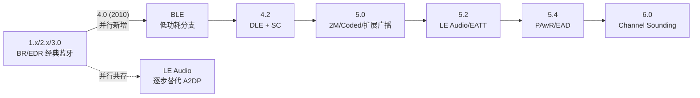

# BLE 概述

> 🌿 知识树位置: 树干 → 枝干[无线关联] → 分枝[BLE] → 叶[00-概述]
> ⬆️ 父节点: [00-无线概览与USB交汇](../00-无线概览与USB交汇.md)

---

低功耗蓝牙（BLE，Bluetooth Low Energy），官方营销名"蓝牙智能"（Bluetooth Smart），2009 年底定稿、随 **Bluetooth 4.0（2010）**正式发布。它与经典蓝牙（BR/EDR，Basic Rate / Enhanced Data Rate）共享 2.4 GHz 频段与品牌，但 PHY、链路层、上层协议栈几乎完全重写。与 USB 知识树的关系（HCI over USB、HOGP、2.4G dongle）见 [00-无线概览与USB交汇](../00-无线概览与USB交汇.md)。

## 一、蓝牙版本史

| 版本 | 年份 | 关键内容 | 对 BLE 的意义 |
|---|---|---|---|
| 1.0-1.2 | 1999-2003 | BR（Basic Rate，1 Mbps，GFSK），初代跳频 | 与 BLE 无关 |
| 2.0 + EDR | 2004 | EDR（Enhanced Data Rate）：π/4-DQPSK 2 Mbps、8DPSK 3 Mbps | 经典蓝牙提速 |
| 2.1 | 2007 | SSP（Secure Simple Pairing，简化配对） | 经典蓝牙配对现代化；BLE 后来另起 SMP |
| 3.0 + HS | 2009 | HS（High Speed）：借用 802.11 做 AMP 高速通道 | 与 BLE 无关，路线失败 |
| **4.0** | **2010** | **BLE 诞生**：单模/双模芯片、GATT/GAP/SMP 雏形 | 分水岭 |
| 4.1 | 2013 | 传输层重构、允许设备同时 Central+Peripheral | BLE 1.x 修补 |
| 4.2 | 2014 | **数据包长度扩展（DLE）**、LE Secure Connections（ECDH P-256）、**CSA #2**、IPSP（6LoWPAN/IPv6） | BLE 安全与吞吐补课 |
| 5.0 | 2016 | **2M PHY**、**Coded PHY（长距离）**、**扩展广播/周期广播**、广播集 | 覆盖与吞吐全面增强 |
| 5.1 | 2019 | 测向：AoA/AoD（到达角/离开角）、GATT 缓存增强 | 室内定位 |
| 5.2 | 2020 | **LE Audio**（LC3 编码、ISO 通道）、**EATT**、LE 功率控制 | 进军音频 |
| 5.3 | 2021 | 连接子速率（Connection Subrating）、信道分类增强、广播增强 | 细节优化 |
| 5.4 | 2023 | **PAwR**（带响应的周期广播）、**加密广播数据（EAD）** | 电子货架标签 ESL |
| 6.0 | 2024 | **Channel Sounding（信道探测，安全测距）**、广播编码选择等 | 精确测距，对标 UWB |

规范获取：蓝牙技术联盟（Bluetooth SIG，Special Interest Group）官网发布《Bluetooth Core Specification》（当前以 Core 5.4 / 6.0 为准，全卷免费注册下载）；Core Spec 只定义协议，Profile/Service 规范（如 HOGP、BAS）单独发布。本子树以 Core 5.4 术语为准（Central/Peripheral 替代旧称 Master/Slave）。

## 二、BLE 设计目标

| 目标 | 手段 |
|---|---|
| 纽扣电池（CR2032）供电运行数年 | 深度睡眠 + 微秒级唤醒；广播/连接事件化，无连接时几乎零电流 |
| 芯片低成本 | 单模 BLE SoC 可低至几美分~几美元；射频前端极简（GFSK 单调制方式） |
| 手机/PC 普遍覆盖 | 与经典蓝牙共用 2.4 GHz 射频前端的"双模"芯片（Wi-Fi+BT Combo 模组标配） |
| 互操作性 | GATT 统一数据模型 + SIG 标准服务 UUID，跨厂商"扫出来就能连" |
| 可接受的吞吐 | 小数据优先；4.2 DLE + 5.0 2M PHY 后实用吞吐可达 1 Mbps 以上 |

核心哲学：**BLE 为"不经常说话、每次只说几个字节"的设备设计**——这是它与经典蓝牙（持续流媒体）和 USB（确定性带宽）最根本的气质差异。

放在 USB 知识树里对照着看：

| 维度 | USB（树干） | BLE（本枝干） |
|---|---|---|
| 时间模型 | 主机轮询，确定性带宽/延迟 | 事件驱动（广播/连接事件），确定性让位于功耗 |
| 供电 | 总线供电 5 V/最多数百 mA | 自供电，µW 级预算 |
| 错误处理 | 硬件 CRC + 重试（近零误码） | 射频重传 + 监督超时断链，链路可能"消失" |
| 设备发现 | 枚举（主机主动拉描述符） | 广播（设备主动推名片） |
| 速率哲学 | 够快，且越来越快 | 够用就好，睡眠优先 |

吞吐参考（工程口径，随芯片/参数浮动）：LE 1M PHY 不开 DLE 时实用吞吐约 0.6~0.7 Mbps；DLE + LE 2M PHY 后可到 1~1.4 Mbps。别拿它传文件——BLE 的强项是"每秒几次、每次几十字节"的传感器节拍。

## 三、典型应用

| 应用 | 用到的机制 | 本子树章节 |
|---|---|---|
| 传感器（温湿度、心率带） | 广播 + GATT 标准服务（HTS/HRS） | [03](03-广播与连接.md)、[04](04-ATT与GATT.md) |
| 信标（Beacon：iBeacon/Eddystone） | 不可连接广播 + 厂商自定义 AD | [03](03-广播与连接.md) |
| 可穿戴（手环、手表） | 连接 + 绑定 + 众多标准服务 | [05](05-GAP与连接管理.md)、[06](06-SMP安全与配对.md) |
| 键鼠等 HID | HOGP（HID over GATT） | [07](07-HOGP-HIDoverGATT.md) |
| 音频（TWS 耳机、助听） | LE Audio：ISO 通道、CIS/BIG、Auracast | [08](08-经典蓝牙与BLE对比.md) |
| 资产追踪/查找（AirTag 类） | 广播 + 测向（5.1）/测距（6.0） | ——（见 Core Spec） |
| 电子货架标签 ESL | 5.4 PAwR 双向广播 | ——（见 Core Spec） |

## 四、与经典蓝牙的共存

- **双模芯片（Dual-mode）**：手机、笔记本里的蓝牙芯片几乎都是 BR/EDR + LE 双栈（Dual-mode controller + 双栈 Host）。单模（Single-mode，只有 LE）芯片用于传感器/标签等低成本场景。
- **AFH（Adaptive Frequency Hopping，自适应跳频）**：两套射频共享 2.4 GHz ISM 频段时，通过 AFH 把受 Wi-Fi 干扰的信道从跳频序列中剔除，双模芯片内部还会做共存仲裁（Coexistence，时间片协调 BT/Wi-Fi 收发）。
- BLE 的 40 信道与经典蓝牙的 79 信道在频段上交错，详见 [02-链路层与物理层](02-链路层与物理层.md)。
- 全面对比见 [08-经典蓝牙与BLE对比](08-经典蓝牙与BLE对比.md)。

## 五、芯片与产品形态

| 形态 | 组成 | 典型产品 |
|---|---|---|
| 单模 SoC | BLE 控制器+主机栈同芯片，跑自家固件 | 传感器、手环、BLE 键盘（nRF52/ESP32 级） |
| 双模 Combo 模组 | BT/Wi-Fi 共存芯片 + 双栈 | 手机、笔记本、电视 |
| USB dongle（双芯片） | PC 主机栈 ←HCI over USB→ BLE 控制器 | USB 蓝牙适配器、开发调试 dongle |
| 双芯片嵌入式 | MCU 应用核 + 独立 BLE 控制器芯片（UART HCI） | 需要大算力应用的蓝牙设备 |

## 六、Core Spec 卷结构与学习地图

Core Specification（当前 5.4/6.0）按卷组织，本子树章节与卷的对应：

| 规范位置 | 内容 | 本子树章节 |
|---|---|---|
| Vol 6, Part A/B | PHY 与链路层 | [02](02-链路层与物理层.md)、[03](03-广播与连接.md) |
| Vol 3, Part C | GAP（通用访问） | [05](05-GAP与连接管理.md) |
| Vol 3, Part F | ATT | [04](04-ATT与GATT.md) |
| Vol 3, Part G | GATT | [04](04-ATT与GATT.md) |
| Vol 3, Part H | SMP（安全管理） | [06](06-SMP安全与配对.md) |
| Vol 4, Part B/C/D/E | HCI 逻辑/UART/USB/SDIO/vHCI 传输 | [01](01-蓝牙体系架构与HCI.md) |
| HOGP 1.0（独立 Profile 规范） | HID over GATT | [07](07-HOGP-HIDoverGATT.md) |

高频名词速查：**GAP**管"发现与连接"，**ATT**管"属性表读写"，**GATT**管"表上摆什么服务"，**SMP**管"配对加密"，**HCI**管"主机↔控制器"。五个名字记牢，BLE 文档就读懂一半。

## 七、关键数字速查（背下这几条，BLE 就入门了）

| 数字 | 含义 |
|---|---|
| 40 = 3 + 37 | 2.4 GHz 信道总数 = 广播 + 数据信道 |
| 2402 / 2426 / 2480 MHz | 三个广播信道（信道号 37/38/39） |
| 0x8E89BED6 | 广播包固定 Access Address |
| 7.5 ms ~ 4 s | 连接间隔范围 |
| 20 ms ~ 10.24 s | 广播间隔范围（0.625 ms 步进） |
| 23 / 517 | ATT MTU 默认值 / 上限 |
| 31 + 31 / 255 | 传统广播数据+扫描响应 / 扩展广播单包载荷上限 |
| 5~16 | 连接跳频增量（Hop Increment） |
| 150 µs | 广播→SCAN_REQ/CONNECT_IND 的帧间隔（T_IFS） |
| 15 min（典型） | RPA 地址轮换周期 |

## 八、市场与生态（一句带过）

BLE 是出货量最大的无线协议之一，年出货芯片数十亿颗，几乎所有智能手机、PC、平板原生支持，主机侧协议栈（BlueZ、Zephyr、WinRT、CoreBluetooth）全部内置。

## 九、本子树导航

| 文件 | 内容 |
|---|---|
| [00-BLE概述](00-BLE概述.md) | 本文 |
| [01-蓝牙体系架构与HCI](01-蓝牙体系架构与HCI.md) | Controller/Host、HCI 包与命令、L2CAP |
| [02-链路层与物理层](02-链路层与物理层.md) | 信道、PHY、包结构、跳频、LLCP、加密 |
| [03-广播与连接](03-广播与连接.md) | PDU 类型、AD 结构、iBeacon、连接建立 |
| [04-ATT与GATT](04-ATT与GATT.md) | 属性表、PDU、服务/特征发现 |
| [05-GAP与连接管理](05-GAP与连接管理.md) | 角色、地址、绑定、参数管理 |
| [06-SMP安全与配对](06-SMP安全与配对.md) | 配对方法、ECDH、密钥分发、攻击面 |
| [07-HOGP-HIDoverGATT](07-HOGP-HIDoverGATT.md) | BLE 键鼠与 USB-HID 的同构 |
| [08-经典蓝牙与BLE对比](08-经典蓝牙与BLE对比.md) | BR/EDR 对比、LE Audio、选型 |

## 相关节点

- [../00-无线概览与USB交汇](../00-无线概览与USB交汇.md)
- [../99-WirelessUSB与MA-USB历史](../99-WirelessUSB与MA-USB历史.md)
- [../../10-树干-USB核心/01-概述与版本演进](../../10-树干-USB核心/01-概述与版本演进.md) —— 版本演进的"树干版"写法对照
- [../../20-枝干-设备类协议/其他设备类/05-蓝牙控制器类-HCIoverUSB](../../20-枝干-设备类协议/其他设备类/05-蓝牙控制器类-HCIoverUSB.md)
