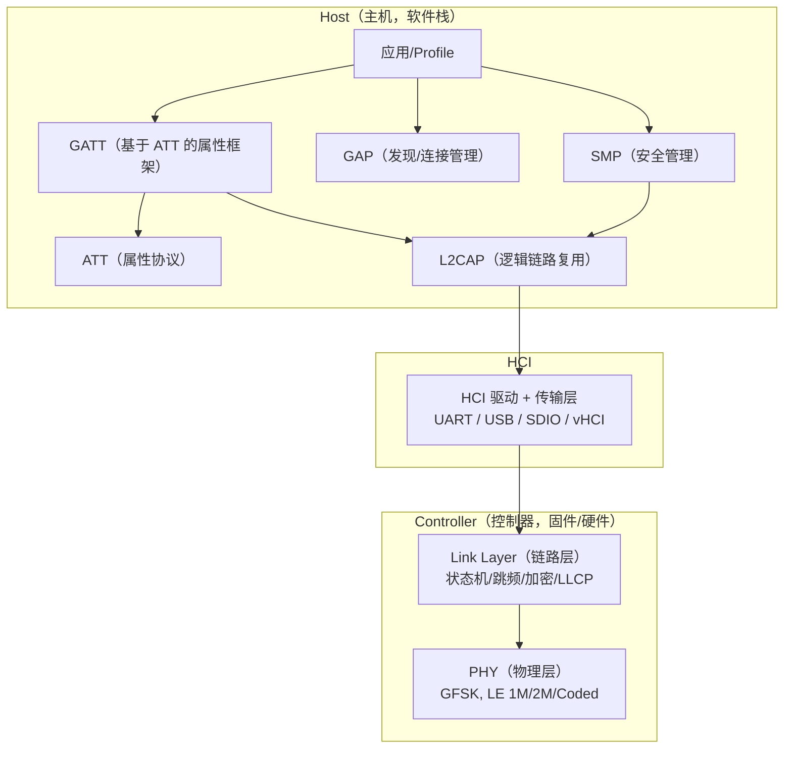
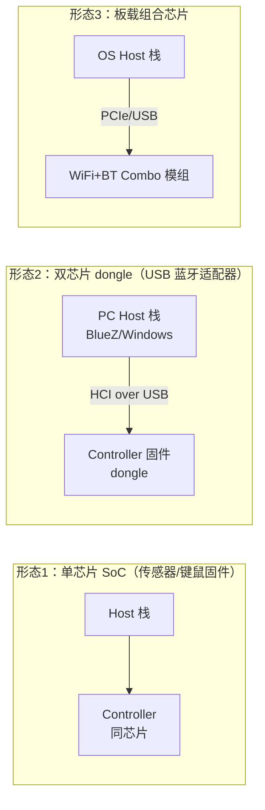

# 蓝牙体系架构与 HCI

> 🌿 知识树位置: 树干 → 枝干[无线关联] → 分枝[BLE] → 叶[01-体系架构与HCI]
> ⬆️ 父节点: [00-BLE概述](00-BLE概述.md)

---

蓝牙采用与 USB 相似的**主机/控制器分离**思想：射频与实时性敏感的链路层做成控制器（Controller），业务逻辑做成主机栈（Host），两者以 HCI（Host Controller Interface，主机控制器接口）为界。USB 蓝牙 dongle 的本质就是把 Controller 挂在 USB 总线另一端（见 [../../20-枝干-设备类协议/其他设备类/05-蓝牙控制器类-HCIoverUSB](../../20-枝干-设备类协议/其他设备类/05-蓝牙控制器类-HCIoverUSB.md)）。

## 一、架构总览



| 块 | 职责 | 对应 USB 树的类比 |
|---|---|---|
| Controller = PHY + LL + HCI | 调制解调、跳频、重传、加密引擎、连接调度 | USB 总线接口/PHY + SIE |
| L2CAP | 逻辑信道复用、MTU/分段、流控 | 端点+传输类型 |
| ATT/GATT | 属性数据库与读写订阅 | 设备类协议（类 HID 的接口语义） |
| GAP | 发现、连接、角色、广播 | 枚举与设备状态 |
| SMP | 配对、密钥、加密 | 类似"安全描述符+认证" |

## 二、HCI 三种包

HCI 链路上只有三类信息（5.2 起新增 ISO 数据包用于 LE Audio）：

| 包类型 | USB/H4 包类型指示 | 方向 | 用途 |
|---|---|---|---|
| HCI Command | 0x01 | Host → Controller | 控制命令 |
| HCI Event | 0x04 | Controller → Host | 命令结果/异步通知 |
| ACL 数据 | 0x02 | 双向 | L2CAP 承载（BLE 全部业务数据） |
| SCO/eSCO 数据 | 0x03 | 双向 | 经典蓝牙语音 |
| ISO 数据 | 0x05 | 双向 | LE Audio 等时流（5.2+） |

### 2.1 Command：Opcode = OGF<<10 | OCF

```
 16-bit Opcode = OGF(6 bits) << 10 | OCF(10 bits)
随后 1 字节参数总长 + 参数。
```

| OGF | 组 | 例子 |
|---|---|---|
| 0x01 | Link Control | Disconnect（OCF 0x0006） |
| 0x03 | Host Controller | Reset（OCF 0x0003） |
| 0x04 | Informational | Read BD_ADDR（OCF 0x0009 → Opcode 0x1009） |
| 0x08 | LE（Low Energy） | 全部 LE 命令 |

### 2.2 最常用 LE 命令速查（含返回事件）

| 命令 | Opcode | 参数要点 | 完成指示 |
|---|---|---|---|
| LE Set Advertising Parameters | 0x2006 | 最小/最大广播间隔、类型、信道图 | Command Complete (0x0E) |
| LE Set Advertising Data | 0x2008 | ≤31 字节 AD 数据 | Command Complete |
| LE Set Advertising Enable | 0x200A | 0/1 | Command Complete |
| LE Set Scan Parameters | 0x200B | 扫描类型/窗口/间隔 | Command Complete |
| LE Set Scan Enable | 0x200C | 使能扫描 + 是否上报重复 | Command Complete |
| LE Create Connection | 0x200D | 对端地址 + 连接参数 + 窗口 | LE Connection Complete |
| LE Read Buffer Size | 0x2002 | 查询 ACL 包大小/数量 | Command Complete |
| LE Read White List Size | 0x000F OCF → 0x200F | 白名单容量 | Command Complete |

### 2.3 Event：LE Advertising Report 字节级示例

广播报告是 Host 感知外界 BLE 设备的主要途径（HCI Event 0x3E 的 LE Meta 子事件 0x02）：

```
04                          ; HCI Event 包类型
3E                          ; 事件码 = LE Meta Event
14                          ; 参数长度 = 20 字节（单设备时）
02                          ; Subevent = LE Advertising Report
01                          ; Num Reports = 1
00                          ; Event Type = ADV_IND（可连接）
01                          ; Addr Type = 0x01 Random
C1 02 34 56 78 AB           ; 地址 AB:78:56:34:02:C1（小端）
08 09 4E 52 46 35 32 38 33  ; AD 数据: len=8, type=0x09, "NRF5283"
C8                          ; RSSI = -56 dBm（有符号，最后一个字节）
```

## 三、HCI 传输层

| 传输 | 说明 | 备注 |
|---|---|---|
| UART H4 | 每包前 1 字节类型指示，无流控 | 最简单，SoC 间串口常用 |
| H5 / H4DS | 三线 UART，带滑窗重传与节电 | ETSI TS 101 ...（SIG 采纳） |
| **USB** | 控制端点=Command，中断 IN=Event，批量=ACL，ISO=音频 | PC dongle 标准；详见链接文件 |
| SDIO | 嵌入式（较少见） | 具体见 Core Spec Vol 4 |
| vHCI | 虚拟 HCI（仿真控制器/直连内核调试） | BlueZ `btvirt`、Zephyr 原生 HCI UART |

## 四、Controller 与 Host 的组合形态



- 单芯片：Host 与 Controller 同固件，HCI 可编译为内部调用（Zephyr/ESP-IDF 常见）。
- 双芯片：HCI 必须走真实传输层（UART/USB），协议边界必须严格遵守——这就是 HCI 规范存在的意义。

## 五、L2CAP（Logical Link Control and Adaptation Protocol）

L2CAP 在 ACL 数据之上做**信道（Channel）复用**，每个信道由 CID（Channel Identifier，16 位）标识。

### 5.1 LE 固定信道

| CID | 用途 | 上层 |
|---|---|---|
| 0x0004 | Attribute Protocol | ATT |
| 0x0005 | LE L2CAP Signaling | 连接参数更新、CoC 建立 |
| 0x0006 | Security Manager Protocol | SMP 配对/加密 |

固定信道无连接建立开销，ATT/SMP 的 PDU 直接封 L2CAP 头（4 字节：Length+CID）进 ACL。

### 5.2 PDU 封装示例（ATT Read Request over ACL）

```
02                     ; HCI ACL 包类型
40 00                  ; 连接句柄+PB/BC 标志（小端）
07 00                  ; ACL 数据总长 = 7
04 00                  ; L2CAP 长度 = 4
04 00                  ; CID = 0x0004 (ATT)
0A                     ; ATT Read Request
15 00                  ; Handle = 0x0015
```

### 5.3 关键机制

- **MTU**：每信道协商 MTU；ATT 默认 23 字节（详见 [04-ATT与GATT](04-ATT与GATT.md)）。
- **LE Credit-based Flow Control**（CoC，面向连接的信道）：信用流控，用于大数据（如 OTA 升级私有协议）；5.2 的 EATT 也基于动态 CoC 信道。
- **重传/流控**：BLE 的可靠性主要由链路层 ARQ 保证（SN/NESN），L2CAP 层不再做经典蓝牙式的 RTX 重传；错误处理交上层。
- 信令信道 0x0005 承载 `CONNECTION_PARAM_UPDATE`、`DATA_LENGTH_UPDATE` 等请求——与链路层 LLCP 的同名流程对应（谁发起取决于角色，见 [02-链路层与物理层](02-链路层与物理层.md)）。

## 相关节点

- [02-链路层与物理层](02-链路层与物理层.md) —— HCI 之下的真实空口
- [04-ATT与GATT](04-ATT与GATT.md) —— CID 0x0004 上跑什么
- [06-SMP安全与配对](06-SMP安全与配对.md) —— CID 0x0006
- [../../20-枝干-设备类协议/其他设备类/05-蓝牙控制器类-HCIoverUSB](../../20-枝干-设备类协议/其他设备类/05-蓝牙控制器类-HCIoverUSB.md)
- [../../10-树干-USB核心/02-体系架构与分层模型](../../10-树干-USB核心/02-体系架构与分层模型.md) —— 主机/控制器分层思想的源头
- [../../10-树干-USB核心/06-四种传输类型](../../10-树干-USB核心/06-四种传输类型.md) —— HCI 端点与 USB 传输类型的对应
