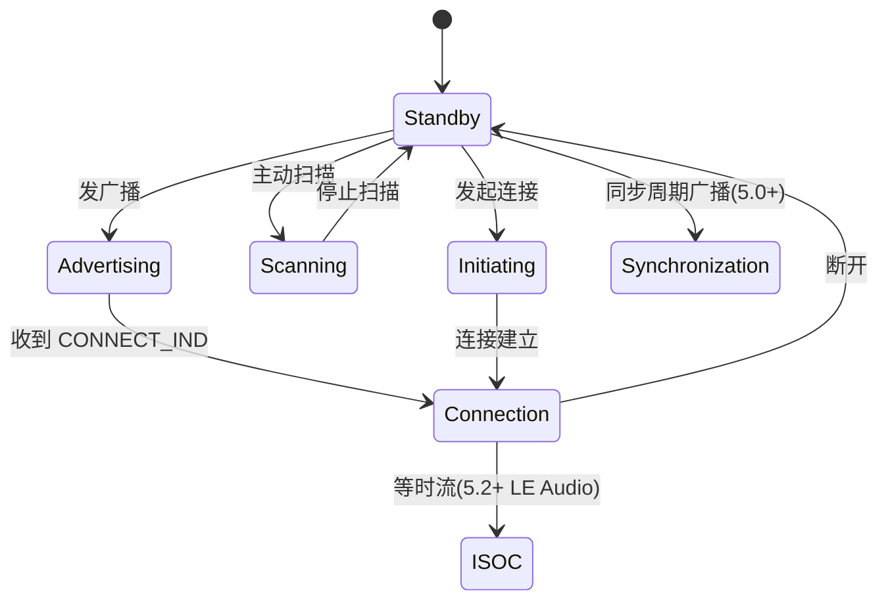
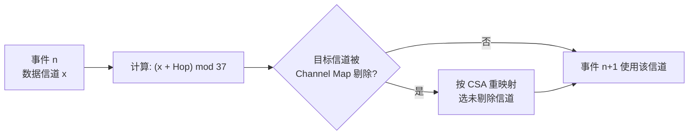

# 链路层与物理层

> 🌿 知识树位置: 树干 → 枝干[无线关联] → 分枝[BLE] → 叶[02-链路层与物理层]
> ⬆️ 父节点: [00-BLE概述](00-BLE概述.md)

---

链路层（LL, Link Layer）与物理层（PHY, Physical Layer）是 BLE 的"树根"，Core Spec Vol 6 的内容。这里的每一个字节格式都决定了嗅探器（sniffer）上看到的东西。

## 一、频段与信道

工作在 2.4 GHz ISM（Industrial, Scientific and Medical）频段，共 **40 个物理信道**，每信道 2 MHz：

```
f = 2402 + 2k MHz，k = 0..39
```

| 信道类型 | 信道号 | 频率 | 说明 |
|---|---|---|---|
| 广播（Advertising） | **37** | 2402 MHz | 频段最低端 |
| 广播 | **38** | 2426 MHz | Wi-Fi 信道 1(2412) 与 6(2437) 之间的空隙 |
| 广播 | **39** | 2480 MHz | 频段最高端，高于 Wi-Fi 11(2462) |
| 数据（Data） | 0~36 | 2404~2476 MHz | 跳频使用，由信道图控制 |

三个广播信道刻意安排在频段两端与中间空隙，**避开 Wi-Fi 最常用的 1/6/11 热点信道中心频点**，降低广播被吞的概率——但只是"降低"，2.4 GHz ISM 从不承诺无干扰（与 USB 的电气隔离不同，见 [../../10-树干-USB核心/03-物理层与电气特性](../../10-树干-USB核心/03-物理层与电气特性.md) 的确定性对比）。

## 二、调制与三档 PHY

- 调制：GFSK（高斯频移键控，Gaussian Frequency Shift Keying），BT=0.5，1 Msym/s，每符号 1 bit。
- 调制指数（1M/2M）0.5；LE Coded 同为 GFSK 1 Msym/s，靠编码降有效速率。

| PHY | 引入版本 | 有效速率 | 最小灵敏度要求（规范值） | 典型用途 |
|---|---|---|---|---|
| LE 1M | 4.0（必选） | 1 Mbps | -70 dBm | 默认，互操作基准 |
| LE 2M | 5.0 | 2 Mbps | -70 dBm | 短距高速（吞吐/游戏外设） |
| LE Coded S=2 | 5.0 | 500 kbps | -75 dBm | 中距，2 倍编码扩展 |
| LE Coded S=8 | 5.0 | 125 kbps | -80 dBm | 远距（视距数百米级），前向纠错 FEC + 脉冲扩展 |

发射功率：规范允许 -20 ~ +20 dBm（0.01~100 mW），5.2 起 LE 功率控制（LE Power Control）允许对端请求升降功率。典型芯片 0~+8 dBm，空旷视距 10~100 m 量级；Coded PHY 产品可宣传 1 km+（具体取决于天线与噪声环境，见 Core Spec Vol 6 Part A）。

## 三、链路层状态机



| 状态 | 干什么 |
|---|---|
| Standby | 睡觉，最省电 |
| Advertising | 周期性发广播 PDU（37/38/39 轮发） |
| Scanning | 被动收/主动问广播 |
| Initiating | 盯着目标设备广播，准备回 CONNECT_IND |
| Connection | 连接态，按连接间隔收发 |
| Synchronization | 与周期广播序列同步 |
| ISOC | 等时同步通道（LE Audio 专用） |

## 四、包结构（未编码 PHY）

```
| Preamble | Access Address | Header(2B) | Payload | MIC(可选4B) | CRC24(3B) |
```

| 字段 | 长度 | 内容 |
|---|---|---|
| Preamble | 1 B（LE 1M）/ 2 B（LE 2M） | 01010101 或 10101010（2M 时 0x5555/0xAAAA），按 Access Address 首位取反对齐，用于接收端时钟同步 |
| Access Address | 4 B | 包的身份；广播固定 `0x8E89BED6`；每个连接一个随机生成值 |
| Header | 2 B | 广播头/数据头两种格式，见下 |
| Payload | 0~255 B | 广播 ≤31+6（含 AdvA）；连接态 DLE 后 ≤251 B |
| MIC | 0 或 4 B | 加密时的消息完整性校验码（Message Integrity Check，CCM 产生） |
| CRC24 | 3 B | 多项式 x^24+x^10+x^9+x^6+x^4+x^3+x+1（0x00065B）；广播包初值 0x555555，连接包初值由 CONNECT_IND 下发 |

### 4.1 广播 PDU 头（16 bits）

| 位 | 字段 | 说明 |
|---|---|---|
| 0-3 | PDU Type | 见 [03-广播与连接](03-广播与连接.md) 类型表 |
| 4 | RFU | 保留 |
| 5 | ChSel | 0=CSA#1，1=CSA#2（连接时声明信道选择算法） |
| 6 | TxAdd | 发送者地址类型：0=Public，1=Random |
| 7 | RxAdd | 接收者地址类型（仅 ADV_DIRECT_IND 用） |
| 8-15 | Length | 载荷字节数（legacy 广播 ≤37：6B AdvA + ≤31B 数据） |

### 4.2 连接态数据 PDU 头（16 bits）

| 位 | 字段 | 说明 |
|---|---|---|
| 0-1 | LLID | 00 保留 / 01 LL 数据（续）/ 10 LL 数据（起）/ 11 LL 控制帧（LLCP） |
| 2 | NESN | Next Expected Sequence（对端下一期望序号，ARQ 用） |
| 3 | SN | 本包序号 |
| 4 | MD | More Data：我还有数据，别睡 |
| 5 | CP | 时钟精度字段存在（5.2+） |
| 6-7 | RFU | 保留 |
| 8-15 | Length | 载荷字节数（0~251，DLE 后；0 表示空包仅作应答） |

LE Coded PHY 的帧在此基础上前移：Preamble+AA 经 S=2/S=8 编码扩展，头部携带 2-bit CI（Coding Indicator）声明载荷所用编码，载荷+CRC+MIC 进入 FEC 块——细节见 Core Spec Vol 6 Part B 3.x。

## 五、连接与跳频

连接建立后双方在**连接事件（connection event）**中成对收发，事件起点称为锚点（anchor point）：

| 参数 | 范围/单位 | 说明 |
|---|---|---|
| 连接间隔 ConnInterval | 7.5 ms ~ 4 s（1.25 ms 单位） | 两次连接事件的周期 |
| 从机延迟 ConnLatency | 0~499 个事件 | 允许外设连续跳过 N 个事件 |
| 监督超时 SupervisionTimeout | 100 ms ~ 32 s（10 ms 单位） | 超时未收到有效包则断链；必须 > 2×(1+Latency)×Interval |

### 5.1 跳频机制

| 要素 | 内容 |
|---|---|
| Channel Map | 5 字节位图（40 bit 中数据信道 37 bit 有效），把被 Wi-Fi 干扰的信道标 0 剔除（AFH 思想） |
| Hop Increment | 5 bit，取值 5~16，连接建立时由 Central 指定 |
| CSA #1 | 信道选择算法 1：先在未剔除信道里算，再映射回物理信道号 |
| CSA #2 | 4.2 引入，用信道图生成伪随机重映射表，抗窄带干扰更均匀；广播头 ChSel 位声明 |



## 六、LL 控制协议（LLCP，LLID=11）

连接双方用 LLCP 管理链路本身，常用控制 PDU：

| Opcode | 名称 | 用途 |
|---|---|---|
| 0x00 | LL_CONNECTION_UPDATE_IND | 即时更新连接参数（Master/Central 直接生效） |
| 0x01 | LL_CHANNEL_MAP_IND | 更新信道图 |
| 0x02 | LL_TERMINATE_IND | 断链（带原因码） |
| 0x03/0x04 | LL_ENC_REQ / LL_ENC_RSP | 开始加密握手（见下） |
| 0x05/0x06 | LL_START_ENC_REQ / RSP | 用新密钥切换加密 |
| 0x08/0x09 | LL_FEATURE_REQ / RSP | 特性交换 |
| 0x0F/0x10 | LL_CONNECTION_PARAM_REQ / RSP | 4.1+ 双方协商连接参数（Peripheral 也能发起） |
| 0x14/0x15 | LL_LENGTH_REQ / RSP | **DLE**：把空口载荷从 27 B 扩到 251 B |
| 0x16~0x18 | LL_PHY_REQ / RSP / UPDATE_IND | PHY 切换（2M/Coded） |

## 七、加密与白化

- **加密**：AES-128，CCM 模式（计数器 CTR 加密 + CBC-MAC 产出 4 字节 MIC）；nonce 由方向位、IV、包计数器组成，防重放。握手 LL_ENC_REQ→…→START_ENC 一气呵成，密钥来自 SMP（见 [06-SMP安全与配对](06-SMP安全与配对.md)）。
- **白化/扰码（Whitening / 数据扰码）**：载荷与 CRC 经 7 位 LFSR（多项式 x^7+x^4+1，种子与信道号相关）异或，打散长连 0/1，利于接收端 AGC 与同步；Coded PHY 在 FEC 之前扰码。5.0 规范改称 data whitening/scrambling。

## 相关节点

- [01-蓝牙体系架构与HCI](01-蓝牙体系架构与HCI.md) —— LL 之上如何被主机看到
- [03-广播与连接](03-广播与连接.md) —— 广播 PDU 与连接建立细节
- [06-SMP安全与配对](06-SMP安全与配对.md) —— 密钥从哪来
- [../../10-树干-USB核心/03-物理层与电气特性](../../10-树干-USB核心/03-物理层与电气特性.md) —— 有线 PHY 的确定性对照
- [../../10-树干-USB核心/06-四种传输类型](../../10-树干-USB核心/06-四种传输类型.md) —— 连接间隔 vs 端点轮询
