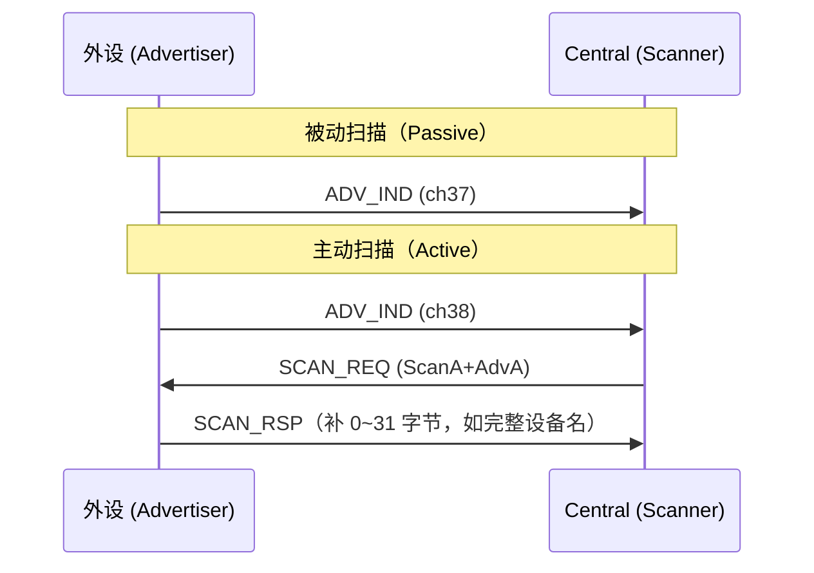
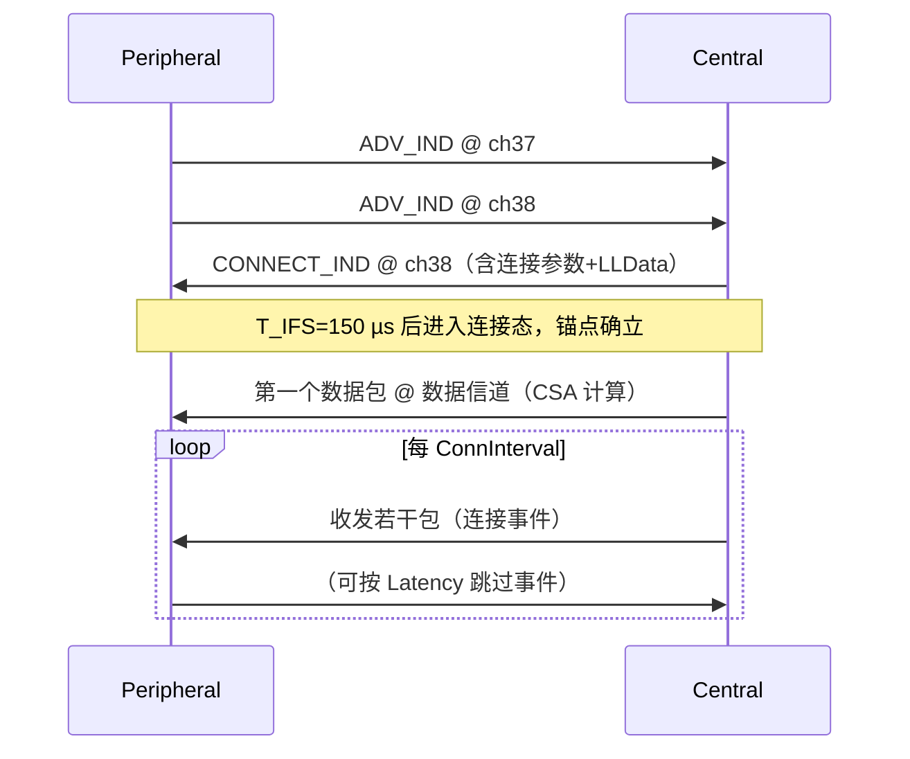

# 广播与连接

> 🌿 知识树位置: 树干 → 枝干[无线关联] → 分枝[BLE] → 叶[03-广播与连接]
> ⬆️ 父节点: [00-BLE概述](00-BLE概述.md)

---

广播（Advertising）是 BLE 设备的"名片"，也是 BLE 与 USB 在时间模型上最不同的一点：USB 设备被轮询，BLE 外设**先自说自话，等被选中才进连接**（对比 [../../10-树干-USB核心/06-四种传输类型](../../10-树干-USB核心/06-四种传输类型.md) 的中断传输轮询模型）。

## 一、传统广播 PDU 类型（信道 37/38/39）

PDU Type（4 bit）定义于广播头（见 [02-链路层与物理层](02-链路层与物理层.md)）：

| 值 | PDU | 可连接 | 可扫描 | 载荷 | 说明 |
|---|---|---|---|---|---|
| 0x0 | ADV_IND | ✔（任意 Central） | ✔（可回 SCAN_RSP） | AdvA(6)+Data(≤31) | 最常用：传感器、键鼠待配对 |
| 0x1 | ADV_DIRECT_IND | ✔（仅指定对端） | ✘ | AdvA+TargetA（各 6B） | 重连专用；4.x 中 TxAdd=1 表示高占空比（间隔 ≤3.75ms），5.x 建议改用扩展广播 |
| 0x2 | ADV_NONCONN_IND | ✘ | ✘ | AdvA+Data(≤31) | 纯单向：iBeacon 类 |
| 0x6 | ADV_SCAN_IND | ✘ | ✔（可回 SCAN_RSP） | AdvA+Data(≤31) | 可被查询但不可连接（beacon+附加信息） |
| 0x3 / 0x4 | SCAN_REQ / SCAN_RSP | —— | —— | ScanA+AdvA / AdvA+RspData(≤31) | 主动扫描的问答对 |
| 0x5 | CONNECT_IND | —— | —— | InitA+AdvA+LLData(22B) | Central 回的"连接请求"（旧名 CONNECT_REQ） |
| 0x7 | ADV_EXT_IND | —— | —— | Extended Header | 5.0 扩展广播入口（见第五节） |

## 二、广播间隔与功耗权衡

- 间隔 = N × 0.625 ms，N ∈ [0x20, 0x4000] → **20 ms ~ 10.24 s**；规范还要求每次广播事件叠加 0~10 ms 随机延迟（防碰撞）。
- ADV_IND（可连接）最小 20 ms；不可连接广播 5.x 起也允许到 20 ms（4.x 曾限制 100 ms）。

| 广播间隔 | 被发现速度 | 平均电流（数量级示意） |
|---|---|---|
| 20 ms | 毫秒级扫到 | 数十~数百 µA |
| 100 ms | ~0.1 s | 十 µA 级 |
| 1 s | 秒级 | 个位数 µA |
| 10 s | 十秒级 | 亚 µA |

经验法则：待配对期用 20~100 ms，配对成功后停广播；长期 beacon 视场景 1 s+。这就是 BLE 能跑纽扣电池而 USB 外设可以"永远在线"的代价差异。

## 三、扫描

| 参数 | 含义 | 范围 |
|---|---|---|
| Scan Interval | 相邻扫描窗口起点间隔 | 2.5 ms ~ 10.24 s |
| Scan Window | 每次连续射频收听时长 | ≤ Scan Interval |
| 占空比 | Window/Interval | 100%（连续扫描）到个位数 % |



- **被动扫描**只收 ADV_IND，看不到 SCAN_RSP 内容；**主动扫描**多一次问答，把名片凑成两页。
- 扫描响应与广播数据合计最多 62 字节——这是传统广播的数据天花板。

## 四、广播数据结构：AD Structure

Data 字段由一串 AD 结构（Advertising Data Structure）拼接：

```
| Length(1B) | AD Type(1B) | Data(Length-1 B) |
```

常用 AD Type：

| 类型 | 名称 | 典型内容 |
|---|---|---|
| 0x01 | Flags | bit0 LE 有限发现、bit1 LE 普遍发现、bit2 BR/EDR 不支持（几乎总为 `06`） |
| 0x02 / 0x03 | Incomplete / Complete 16-bit Service UUID 列表 | `0x180F`（电池）等 |
| 0x06 / 0x07 | Incomplete / Complete 128-bit Service UUID 列表 | 厂商私有服务 |
| 0x08 / 0x09 | Shortened / Complete Local Name | "NRF52-Kbd" |
| 0x0A | Tx Power Level | 有符号 dBm |
| 0x16 | Service Data | Eddystone 等框架用 |
| 0x19 | Appearance | 与 GAP 服务 0x2A01 同源 |
| 0xFF | Manufacturer Specific Data | 厂商自定义，前 2 字节为公司 ID（蓝牙 SIG 分配） |

### 4.1 iBeacon 字节级实例（Apple）

```
02 01 06                       ; AD: Flags = 0x06
1A FF 4C 00 02 15              ; AD: len=26, type=0xFF, Apple(0x004C 小端),
                               ;     子类型 0x02（Proximity Beacon）, 长度 0x15(21B)
E2 C5 6D B5 DF FB 48 D2 B0 60  ; iBeacon UUID 前 8 字节
D0 F5 A7 10 96 E0              ; iBeacon UUID 后 8 字节
00 01                          ; Major = 1
00 02                          ; Minor = 2
C5                             ; 校准 TX Power = -59 dBm（有符号）
```

### 4.2 Eddystone-URL（Google）简例

```
03 03 AA FE                    ; AD: 完整 16-bit UUID 列表 = 0xFEAA
09 16 AA FE 10 00 03 67 6F 6F  ; Service Data: len=9, type=0x16, UUID 0xFEAA,
                               ; 帧=0x10(URL), TX=0 dBm, 前缀 0x03="https://",
                               ; 编码 URL "goo"（后续帧可继续编码完整网址）
```

（URL 编码用 1 字节代表常见子串，如 0x07=".com"，详见 Eddystone 规范。）

## 五、5.0 扩展广播（Extended Advertising）

| 能力 | 说明 |
|---|---|
| 入口 | ADV_EXT_IND 仍在 37/38/39，仅含少量头部字段 + AUX 指针 |
| 二次广播 | AUX_ADV_IND / AUX_CHAIN_IND 在**数据信道**发送，载荷可达 **255 B/包**，链路层分片链接 |
| ADI（AdvDataInfo） | 16 bit（策略+滚动 ID），帮助接收端合并分片、去重 |
| 广播集（Advertising Set） | 单设备并行多路广播（不同身份/间隔/内容） |
| Periodic Advertising | 周期广播序列，供 Synchronization 状态同步接收（beacon 网格、Auracast） |
| 代价 | 老手机（4.x 栈）看不到扩展广播；兼容场景仍用 legacy |

## 六、连接建立全流程



### 6.1 CONNECT_IND 载荷（34 B）

| 字段 | 长度 | 内容 |
|---|---|---|
| InitA / AdvA | 6+6 B | 发起方/广播方地址 |
| AA | 4 B | **新连接的 Access Address**（随机生成，规则：4 字节互不相等、无 >6 个连续同值位、32 bit 内跳变 ≤24 次、高 16 位跳变 ≤11 次、≠0x8E89BED6） |
| CRCInit | 3 B | 本连接 CRC 初值 |
| WinSize / WinOffset | 1+2 B | 首个连接事件的接收窗口（1.25 ms 单位） |
| Interval | 2 B | 连接间隔（1.25 ms 单位） |
| Latency | 2 B | 从机延迟 |
| Timeout | 2 B | 监督超时（10 ms 单位） |
| ChM | 5 B | 初始信道图 |
| Hop(5b) + SCA(3b) | 1 B | 跳频增量 5~16；Central 睡眠时钟精度 |

## 七、连接参数协商

- **PPCP**（Peripheral Preferred Connection Parameters，特征 0x2A04）：外设在 GATT 里放一份"期望参数"（最小/最大间隔、Latency、超时倍数），Central 酌情采纳。
- 外设主动要：4.1+ 走 `LL_CONNECTION_PARAM_REQ/RSP`（链路层协商）；或 L2CAP 信令信道 0x0005 的 CONNECTION_PARAM_UPDATE（只能 Peripheral→Central）。
- 合法性约束：`SupervisionTimeout > 2 × (1 + Latency) × Interval`（同时各自满足规范范围），否则链路可能被误判断开。

**功耗计算示例**：Interval = 1 s，Latency = 4 → 外设最多每 `1 s × (4+1) = 5 s` 醒一次；若每次唤醒射频活动 3 mA × 3 ms，平均电流 ≈ 3 mA × 3 ms / 5 s = **1.8 µA**（未计广播），CR2032（~220 mAh）理论上可用十年级——参数每放宽 10 倍间隔，平均电流近似降 10 倍。

## 八、多连接拓扑

Central 可同时维持多连接（Nordic SoC 常见 8~20 条），调度器把各连接事件在时间轴上**交错**排布；连接间隔小、连接数多时事件拥挤，吞吐与实时性互相挤压——这也是 2.4G 私有 dongle 在游戏键鼠场景仍占优的原因之一（一条独占链路，回报率可做到 1 kHz/8 kHz）。

## 九、广播配置伪代码（nRF / ESP32 风格）

```c
// 1. 设置广播参数
ble_adv_params_t p = {
    .interval_min = 0x20,          // 20 ms
    .interval_max = 0x40,          // 40 ms（范围内随机化）
    .type = ADV_IND,               // 可连接可扫描
    .own_addr_type = RANDOM_STATIC,
    .channels = CH37|CH38|CH39 };
ble_set_adv_params(&p);

// 2. 填 AD 结构（注意总长 ≤31 B）
ble_adv_data_t d = { FLAGS(0x06),
                     COMPLETE_16(0x180F),      // 声明电池服务
                     NAME("USB-Tree Sensor"),
                     MFG(0x0059, "Nordic...") };
ble_set_adv_data(&d);

// 3. 启动广播；等连接事件回调
ble_adv_start();
on_connection(ble_conn_params_set(INTERVAL_45MS, LATENCY_2, TIMEOUT_4S));
```

（ESP32 NimBLE / Zephyr / SoftDevice 的真实 API 名各异，流程一致：参数→数据→使能→回调。）

## 相关节点

- [02-链路层与物理层](02-链路层与物理层.md) —— PDU 头与跳频的字节细节
- [05-GAP与连接管理](05-GAP与连接管理.md) —— 角色与地址体系
- [07-HOGP-HIDoverGATT](07-HOGP-HIDoverGATT.md) —— 连上之后键鼠数据怎么走
- [../../10-树干-USB核心/06-四种传输类型](../../10-树干-USB核心/06-四种传输类型.md) —— 轮询模型的对照
- [../../20-枝干-设备类协议/其他设备类/05-蓝牙控制器类-HCIoverUSB](../../20-枝干-设备类协议/其他设备类/05-蓝牙控制器类-HCIoverUSB.md) —— 广播数据在 HCI 中的形态
