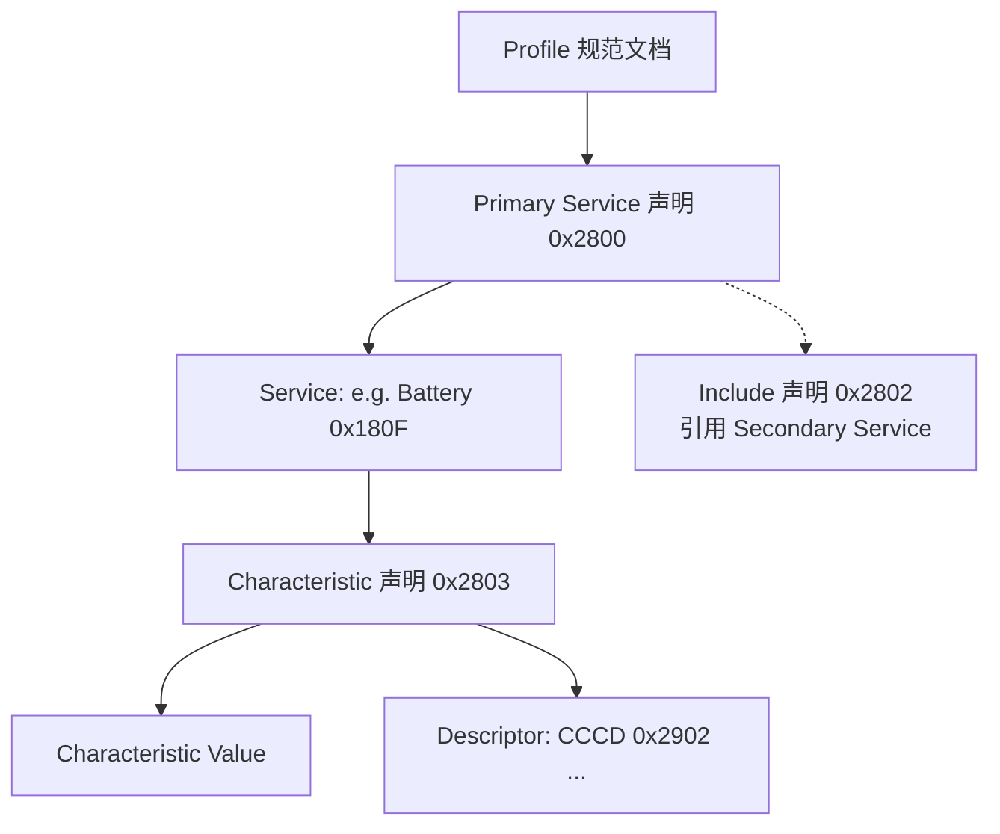
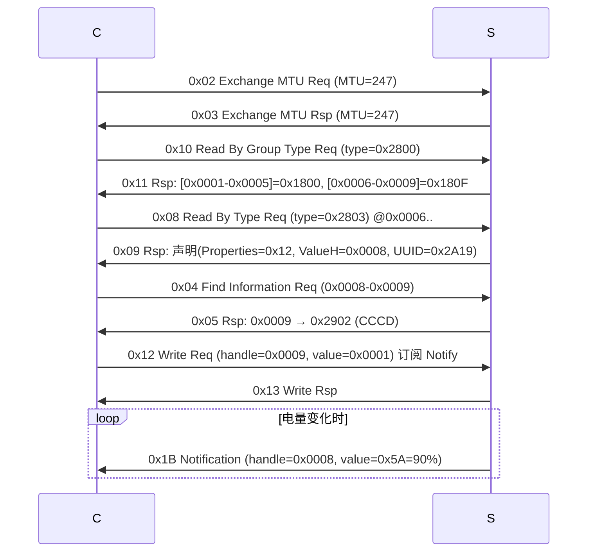

# ATT 与 GATT

> 🌿 知识树位置: 树干 → 枝干[无线关联] → 分枝[BLE] → 叶[04-ATT与GATT]
> ⬆️ 父节点: [00-BLE概述](00-BLE概述.md)

---

属性协议（ATT, Attribute Protocol）定义了一张"属性表"如何被读写；通用属性规范（GATT, Generic Attribute Profile）规定这张表里如何组织服务与特征。所有 BLE 数据业务（包括 HOGP 键鼠报告）最终都是对这张表的读写与订阅。它跑在 L2CAP 固定信道 0x0004 上（见 [01-蓝牙体系架构与HCI](01-蓝牙体系架构与HCI.md)）。

## 一、属性（Attribute）四元组

| 元素 | 大小 | 说明 |
|---|---|---|
| Handle | 2 B（0x0001~0xFFFF） | 表内索引，服务器内唯一、递增排列 |
| Type | UUID 16 bit 或 128 bit | 属性类型；16-bit UUID 由 SIG 分配，128-bit 厂商自定义 |
| Value | ≤ MTU-1 | 任意字节 |
| Permissions | — | 访问权限：可读/可写/加密后可读/认证后可读等（与本表元数据无关，不占用空口字节） |

**ATT MTU**：默认 **23 字节**（1 字节操作码 + 22 字节载荷）；通过 Exchange MTU 协商增大，LE 上限 **517**；链路层 DLE（载荷 27→251 B）是大 MTU 高效运转的前提（见 [02-链路层与物理层](02-链路层与物理层.md)）。

## 二、PDU 模型

| 方法类型 | 应答 | 例子 |
|---|---|---|
| Request | 必有 Response | Read Request |
| Command | **无任何应答**（fire-and-forget） | Write Command（写键值如灯光） |
| Notification | 无需确认 | 电量上报（发完即忘） |
| Indication | 需对方 Confirmation | Service Changed（可靠送达） |
| Confirmation | — | 对 Indication 的回执（opcode 0x1E） |

### 2.1 核心 Opcode 表（数值务必准确）

| Opcode | PDU | 方向 | 备注 |
|---|---|---|---|
| 0x01 | Error Response | S→C | 携带"请求 opcode + 出错 handle + 错误码" |
| 0x02 / 0x03 | Exchange MTU Req / Rsp | C↔S | 参数：服务器/客户端 RX MTU（2B） |
> 🔍 对抗抽查（evolve #30）：方法名序列（Exchange MTU/Execute Write/Find By Type/Handle Value NTF-CFM…）与 Core 6.0 Vol 3 Part F 提取文本比对一致。

| 0x04 / 0x05 | Find Information Req / Rsp | C↔S | 枚举 Handle→UUID 对（发现描述符） |
| 0x06 / 0x07 | Find By Type Value Req / Rsp | C↔S | 按类型+值找 handle 范围（找服务声明） |
| 0x08 / 0x09 | Read By Type Req / Rsp | C↔S | 按类型读（发现特征的主力） |
| 0x0A / 0x0B | Read Req / Rsp | C↔S | 读 ≤MTU-1 字节 |
| 0x0C / 0x0D | Read Blob Req / Rsp | C↔S | 带偏移读长值 |
| 0x0E / 0x0F | Read Multiple Req / Rsp | C↔S | 批量读 |
| 0x10 / 0x11 | Read By Group Type Req / Rsp | C↔S | **发现服务**（按组返回首尾 handle） |
| 0x12 / 0x13 | Write Req / Rsp | C↔S | 有应答写 |
| 0x14 | Signed Write Command | C→S | 无应答+签名（CSRK） |
| 0x16 / 0x17 | Prepare Write Req / Rsp | C↔S | 长写第一步（排队） |
| 0x18 / 0x19 | Execute Write Req / Rsp | C↔S | 长写第二步（提交/取消） |
| 0x1B | Handle Value Notification | S→C | 无应答通知 |
| 0x1D / 0x1E | Handle Value Indication / Confirmation | S↔C | 需确认通知 |
| 0x52 | Write Command | C→S | **无应答写**（HID 输出报告常用） |

（5.2 的 EATT 在动态 L2CAP 信道上允许多个并发 ATT 事务，opcode 0xBF-0x… 的多变量读等新增 PDU 此处不展开，见 Core Spec Vol 3 Part F。）

### 2.2 Error Response 常见错误码

| 码 | 名称 | 场景 |
|---|---|---|
| 0x01 | Invalid Handle | handle 不存在 |
| 0x02 | Read Not Permitted | 属性禁止读 |
| 0x03 | Write Not Permitted | 属性禁止写 |
| 0x05 | Insufficient Authentication | 需要先配对/认证（最常见的安全拦路虎） |
| 0x06 | Request Not Supported | 服务器不支持该请求 |
| 0x08 | Insufficient Authorization | 授权不足 |
| 0x0A | Attribute Not Found | 发现流程走到头 |
| 0x0F | Insufficient Encryption | 需要加密链路 |

## 三、GATT 层级结构



| 元素 | 声明 UUID | 内容 |
|---|---|---|
| Primary Service | 0x2800 | 值 = 服务 UUID（如 0x180F） |
| Secondary Service | 0x2801 | 只能被 Include 引用，不单独发现 |
| Include | 0x2802 | 引用另一服务的 handle 范围 |
| Characteristic | 0x2803 | 值 = Properties(1B) + Value Handle(2B) + 特征 UUID |

### 3.1 特征属性位（Properties，1 字节）

| bit | 属性 | 含义 |
|---|---|---|
| 0x01 | Broadcast | 可在广播中携带 |
| 0x02 | Read | 可读 |
| 0x04 | Write Without Response | 可无应答写 |
| 0x08 | Write | 可有应答写 |
| 0x10 | Notify | 可通知（配合 CCCD） |
| 0x20 | Indicate | 可指示（配合 CCCD） |
| 0x40 | Authenticated Signed Writes | 支持签名写 |
| 0x80 | Extended Properties | 扩展位在 0x2900 描述符 |

### 3.2 CCCD：订阅为何是"每连接独立"

CCCD（Client Characteristic Configuration Descriptor，UUID **0x2902**）：2 字节位图，有效位：

| bit | 含义 |
|---|---|
| 0 | 使能 Notification（写 0x0001） |
| 1 | 使能 Indication（写 0x0002） |

**关键设计**：服务器为**每个连接**单独保存一份 CCCD 值（而非存在属性表里共享）。所以手机 A 订阅了电量，手机 B 不订阅，互不影响——这也解释了为什么重连后客户端要重新写 CCCD（bond 后服务器会记住该客户端的 CCCD 并在重连时恢复）。

## 四、常用标准服务/特征 UUID 速查

| UUID | 名称 | 关键特征 |
|---|---|---|
| 0x1800 | GAP 服务 | Device Name 0x2A00、Appearance 0x2A01、PPCP 0x2A04 |
| 0x1801 | GATT 服务 | **Service Changed 0x2A05**、Database Hash 0x2B2A（5.1） |
| 0x180A | Device Information | Manufacturer 0x2A29、Model 0x2A24、Firmware Rev 0x2A26、**PnP ID 0x2A50** |
| 0x180F | Battery Service | Battery Level 0x2A19（0~100%，Notify） |
| 0x1812 | HID 服务 | HOGP 核心，见 [07-HOGP-HIDoverGATT](07-HOGP-HIDoverGATT.md) |
| 0x1813 | Scan Parameters | Scan Interval Window 0x2A10（客户端建议扫描节奏） |

## 五、服务发现完整流程（抓包级）

以"发现服务→发现特征→订阅电量"为例（C=客户端，S=服务器）：



字节示例——`Read By Group Type Request`：

```
04 00            ; L2CAP: 长度 4
04 00            ; L2CAP: CID 0x0004 (ATT)
10 01 00 FF FF 00 28   ; ATT: opcode 0x10, 起始 0x0001, 结束 0xFFFF, 类型 0x2800
```

## 六、GATT 缓存与 Service Changed

- 客户端可**缓存**服务器属性表结构（发现一次，重连直接用）——GAP 的信任与 bond（见 [05-GAP与连接管理](05-GAP与连接管理.md)）是缓存的前提。
- 服务器表结构变了（OTA 加了服务）必须通知客户端：GATT 服务（0x1801）的 **Service Changed（0x2A05，Indicate）**携带受影响 handle 范围，客户端收到后重新发现。
- 5.1 增加 Database Hash（0x2B2A）：一次性读出表结构哈希，客户端比对即可知表是否变化，减少 Indicate 依赖。

## 相关节点

- [01-蓝牙体系架构与HCI](01-蓝牙体系架构与HCI.md) —— ATT PDU 如何封进 ACL
- [05-GAP与连接管理](05-GAP与连接管理.md) —— 连接与绑定是发现的前提
- [06-SMP安全与配对](06-SMP安全与配对.md) —— 0x05 Insufficient Authentication 的解法
- [07-HOGP-HIDoverGATT](07-HOGP-HIDoverGATT.md) —— GATT 数据模型的最大宗应用
- [../../20-枝干-设备类协议/HID-人机接口设备/02-报告描述符与Item编码](../../20-枝干-设备类协议/HID-人机接口设备/02-报告描述符与Item编码.md) —— HID 数据模型与 GATT 的对照
- [../../10-树干-USB核心/08-枚举流程与标准请求](../../10-树干-USB核心/08-枚举流程与标准请求.md) —— "描述符发现"在 USB 中的对应
