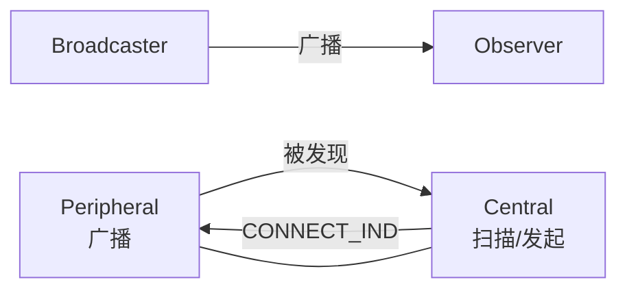
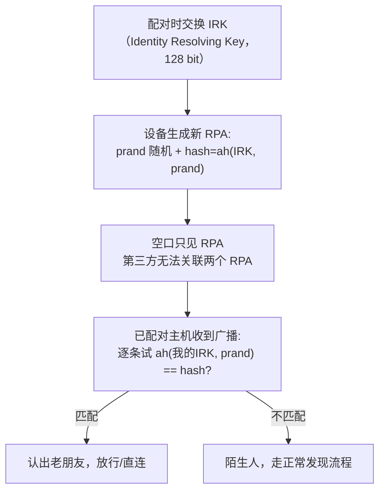
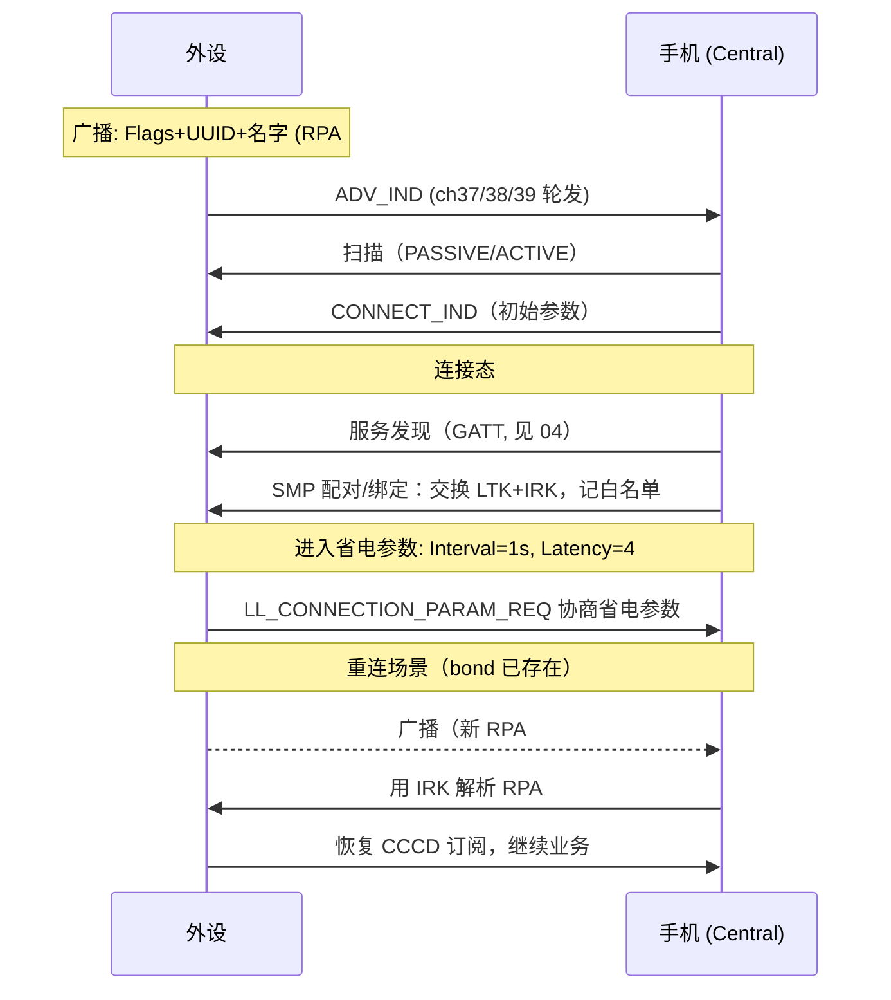

# GAP 与连接管理

> 🌿 知识树位置: 树干 → 枝干[无线关联] → 分枝[BLE] → 叶[05-GAP与连接管理]
> ⬆️ 父节点: [00-BLE概述](00-BLE概述.md)

---

通用访问规范（GAP, Generic Access Profile）回答三个问题：**我是谁（地址）、我是什么角色、别人怎么找到并连上我**。它是广播（[03](03-广播与连接.md)）与安全（[06](06-SMP安全与配对.md)）的组织者。

## 一、GAP 四角色

| 角色 | 行为 | 无线电活跃度 |
|---|---|---|
| Broadcaster（广播者） | 只发广播，不收 | 周期性发射 |
| Observer（观察者） | 只听广播 | 周期性收听 |
| Central（主机/中心） | 发起连接（对应旧称 Master） | 扫描+连接+调度多从设备 |
| Peripheral（外设/从机） | 广播等待被连（对应旧称 Slave） | 广播→连接态 |

- 只有 **Central/Peripheral** 涉及连接；Broadcaster/Observer 是纯广播世界的角色（beacon）。
- 术语变迁：5.3 起规范正式以 Central/Peripheral 取代 Master/Slave，读老文档/老代码（`sd_ble_gap_...`、sniffer 抓包）时按同义转换。
- 连接态角色不对称是硬约束：**只有 Central 能在 CONNECT_IND 里拍板初始连接参数**，外设只能事后协商——这与 USB 主机轮询设备的权力结构如出一辙（对照 [../../10-树干-USB核心/02-体系架构与分层模型](../../10-树干-USB核心/02-体系架构与分层模型.md)）。
- 一台设备可同时担任多角色（如手环同时是手机的 Peripheral 和另一设备外设的 Central）；5.2 的拓扑增强（Topology Enhancement）进一步放宽了多角色并发约束，细节见 Core Spec。



## 二、设备地址体系（48 bit，看起来像 MAC，语义完全不同）

| 类型 | 最高 2 bit | 可否解析 | 特点 |
|---|---|---|---|
| Public Address | —（IEEE 分配） | — | 厂商 OUI 静态地址，等于裸奔身份 |
| Random Static | 11 | 否 | 开机可变但一般每次上电不变；常用默认 |
| Random Private **Resolvable**（RPA） | 01 | 是（持 IRK 者） | **周期轮换**（典型 15 分钟），防追踪首选 |
| Random Private Non-resolvable | 00 | 否 | 纯随机轮换，白名单无法认出你，少用 |

### 2.1 RPA 的生成与解析

RPA = `prand(3 B) + hash(3 B)`，其中 prand 最高 2 bit = `01`，hash = ah(IRK, prand)（ah 是 AES-128 构造的 24 bit 校验函数，定义于 Core Spec Vol 3 Part H）。



这就是"手机重连手环时，AirTag 防跟踪、手环不被陌生人定位"的同一套机制：**身份藏在 IRK 里，不在地址里**。IRK 在配对第三阶段分发（见 [06-SMP安全与配对](06-SMP安全与配对.md)）。

### 2.2 地址字节级判别示例

```
C0 56 34 12 9F D2   → 最高字节 0xC0 = 11xxxxxx → Random Static（0xC0/0xF0/0xFC...）
F1 8A 3B 22 44 02   → 最高字节 0xF1 = 11...   → Random Static
42 11 22 33 44 55   → 最高字节 0x42 = 01...   → RPA（Resolvable Private）
08 77 66 55 44 33   → 最高字节 0x08 = 00...   → Non-resolvable Private
AC:BC:32:80:00:01   → 以 0xAC 开头（OUI）      → Public（IEEE 分配）
```

（地址在空口/HCI 中均按小端传输，最低字节在前；判别只看**最高字节的最高 2 bit**。）

### 2.3 白名单与广播过滤

GAP 用**过滤接受表（Filter Accept List，旧称白名单 White List）**控制"理睬谁"：HCI 层维护一组（地址类型+地址）条目，控制器在射频层直接过滤，省去主机 wake 开销。广播端可配四种过滤策略（`LE Set Advertising Parameters` 的 FilterPolicy 字段）：

| 值 | Scanning 过滤 | Connection 过滤 |
|---|---|---|
| 0x00 | 接受所有扫描请求 | 接受所有连接请求 |
| 0x01 | 仅白名单 | 接受所有 |
| 0x02 | 接受所有 | 仅白名单 |
| 0x03 | 仅白名单 | 仅白名单 |

定向重连（ADV_DIRECT_IND）+ 白名单 + RPA 解析，三者组合出"只有我的主人能连我"的工程实现。

### 2.4 连不上？排查清单

| 现象 | 常见根因 |
|---|---|
| 扫不到设备 | 广播类型为不可连接（ADV_NONCONN_IND）/ 已连接后停播 / 扫描窗口占空比太低 |
| 扫到连不上 | 广播端过滤策略 0x02/0x03（仅白名单）/ 连接参数非法（Timeout ≤ 2×(1+Latency)×Interval） |
| 定向广播无响应 | ADV_DIRECT_IND 的 TargetA 与主机当前 RPA 不符（地址已轮换或解析失败） |
| 连上即断 | 密钥失效（一方已删除 bond）但另一方仍坚持加密 |
| 能连不能读报告 | 未完成配对/加密，ATT 回 Insufficient Authentication |

## 三、连接参数管理（谁说了算）

| 事项 | 规则 |
|---|---|
| 初始参数 | Central 在 CONNECT_IND 中单方面决定（见 [03-广播与连接](03-广播与连接.md) 6.1 节） |
| 外设表达期望 | GATT 的 **PPCP（0x2A04）**：Min/Max Interval、Slave Latency、Timeout Multiplier（6 B） |
| 外设主动更新 | L2CAP 信令 `CONNECTION_PARAM_UPDATE`（仅 Peripheral→Central）或链路层 LLCP `LL_CONNECTION_PARAM_REQ/RSP`（双方协商） |
| 合法性约束 | `SupervisionTimeout > 2 × (1 + Latency) × Interval`，且 Interval ∈ [7.5 ms, 4 s]、Timeout ∈ [100 ms, 32 s] |

手机（Central）常在连接初期用激进参数（7.5~30 ms）快速交换数据，随后按省电需求放宽——主机侧策略不同，同一外设的续航可差数倍。

## 四、设备名称与外观

| 特征 | UUID | 说明 |
|---|---|---|
| Device Name | 0x2A00 | UTF-8 字符串；可同时在广播 AD 0x08/0x09 携带缩写 |
| Appearance | 0x2A01 | 16 bit 类别码（如"鼠标""心率带"），广播 AD 0x19 同步 |
| Central Address Resolution | 0x2AA6 | 4.2+：告知外设"主机能否解析 RPA" |

## 五、全生命周期时序



**bonding（绑定）= 配对 + 密钥持久化**。配对只是"这次会话换钥匙"，bonding 把 LTK/IRK 写进双方非易失存储，下次重连直接加密、直接认人，用户无感。详见 [06-SMP安全与配对](06-SMP安全与配对.md)。

## 六、实践：nRF Connect 里看到的一切

用手机 App（如 nRF Connect）扫 BLE 设备时，界面元素与本文概念一一对应：

| App 显示 | 对应概念 | 本文章节 |
|---|---|---|
| 设备名 "Sensor" | AD 0x09 / GATT 0x2A00 | 四 |
| 地址 `F2:8A:xx...` + 类型 "Random" | RPA（最高位 01）或 Static（11） | 二 |
| RSSI -67 dBm | 广播包实测场强（HCI Advertising Report 尾字节） | —— |
| "Connectable" 标志 | ADV_IND vs ADV_NONCONN_IND | ——（[03](03-广播与连接.md)） |
| 服务列表 0x180F/0x180A | Primary Service 声明 | ——（[04](04-ATT与GATT.md)） |
| 特征旁的"↓↑"订阅箭头 | CCCD 0x2902 写入 | ——（[04](04-ATT与GATT.md)） |
| 配对弹窗（数字比对/输入 PIN） | SMP 配对方法 | ——（[06](06-SMP安全与配对.md)） |
| "Forget/Bond" 菜单 | 删除 LTK/IRK/CSRK 持久化密钥 | 三/五 |

## 相关节点

- [03-广播与连接](03-广播与连接.md) —— 广播与连接建立的空口细节
- [04-ATT与GATT](04-ATT与GATT.md) —— GAP 服务本身就是一张 GATT 表
- [06-SMP安全与配对](06-SMP安全与配对.md) —— IRK/LTK 从配对中来
- [../../10-树干-USB核心/08-枚举流程与标准请求](../../10-树干-USB核心/08-枚举流程与标准请求.md) —— USB 枚举 vs BLE 发现的角色对应
- [../../20-枝干-设备类协议/其他设备类/05-蓝牙控制器类-HCIoverUSB](../../20-枝干-设备类协议/其他设备类/05-蓝牙控制器类-HCIoverUSB.md) —— 白名单/地址在 HCI 命令中的接口
