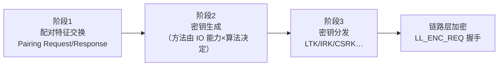
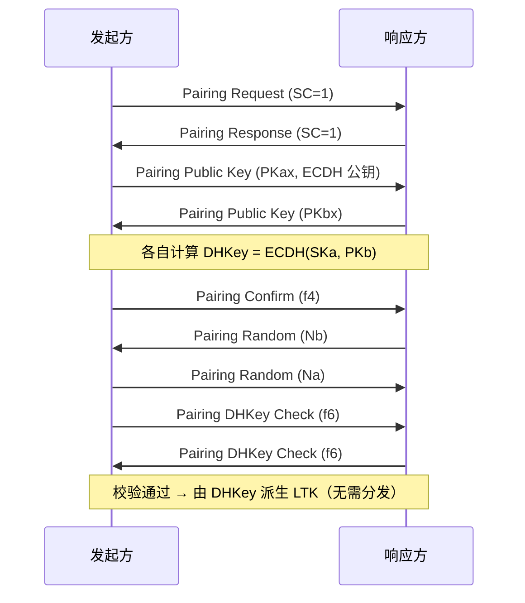

# SMP 安全与配对

> 🌿 知识树位置: 树干 → 枝干[无线关联] → 分枝[BLE] → 叶[06-SMP安全与配对]
> ⬆️ 父节点: [00-BLE概述](00-BLE概述.md)

---

安全管理协议（SMP, Security Manager Protocol）跑在 L2CAP 固定信道 **0x0006** 上，负责配对（Pairing）、加密建立（Encryption）与密钥分发（Key Distribution）。USB 世界里"信任即插即用"，BLE 世界里"先配对、再加密、才谈敏感数据"——这是两棵树安全模型的根本差异。

## 一、配对三阶段



### 1.1 阶段 1：Pairing Request / Response（7 字节定长）

| 偏移 | 长度 | 字段 | 说明 |
|---|---|---|---|
| 0 | 1 | Opcode | 0x01（Request）/ 0x02（Response） |
| 1 | 1 | IO Capability | 见 1.2 表 |
| 2 | 1 | OOB data flag | 0x00 无 / 0x01 有（NFC 等，4.x；5.x 扩展） |
| 3 | 1 | AuthReq | 见下 |
| 4 | 1 | MaxEncKeySize | 7~16 字节 |
| 5 | 1 | Initiator Key Distribution | 位图（加密后发起方想收的密钥） |
| 6 | 1 | Responder Key Distribution | 位图（加密后响应方想收的密钥） |

**AuthReq 位图**：bit0-1 Bonding（0 无 / 1 bonding）、bit2 **MITM**（要求防中间人）、bit3 **SC**（Secure Connections）、bit4 Keypress、bit5 CT2。

密钥分发位图：bit0 LTK/EncKey、bit1 IRK/IdKey、bit2 CSRK/SignKey（legacy 还含 EDIV+Rand；地址随 IRK 分发）。

### 1.2 IO 能力与配对方法

五种 IO 能力（IO Capability，1 字节取值）：

| 值 | 能力 | 例子 |
|---|---|---|
| 0x00 | DisplayOnly | 只能显示 6 位数字 |
| 0x01 | DisplayYesNo | 能显示并确认是/否 |
| 0x02 | KeyboardOnly | 只能输入 |
| 0x03 | NoInputNoOutput | 什么都没有（多数手环/标签） |
| 0x04 | KeyboardDisplay | 都行 |

**方法决策（是否选 MITM 方法）**：

| 组合（发起方 × 响应方） | Legacy Pairing | LE Secure Connections |
|---|---|---|
| 任一方 NoInputNoOutput | Just Works（无 MITM） | **Numeric Comparison 不可用**，仍 Just Works |
| DisplayOnly × KeyboardOnly | Passkey Entry | Passkey Entry |
| DisplayYesNo × DisplayYesNo | Passkey Entry（无 MITM 可能降级） | **Numeric Comparison**（双方比 6 位数字） |
| 有键盘 × 有显示 | Passkey Entry | Passkey Entry 或 Numeric Comparison |
| OOB 可用 | OOB（是否 MITM 取决于 OOB 通道） | OOB |

规则内核：**MITM 保护必须来自"通道外的秘密"（人眼看数字、敲键盘、NFC），纯软件无法凭空创造**。这也是"Just Works 不安全但可用"的根本原因——与 USB 无认证直连相比，BLE 至少把"要不要认证"变成了协议里的显式选项。

## 二、Legacy Pairing vs LE Secure Connections

| 维度 | LE Legacy（4.0/4.1） | LE Secure Connections（4.2+） |
|---|---|---|
| 核心算法 | 自定义函数 c1/s1（AES-128 拼装） | **ECDH P-256** 椭圆曲线 Diffie-Hellman（FIPS 186 曲线） |
| 临时密钥 TK | 由配对方法拼出（Passkey 直接参与运算） | 不存在 TK；口令只用于 f4/f5/f6 校验函数 |
| 被动嗅探 | **可破解**：抓到配对过程即可能算出 STK/LTK（工具 Crackle 就是干这个的） | 不可（ECDH 保密协商，监听者只见公钥） |
| 中间人 | Just Works 下无保护 | Numeric Comparison/OOB 下有保护 |

Legacy 流程（简）：确认值 c1 / 随机数 Mrand 交叉验证（Pairing Confirm 0x03 + Pairing Random 0x04）→ 双方各自算出 **STK**（短期密钥）→ 加密链路 → 加密态下分发 **LTK**（长期密钥）。

SC 流程（简）：



## 三、加密建立（链路层视角）

LTK 就绪后由 LLCP 完成（字段名层面，细节见 Core Spec Vol 6 Part B）：

```
LL_ENC_REQ  (Rand + EDIV[legacy] + SKDm + IVm)
LL_ENC_RSP  (SKDs + IVs)
→ 双方组合 SKD=SKDm‖SKDs、IV=IVm‖IVs，以 LTK 派生会话密钥
LL_START_ENC_REQ → LL_START_ENC_RSP（切换加密，之后所有包带 4 字节 MIC）
```

- Legacy：LTK→（与 SKD 混合）→ STK→会话密钥；SC：LTK 直接派生会话密钥。
- **MIC**：CCM 模式的 4 字节完整性码，篡改即丢包（见 [02-链路层与物理层](02-链路层与物理层.md) 第七节）。

## 四、阶段 3：密钥分发（Encrypt Information，加密态下）

| SMP Opcode | PDU | 内容 |
|---|---|---|
| 0x06 | Encryption Information | LTK（16 B） |
| 0x07 | Master Identification | EDIV(2 B) + Rand(8 B)（legacy 索引用） |
| 0x08 | Identity Information | IRK（16 B） |
| 0x09 | Identity Address Information | 身份地址（类型 + 6 B） |
| 0x0A | Signing Information | CSRK（16 B，签名写用） |
| 0x0B | Security Request | 外设催主机配对（单独使用） |

SC 模式下 LTK 由 DHKey 派生，不走 0x06/0x07 分发；IRK/CSRK/地址仍照发。

## 五、安全等级（Mode 1）

| 级别 | 名称 | 含义 |
|---|---|---|
| Level 1 | No Security | 裸连，如 beacon |
| Level 2 | Unauthenticated pairing with encryption | Just Works 加密（防窃听不防中间人） |
| Level 3 | Authenticated pairing with encryption | Passkey/NC/OOB，防 MITM |
| Level 4 | Authenticated LE Secure Connections | SC + 认证，现行推荐底线 |

GATT 属性权限据此拦人：权限不足时 ATT 回 `Insufficient Authentication (0x05)`，客户端应发起 SMP（见 [04-ATT与GATT](04-ATT与GATT.md)）。

## 六、bonding 后的重连

- 密钥持久化清单：LTK（+EDIV/Rand）、IRK + 身份地址、CSRK、（外设侧）数据库哈希/CCCD 记忆。
- 重连识别：广播用 **RPA**，主机用 IRK 解析（流程见 [05-GAP与连接管理](05-GAP与连接管理.md)）；或用 ADV_DIRECT_IND 定向高占空比重连。
- 重连后立即用 LTK 走 LL_START_ENC 恢复加密，无需重新配对——键鼠"开机即用"的体验全部依赖 bonding。

## 七、已知弱点与最佳实践

| 弱点 | 说明 | 对策 |
|---|---|---|
| Just Works | 无 MITM：攻击者可夹在中间代答 | 需要安全的产品用 Numeric Comparison/OOB；硬件加确认键 |
| 固定 Passkey | 键盘只显示固定 6 位（"000000"）= 形同虚设 | 使用动态 Passkey 或 SC |
| Legacy 可被动破解 | 抓包配对过程可恢复密钥（工具 Crackle 一条命令） | 强制 LE Secure Connections（4.2+，现在芯片全面支持） |
| 配对弹窗钓鱼 | 诱导用户对攻击者设备点"配对" | 用户教育 + OS 显示设备名/图标核对 |
| 广播隐私 | 静态地址可被追踪 | 启用 RPA（15 分钟轮换） |

**BLE Mesh 一笔带过**：蓝牙 Mesh（2017）的安全模型独立于 SMP——进网（Provisioning）用独立的椭圆曲线流程，业务数据用 **Application Key / Network Key** 两层密钥体系加密，与点对点配对互不复用，详见 Mesh Profile Specification。

## 相关节点

- [02-链路层与物理层](02-链路层与物理层.md) —— CCM/MIC 在空口的形态
- [04-ATT与GATT](04-ATT与GATT.md) —— 权限与 Insufficient Authentication
- [05-GAP与连接管理](05-GAP与连接管理.md) —— IRK/RPA 与 bonding 生命周期
- [07-HOGP-HIDoverGATT](07-HOGP-HIDoverGATT.md) —— HOGP 对加密链路的强制要求
