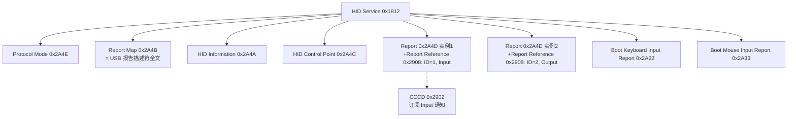
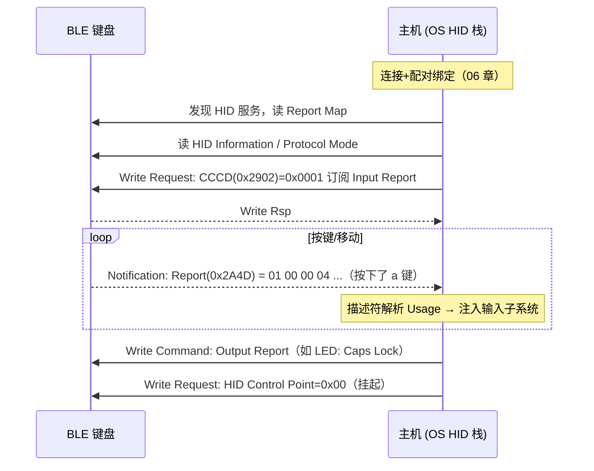

# HOGP：HID over GATT

> 🌿 知识树位置: 树干 → 枝干[无线关联] → 分枝[BLE] → 叶[07-HOGP]
> ⬆️ 父节点: [00-BLE概述](00-BLE概述.md)

---

HOGP（HID over GATT，规范版本 1.0）是 **BLE 挂回 USB 知识树的关键枝点**：键盘鼠标的报告语义完全不变，只是把 USB 的"中断端点轮询"换成了 GATT 的"CCCD 订阅 + Notification"。OS 端 HID 驱动解析的东西——报告描述符、报告 ID、Usage——与 USB-HID 一字不差。

## 一、报告描述符完全复用

HOGP 的 Report Map 特征里放的就是一份**原汁原味的 USB HID 报告描述符**（Usage/Item 编码体系），解析器可直接复用：

👉 Item 编码规则见：[02-报告描述符与Item编码](../../20-枝干-设备类协议/HID-人机接口设备/02-报告描述符与Item编码.md)
👉 跨传输总览见：[10-HID跨传输I2C与BLE](../../20-枝干-设备类协议/HID-人机接口设备/10-HID跨传输I2C与BLE.md)

这意味着厂商只需维护一份描述符：USB 有线模式与 BLE 无线模式共用；对操作系统而言"插线是 HID 键盘，蓝牙也是 HID 键盘"，应用层零改动。

## 二、HID 服务（UUID 0x1812）结构



### 2.1 各特征字段详解

| 特征 | UUID | 读/写 | 内容 |
|---|---|---|---|
| Report Map | 0x2A4B | 读 | 完整 HID 报告描述符字节串（与 USB 描述符逐字节相同） |
| HID Information | 0x2A4A | 读 | 4 B：bcdHID(2，如 0x0101=1.01) + bCountryCode(1) + Flags(1，bit0 Remote Wake、bit1 Normally Connectable) |
| Protocol Mode | 0x2A4E | 读/写 | 0x00=Boot 协议 / 0x01=Report 协议（与 USB SET_PROTOCOL 语义一致） |
| HID Control Point | 0x2A4C | 写 | 0x00=挂起（SUSPEND）、0x01=退出挂起（EXIT_SUSPEND） |
| Report | 0x2A4D | 读/写/Notify | 报告本体；同一 UUID 可有多个实例，靠 Report Reference 区分 |
| Boot Keyboard Input Report | 0x2A22 | 读/Notify | BIOS 兼容的 8 B 键盘报告 |
| Boot Mouse Input Report | 0x2A33 | 读/Notify | BIOS 兼容的 3~4 B 鼠标报告 |

### 2.2 Report Reference 描述符（0x2908）：与 USB wValue 同构

每个 Report 实例挂一个 Report Reference Descriptor，2 字节：

| 偏移 | 字段 | 取值 |
|---|---|---|
| 0 | Report ID | 1~255（0 表示无 ID） |
| 1 | Report Type | 0x01 Input / 0x02 Output / 0x03 Feature |

对照 USB 的 `GET_REPORT/SET_REPORT`：`wValue 低字节 = 报告类型（1/2/3），高字节 = 报告 ID`——**同样的二元组**，两边编码同构，主机栈可以共用查找表。

### 2.3 配套标准服务

| 服务 | UUID | 内容 |
|---|---|---|
| Battery Service | 0x180F | Battery Level 0x2A19（0~100%，Notify；键鼠电量显示靠它） |
| Device Information | 0x180A | **PnP ID 0x2A50**：VID Source(1)+VID(2)+PID(2)+Version(2)；注意 VID Source 0x01 = USB-IF 分配的 VID——BLE 设备沿用 USB 的厂商编号体系 |
| Scan Parameters | 0x1813 | Scan Interval Window 0x2A10：外设告诉主机"请按此节奏扫描"，为主机省电 |

## 三、数据流：一次按键的旅程



要点：

- **Input 报告**走 Notification（订阅后外设主动推）；**Output 报告**（键盘 LED）走主机写入；**Feature 报告**走 Read/Write Request。
- HOGP 规范要求报告访问需**加密链路**（部分权限要求认证），所以没配对完通常拿不到报告——这就是蓝牙键鼠必须配对的原因。
- CCCD 按连接独立存储，bond 后重连主机要重新（由栈自动）写 CCCD（见 [04-ATT与GATT](04-ATT与GATT.md) 3.2 节）。

### 3.1 报告字节示例

键盘 Input Report（Report ID=1，8 B 标准布局，描述符同 USB）：

```
01 00 00 04 00 00 00 00
│  │  │  └─ Key1 = 0x04 = 'a'
│  │  └─ 保留
│  └─ Modifier = 0x00（无 Ctrl/Shift）
└─ Report ID = 1
```

## 四、主机侧实现现状

| 平台 | 支持 |
|---|---|
| Windows | 8.1 起原生支持 HOGP 键鼠；报告注入走系统 HID 类栈 |
| Linux | BlueZ 的 HOG（HID over GATT）子系统把 BLE 报告转成 uhid 虚拟设备，进内核 HID core，与 USB-HID 同一条下游管线 |
| Android | 原生支持 BLE 键鼠（早期版本支持键盘，鼠标支持随后加入；随版本而异） |
| iOS/iPadOS | 13 起支持蓝牙鼠标，键盘更早；系统级无障碍驱动 |

主机侧开发的通常形态：**厂商只需提供描述符正确的固件，OS 原生驱动接管**；私有扩展按键（多媒体滚轮自定义层）则另开厂商 Report ID 通道。

## 五、与经典蓝牙 HID Profile 对比

| 维度 | 经典蓝牙 HID（BR/EDR） | HOGP（BLE） |
|---|---|---|
| 承载 | L2CAP PSM 0x0011（控制）/0x0013（中断） | GATT 特征 + Notification |
| 描述符 | 同一套 HID 报告描述符 | 同一套（放 Report Map） |
| 连接建立 | inquiry/page 秒级 | 广播 + CONNECT_IND 毫秒级 |
| 功耗 | 高（持续链路） | 极低（事件化） |
| Boot 协议 | 有 | 有（0x2A22/0x2A33 + Protocol Mode） |
| 现状 | 老蓝牙键鼠，逐渐退出 | 当前主流 |

## 六、双模设备：一份描述符，两种传输

典型双模键盘主控：USB 线插入 → 枚举为 USB-HID 复合设备（走有线）；拔线 → 走 BLE HOGP；两种模式的报告格式、Report ID、描述符完全一致，OS 感知不到差异（甚至同时连接时部分固件会自动切换）。实现细节与 I2C 另一传输见：

👉 [10-HID跨传输I2C与BLE](../../20-枝干-设备类协议/HID-人机接口设备/10-HID跨传输I2C与BLE.md)

## 七、GATT 数据库片段示例（YAML）

```yaml
# 一只 BLE 鼠标的 GATT 数据库（节选）
services:
  - uuid: 0x1800        # GAP
    characteristics:
      - { uuid: 0x2A00, value: "BLE Mouse", read: true }
      - { uuid: 0x2A01, value: 0x00C2 }        # Appearance: Mouse
  - uuid: 0x1801        # GATT
    characteristics:
      - { uuid: 0x2A05, indicate: true }       # Service Changed
  - uuid: 0x1812        # HID Service
    characteristics:
      - { uuid: 0x2A4A, value: [0x11, 0x01, 0x00, 0x03] }  # bcdHID=1.11, flags: RW+NC
      - { uuid: 0x2A4B, read: true, value: "<报告描述符原始字节>" }
      - { uuid: 0x2A4E, value: 0x01 }          # Protocol Mode = Report
      - uuid: 0x2A4D                           # Report 实例 1
        descriptors:
          - { uuid: 0x2908, value: [0x01, 0x01] }   # ID=1, Input
        notify: true
      - uuid: 0x2A4D                           # Report 实例 2
        descriptors:
          - { uuid: 0x2908, value: [0x01, 0x02] }   # ID=1, Output
        write: true
  - uuid: 0x180F        # Battery
    characteristics:
      - { uuid: 0x2A19, value: 0x5A, notify: true }  # 90%
```

## 相关节点

- [04-ATT与GATT](04-ATT与GATT.md) —— CCCD/订阅机制的地基
- [05-GAP与连接管理](05-GAP与连接管理.md) —— 重连与 RPA（键鼠免按对码键的关键）
- [06-SMP安全与配对](06-SMP安全与配对.md) —— HOGP 的加密前提
- [../../20-枝干-设备类协议/HID-人机接口设备/02-报告描述符与Item编码](../../20-枝干-设备类协议/HID-人机接口设备/02-报告描述符与Item编码.md)
- [../../20-枝干-设备类协议/HID-人机接口设备/10-HID跨传输I2C与BLE](../../20-枝干-设备类协议/HID-人机接口设备/10-HID跨传输I2C与BLE.md)
- [../../20-枝干-设备类协议/其他设备类/05-蓝牙控制器类-HCIoverUSB](../../20-枝干-设备类协议/其他设备类/05-蓝牙控制器类-HCIoverUSB.md) —— 主机栈如何经 USB 到达 BLE 控制器
