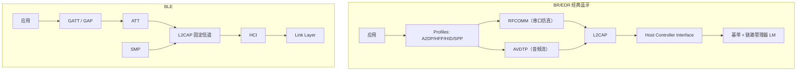
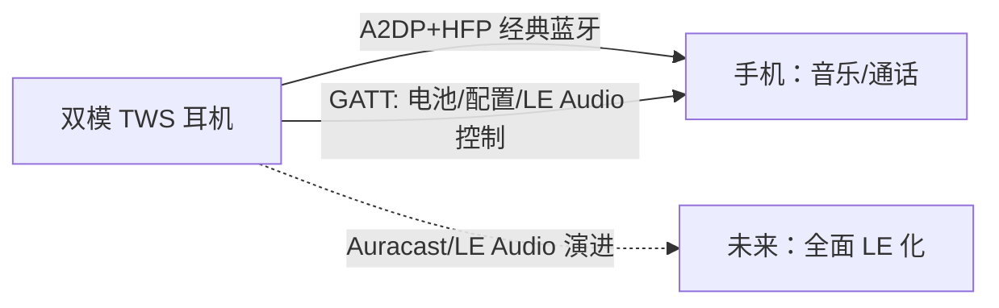

# 经典蓝牙与 BLE 对比

> 🌿 知识树位置: 树干 → 枝干[无线关联] → 分枝[BLE] → 叶[08-经典蓝牙对比]
> ⬆️ 父节点: [00-BLE概述](00-BLE概述.md)

---

"蓝牙"一个名字下装着两套几乎无关的协议栈：BR/EDR（经典蓝牙，Basic Rate / Enhanced Data Rate）与 LE（Low Energy）。共享的只有 2.4 GHz 频段、品牌与（可选的）双模射频前端。本章给全面对照，并回答选型问题。

## 一、全面对比大表

| 维度 | 经典蓝牙 BR/EDR | BLE |
|---|---|---|
| 信道 | 79 × 1 MHz，AFH 剔除坏信道 | 40 × 2 MHz（3 广播 + 37 数据），AFH 思想同源 |
| 调制 | GFSK（1M）+ π/4-DQPSK（2M EDR）+ 8DPSK（3M EDR） | 仅 GFSK（1M / 2M / Coded 500k / 125k） |
| 峰值速率 | 1 / 2 / 3 Mbps（EDR） | 1 / 2 Mbps；Coded 125k/500k；实用吞吐更低 |
| 拓扑 | Piconet：1 主 7 活跃从机，可组 Scatternet | 星型多连接（Central 带多个 Peripheral），数量由芯片调度器定 |
| 连接建立 | inquiry 扫描（典型 10.24 s）+ page 呼叫，秒级~十秒级 | 广播 + CONNECT_IND，毫秒级 |
| 时间模型 | 持续收发的时隙轮询 | 连接事件 + 深睡（Interval 7.5 ms~4 s + Latency） |
| 功耗 | mW 级持续，不适合纽扣电池 | µA 级平均，纽扣电池数年 |
| 配对/安全 | PIN（ legacy）→ SSP（Secure Simple Pairing，ECDH P-256） | SMP：Legacy Pairing → LE Secure Connections（同为 ECDH P-256） |
| 数据模型 | RFCOMM 串口流 / L2CAP 信道 / SDP 服务发现 | ATT 属性表 + GATT 服务/特征 |
| 音频 | SCO/eSCO 语音 + A2DP 流（持续吞吐型） | LE Audio：ISO 等时通道（5.2+） |
| 典型设备 | 耳机、音箱、车机、老键鼠 | 传感器、手环、标签、新键鼠、资产追踪 |
| 命名：芯片 | 双模（Dual-mode）= BR/EDR+LE | 单模（Single-mode，LE only） |

## 二、协议栈对照

两边在 L2CAP 之下没有共享代码路径；连"连接"这个概念的含义都不同（时隙主从 vs 连接事件）。唯一真正"翻译"两界的是 HCI 之上的主机栈。

链路建立时序数字对照：经典蓝牙一次完整连接 = inquiry（典型 10.24 s 扫描窗口）+ page（亚秒级）≈ **数秒到十秒**；BLE = 扫到广播 + 回 CONNECT_IND ≈ **数十毫秒到数秒**（取决于广播间隔）。真无线耳机开盖秒连、手环抬腕即连，都是 BLE 广播模型的红利。

## 三、经典蓝牙 Profile 世界 vs BLE GATT 世界

| 经典 Profile | 用途 | BLE 对应物 |
|---|---|---|
| SPP（串行端口） | 虚拟串口（量产工具、老仪器） | 无标准等价物（Nordic UART Service 0x6E400001-... 为事实标准，非 SIG 规范） |
| A2DP | 高质量立体声音频流 | LE Audio（LC3 + CIS，5.2+） |
| HFP | 免提通话（双向语音） | LE Audio 通话服务（TMAP/ACS 等） |
| HID | 蓝牙键鼠（PSM 0x11/0x13） | **HOGP**（见 [07](07-HOGP-HIDoverGATT.md)） |
| AVRCP | 媒体控制（播放/暂停） | Media Control 服务族（LE Audio） |
| OBEX/FTP/OPP | 文件传输 | 无等价物（被 Wi-Fi/系统分享取代） |

两套世界的服务模型**不可通约**：SDP 服务发现 vs GATT 属性发现，RFCOMM 字节流 vs ATT 属性读写。一台"支持 BLE 的经典蓝牙耳机"不是"简化版"，而是塞了两套栈。

## 四、双模设备策略

现实产品中最常见的分工：

- 耳机：音频走经典 A2DP/HFP（现状最稳），GATT 侧放电量、佩戴检测、配置项；新旗舰开始以 LE Audio 为主路径。
- 键鼠：新设计一律 BLE（HOGP）；仅有线+经典蓝牙双模的老款仍存在。
- 手环/手表：纯 BLE 为主。

### 4.1 配对模型对照（两代 SSP/SMP 同源）

| 关联模型 | 经典蓝牙 SSP | BLE SMP |
|---|---|---|
| Numeric Comparison | 有（两台都带屏） | 有（SC 模式） |
| Just Works | 有（无 MITM） | 有（无 MITM） |
| Passkey Entry | 有 | 有 |
| OOB（NFC） | 有 | 有 |
| 底层算法 | ECDH P-256 | ECDH P-256（SC 模式）/ 自定义 c1/s1（Legacy） |

BLE 的安全模型是向经典蓝牙 SSP"抄作业"后按低功耗重写的，弱点也一脉相承（Just Works）——详见 [06-SMP安全与配对](06-SMP安全与配对.md)。

## 五、LE Audio：更替趋势

| 要素 | 说明 |
|---|---|
| LC3 编解码 | 同音质下码率低于 SBC（A2DP 的默认编码），低功耗高效率 |
| CIS/CIG | Connected Isochronous Stream/Group：等时连接流，天然多路（真无线左右耳不再靠私有转发） |
| BIS/BIG + **Auracast** | 广播音频：一个发射源向无限接收者广播（机场、健身房、教室场景） |
| 现状 | 2022 起规范落地、2023-2025 旗舰手机/耳机逐步支持；A2DP 仍是兼容性基准，短期内两者并存 |

音频编码对照速览：

| 编码 | 所属 | 典型码率 | 评语 |
|---|---|---|---|
| SBC | A2DP 强制 | 328 kbps（高音质档） | 兼容性之王，效率一般 |
| AAC/aptX/LDAC | A2DP 可选扩展 | 256~990 kbps | 厂商授权与专利生态 |
| LC3 | LE Audio 强制 | 160 kbps 起（48 kHz） | 同音质更省电；广播音频唯一标准 |

经典蓝牙 HID 逐渐退出 BLE HOGP 的原因小结：连接建立慢（秒级 vs 毫秒级）、功耗高一个数量级、需要 page/inquiry 全套流程、双模芯片中 BR/EDR 射频成本高——对"纽扣电池遥控器、便携键盘"这类新设计已无理由再选经典 HID。

选型提示：追求"今天就能兼容所有手机"仍选经典 A2DP；面向新设计且目标机型较新，可做双栈（LE Audio 优先 + A2DP 回退）。

## 六、选型决策表

| 需求 | 结论 |
|---|---|
| 与手机/电脑低功耗交换小数据、传感器、穿戴 | BLE |
| 键鼠等 HID，要跨平台连手机 | BLE（HOGP） |
| 键鼠等 HID，只要连 PC 且要 1k~8k Hz 回报率 | 2.4G 私有 dongle（见 [../00-无线概览与USB交汇](../00-无线概览与USB交汇.md)） |
| 立体声音乐、通话，需最大兼容性 | 经典蓝牙（A2DP+HFP），可加 LE Audio 双栈 |
| 虚拟串口连老仪器/产测工具 | 经典 SPP（BLE 没有标准等价物） |
| 一对多广播音频（公共空间） | LE Audio Auracast（经典蓝牙无此能力） |
| 超长距离/穿墙（数百米） | BLE Coded PHY，或直接换 Wi-Fi/LoRa 系 |
| 供电 = 纽扣电池且要跑数年 | 只有 BLE 候选；经典蓝牙与私有 2.4G 常态功耗都不满足 |
| 设备同时要连 PC（插 dongle）和手机 | 双模：BLE 连手机 + 2.4G 私有协议连 dongle（近年游戏键鼠的"三模"即 USB 有线 + BLE + 私有 2.4G） |

## 七、主机栈实现与 USB dongle 的结合点

| 主机栈 | 平台 | 备注 |
|---|---|---|
| BlueZ | Linux | 官方栈；`btusb` 驱动 + HCI over USB；提供 `btvirt` 虚拟控制器 |
| Zephyr | 嵌入式 | Host 与 Controller 同源、可拆可合（HCI UART 直连调试） |
| ESP-IDF NimBLE / Bluedroid | ESP32 系 | NimBLE 轻量（Apache Mynewt 移植）；Bluedroid 全功能 |
| Windows 栈 | Windows | 系统内置，经蓝牙无线电接口加载 dongle 固件 |
| CoreBluetooth | macOS/iOS | 系统栈，GATT 中心视角 |

结合点回到树干：**任何主机栈都是经 HCI 之下的 USB 无线控制器类（0xE0）驱动 dongle 的**——这一跳的完整描述符、端点与固件加载流程见：

👉 [05-蓝牙控制器类-HCIoverUSB](../../20-枝干-设备类协议/其他设备类/05-蓝牙控制器类-HCIoverUSB.md)

## 相关节点

- [00-BLE概述](00-BLE概述.md) —— 版本史
- [01-蓝牙体系架构与HCI](01-蓝牙体系架构与HCI.md) —— 两套栈共享的 HCI 概念
- [07-HOGP-HIDoverGATT](07-HOGP-HIDoverGATT.md) —— HID 双栈并存的实例
- [../99-WirelessUSB与MA-USB历史](../99-WirelessUSB与MA-USB历史.md) —— 被 Wi-Fi Direct 抢走的另一条路
- [../../10-树干-USB核心/01-概述与版本演进](../../10-树干-USB核心/01-概述与版本演进.md) —— 版本演进方法论对照
- [../../20-枝干-设备类协议/其他设备类/05-蓝牙控制器类-HCIoverUSB](../../20-枝干-设备类协议/其他设备类/05-蓝牙控制器类-HCIoverUSB.md)
