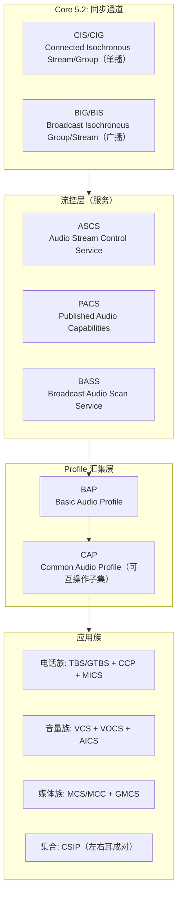
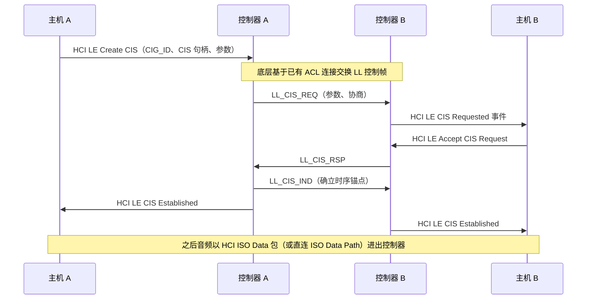
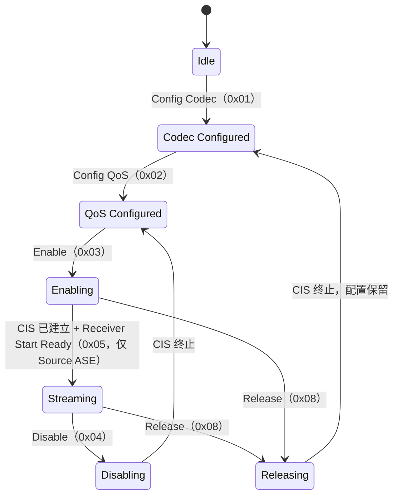
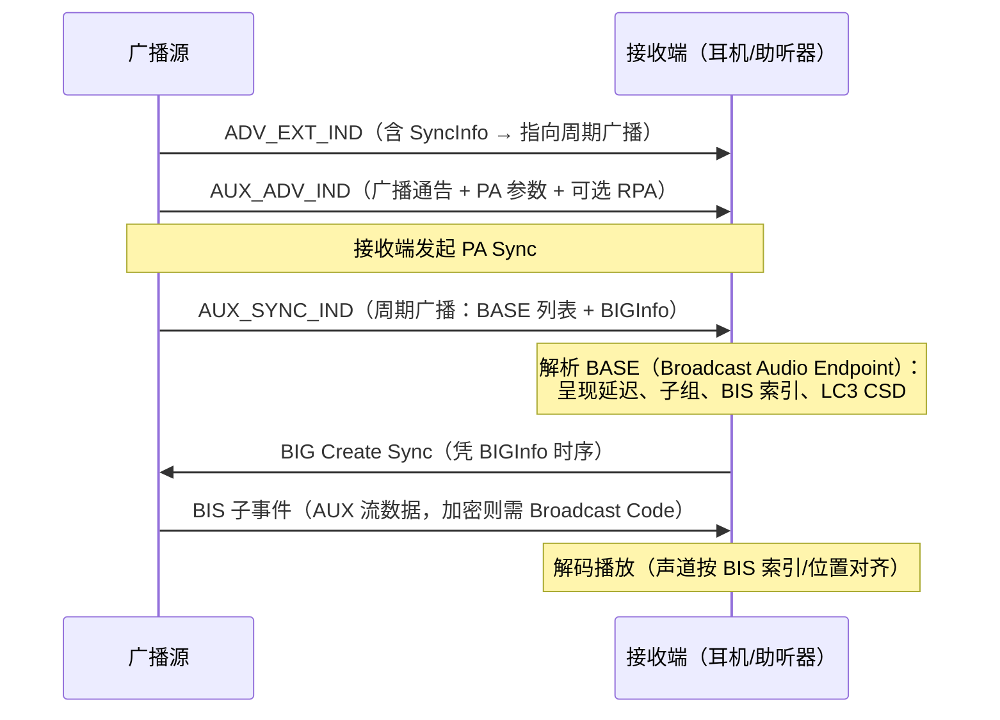
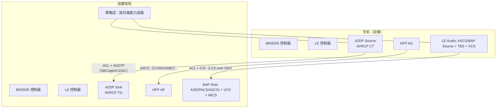

# LE Audio 与 LC3 编解码器

> 🌳 知识树位置: 树干 → 枝干[无线关联] → 分枝[BLE] → 叶
> ⬆️ 父节点: [00-BLE概述](00-BLE概述.md)
> 规范原文缓存索引: [../../80-参考资料/README.md](../../80-参考资料/README.md)

---

LE Audio 是 SIG 基于 Core 5.2 引入的 **同步通道（Isochronous Channels）** 在 BLE 上构建的整套音频体系：用 LE 连接与广播同时承载"流"（而非经典蓝牙 A2DP 那样借用 ACL 异步管道）。它由十几个 adopted specification 组成——BAP、ASCS、PACS、BASS、CAP、电话族、音量族，加上新编码器 **LC3（Low Complexity Communication Codec）**。对 USB 世界的类比：LE Audio 相当于"等时传输（Isochronous Transfer）进音频"——这是 BLE 与 USB 在传输类型设计上罕见的一一对应。

## 一、体系全景：规范分层

| 缩写 | 全称 | 职责 |
|---|---|---|
| BAP | Basic Audio Profile | 单播/广播音频流的建立、CSD/QoS 约束的总纲 |
| ASCS | Audio Stream Control Service | ASE（Audio Stream Endpoint，音频流端点）状态机与控制点 |
| PACS | Published Audio Capabilities | 对外发布自己支持的编码能力、位置、上下文 |
| BASS | Broadcast Audio Scan Service | 广播音频扫描（Scan Delegator 侧），协助加入 BIG |
| CAP | Common Audio Profile | 把上述服务组合成可互操作的通用用例（呼叫/媒体/音量） |
| CSIP | Coordinated Set Identification Service | 左右耳塞/多设备成套识别（同一 RSI 成组） |
| TMAP | Telephony and Media Audio Profile | 手机/耳塞/音箱的"通话+媒体"角色组合声明 |

## 二、同步通道：CIS/CIG 与 BIG/BIS

| 概念 | 说明 |
|---|---|
| CIS | Connected Isochronous Stream，建立在一条 ACL 连接上的同步流（点对点，可双向） |
| CIG | Connected Isochronous Group，多条 CIS 的调度容器；同一 CIG 内各 CIS 事件互不重叠，保证多流同步 |
| BIG | Broadcast Isochronous Group，无连接广播的调度容器（一对多，单向） |
| BIS | BIG 内的一条广播流（如左声道 BIS / 右声道 BIS） |
| CSD | Codec Specific Configuration，编解码私有配置（帧长、每帧字节数、声道数等 LTV 列表） |
| QoS | 服务质量参数集（SDU 间隔、重传次数、传输延迟、呈现延迟），见下表 |

### 2.1 单播 QoS 配置参数（CIG/CIS 级）

| 参数 | 典型取值 | 含义 |
|---|---|---|
| SDU_Interval | 7,500 / 10,000 μs | 上层交付一帧语音数据的周期（与 LC3 帧长对齐） |
| Max_SDU | 26~120+ 字节 | 单个 SDU 上限（由码率×帧长决定） |
| RTN（Retransmission Number） | 1~5 | 每个 CIS 事件内的重传次数 |
| Max_Transport_Latency | 10~100 ms | 控制器侧允许的最大传输延迟 |
| Presentation_Delay | 数十 ms 起 | 接收端"收齐到播出"的缓冲延迟（约束见 BAP） |
| CIG_Sync_Delay / CIS_Sync_Delay | 控制器计算 | 同步参考点，保证多声道同时对齐播放 |

### 2.2 CIS 建立流程概貌

要点：CIS 不是新的链路层"连接"，而是挂在 ACL 连接上的**定时子事件序列**；数据通道可经 HCI（HCI ISO Data packets）或由厂商 ISO Data Path（PCM/I2S 直通编解码器）旁路主机栈。HCI over USB 的实现中，ISO 数据走独立的 HCI ISO Data 包类型（见 [05-蓝牙控制器类-HCIoverUSB](../../20-枝干-设备类协议/其他设备类/05-蓝牙控制器类-HCIoverUSB.md)）。

BIG 侧对应参数在 **BIGInfo**（周期广播扩展头里广播）：BIG_Offset、ISO_Interval、NSE（子事件数）、BN（每事件突发数）、IRC/PTO（重传策略）、SeedAccessAddress 等——接收者无需任何连接即可凭它解出 BIS，字段定义见 Core Spec 的 Periodic Advertising / BIG 部分。

## 三、流控三件套：PACS / ASCS / BASS

### 3.1 PACS：能力发布

PACS 用 GATT 特征值对外发布能力，核心是 **PAC 记录**（一条记录 = 一种编码配置能力）：

| 字段 | 长度/类型 | 说明 |
|---|---|---|
| Codec_ID | 5 字节 | Coding Format（LC3 = 0x06）+ Company ID（2）+ Vendor Codec ID（2） |
| Codec Specific Capabilities | LTV 列表 | 支持的采样率位图、帧时长（7.5/10ms 位图）、声道数、每帧最小/最大字节数、每 SDU 最大帧数 |
| Metadata | LTV 列表 | 流上下文（对话/媒体/游戏/…）、程序信息等 |
| Codec Specific Configuration | LTV 列表 | 推荐的默认 CSD |

另有 Sink/Source Locations（声道位置位图：前左 bit0、前右 bit1、…）与 Available/Supported Audio Contexts 特征值。完整字段定义见 PACS 规范。

### 3.2 ASCS：ASE 状态机（核心）

每个方向每条流占一个 ASE，客户端通过 ASE Control Point 特征值下发操作驱动状态迁移：

注：以上为主干路径；Update Metadata（0x07）可在 Enabling/Streaming 中原地更新，失败回退与自治迁移（如链路丢失）的完整规则见 ASCS 规范。

| ASE 状态 | 语义 |
|---|---|
| Idle | 未配置 |
| Codec Configured | CSD 已选好，未定 QoS |
| QoS Configured | QoS 参数已定，等 Enable |
| Enabling | 已请求建立 CIS，等数据路径就绪 |
| Streaming | 音频流传输中 |
| Disabling | 暂停中（保留 QoS），CIS 终止后回 QoS Configured |
| Releasing | 释放中，CIS 终止后回 Codec Configured |

### 3.3 BASS：广播扫描与"代扫"

BASS 位于接收设备（如耳机，角色 Scan Delegator），允许手机等（角色 Broadcast Assistant）远程代为扫描广播源：助手扫描到 BASE 后，通过 BASS 的 Add Source 操作把广播源信息（广播 SID、地址、PA 周期、BIG 加密信息）写给 Delegator，由 Delegator 自己完成 PA/BIG 同步。另可选 BIG 加密（Broadcast Code，128 位），写进 BASS 即解密。**Scan Offloader** 是被助手委托执行扫描的第三个角色。

## 四、电话族与音量族

| 服务/Profile | 缩写 | 作用 |
|---|---|---|
| Generic Telephone Bearer Service | GTBS | 通用电话承载：来去电列表、呼入/呼出/活动呼叫状态 |
| Telephone Bearer Service | TBS | 厂商扩展电话承载（多 SIM/多线路时每个承载一个实例） |
| Call Control Profile/Service | CCP/CCS | 呼叫控制（接听/挂起/合并等，由 GTBS/TBS 特征值操作） |
| Microphone Control Service | MICS | 静音控制（本端麦克风 Mute 状态） |
| Volume Control Service | VCS | 总音量 + Mute |
| Volume Offset Control Service | VOCS | 每个音频输入源的相对音量偏移 |
| Audio Input Control Service | AICS | 输入源描述/增益模式/静音状态 |

CAP 把这些拼成用例：Unicast 呼叫 = ASCS + TBS/GTBS + MICS + VCS；媒体 = ASCS + MCS/MCC（Media Control，含 Now Playing、搜索）+ VCS；左右耳 = CSIP（RSI 成组）+ BAP 多流。全部走 GATT（见 [04-ATT与GATT](04-ATT与GATT.md)），没有私有 AT 命令——这是与经典 HFP 最大的架构差异。

## 五、LC3 编解码器

LC3 是 SIG 为 LE Audio 指定的编码器（规范《Low Complexity Communication Codec》），**BAP 中唯一必选**的 Coding Format（0x06）。

| 参数 | 取值 |
|---|---|
| 帧时长 | 7.5 ms 或 10 ms（二选一，逐流配置） |
| 采样率 | 8 / 16 / 24 / 32 / 44.1 / 48 kHz |
| 码率 | 16~320 kbps，逐帧可变（帧长按字节整数配置） |
| 声道 | 单声道流；立体声 = 两条流/两个 ASE（保证声道同步与独立重传） |
| 算法骨架 | DC 去除 + LTPF 长时后滤波 + MDCT 变换 + 谱系数量化 + 算术编码；帧间无依赖，丢一帧不扩散 |

**帧结构概念**：一帧 = 固定时长采样块 → 编码为 `Octets_per_Frame` 字节；`Octets_per_Frame = 码率 × 帧时长 ÷ 8`，例如 80 kbps × 10 ms = 100 字节/帧，10 ms 内塞进一个 SDU。发送端逐帧独立编码，接收端错帧最多损失一帧音频。

**与 SBC 对比**（SBC 为经典 A2DP 必选编码，见 [11-经典蓝牙Profile详解](11-经典蓝牙Profile详解.md)）：

| 维度 | LC3 | SBC |
|---|---|---|
| 归属 | SIG LE Audio 指定 | A2DP 必选（BR/EDR） |
| 帧时长 | 固定 7.5/10 ms 两档 | 随参数变化（子带/块配置），约数 ms 量级 |
| 算法 | MDCT + 算术编码 | 子带编码（4/8 子带）+ 位分配 + 块缩放 |
| 同码率质量 | 显著优于 SBC；SIG 宣称同质量下码率约为 SBC 一半 | 基线 |
| 码率范围 | 16~320 kbps 连续可调 | A2DP 高质量档典型上限 ~328 kbps（44.1 kHz Joint Stereo） |
| 承载 | LE ISO（CIS/BIS） | BR/EDR ACL（L2CAP，见 A2DP 篇） |
| 系统延迟 | 算法延迟约一帧量级，且端到端延迟由 QoS 参数显式控制 | 算法延迟低但系统延迟由 A2DP 缓冲策略支配，不可显式协商 |

## 六、延迟构成分析

LE Audio 端到端延迟 = 各段之和，且**每段都可被 QoS 参数显式约束**：

| 段 | 构成 | 由谁控制 |
|---|---|---|
| 采集/编码缓冲 | 攒满一个 SDU 间隔（7.5/10 ms）+ LC3 编码处理 | SDU_Interval、终端处理能力 |
| 控制器排队+重传 | CIS 事件调度 + RTN 次重传机会 | RTN、Max_Transport_Latency |
| 空口传输 | CIS 事件间隔内的子事件 | CIS/CIG 调度（控制器） |
| 接收缓冲/呈现 | 收齐到播出的缓冲 | **Presentation_Delay（接收端声明，发送端确认）** |
| 解码/输出 | LC3 解码 + DAC | 终端处理能力 |

对比 A2DP：延迟大头是发送端深缓冲（数十至数百 ms）且完全由实现自定；LE Audio 把延迟变成协商参数——这正是 GMAP 游戏场景能压低延迟的机制基础。

## 七、Auracast 广播音频

Auracast 是基于 BIG/BIS 的公共广播品牌化用例：一个发射源（手机/笔记本/机场电视）无限量接收（耳机、助听器、音箱）。接收加入时序：

- **BASE** 位于周期广播数据中：呈现延迟（3 字节）+ 子组列表（每组含 BIS 数、Codec_ID、CSD、各 BIS 索引与配置）。
- 加入公共广播通常由 **Broadcast Assistant**（手机）扫描并经 BASS 协助耳机完成 PA/BIG 同步；直接在耳机上扫码/按键也能自行完成（BASE 里有推荐配置）。
- 加密广播 = BIG 级 128 位 Broadcast Code，凭二维码/密码分发。

## 八、GMAP 与 HEA

**GMAP（Gaming Audio Profile）**：面向游戏的规范族，在 BAP 之上定义低延迟配置与"游戏音频 + 语音聊天"多流并行（角色 Game Gateway / Game Terminal 等），用更小的 SDU、更短的呈现延迟换实时性，是"LE Audio 天然低延迟"的极致体现。

**HEA（Hearing Access）**：助听体系（HAP Hearing Aid Profile + HAS 服务），让助听器成为 LE Audio 一等公民：双耳同步流、环境声模式、程序切换，并借助 Auracast 直接接收公共场合广播——传统助听器要靠外挂中转器，HEA 后原生直连。

## 九、与经典 A2DP 并存：双模耳机架构

并存策略：双模耳机同时具备 BR/EDR 与 LE 射频，按对端能力与信号质量选路——老旧手机走 A2DP+HFP，新手机可走 LE Audio（TMAP 兼容性更好、功耗更低、还顺带获得 Auracast 接收能力）。迁移期普遍"双栈都留"，互操作由各 Profile 独立保证。

## 十、实现状态与芯片支持

- 芯片：Nordic nRF53/nRF54 系列（nRF Connect SDK 内置 LE Audio 栈与 LC3）、Qualcomm S5/S7 音频平台、Silicon Labs、ST（STM32WBA）、Telink 等均有公开的 LE Audio 支持（以各厂商发布资料为准）。
- 操作系统：Android 自 13 起内置 LC3 与 LE Audio 协议栈并逐步成熟；Windows 11 已提供 LE Audio 支持；苹果侧从助听器场景（iOS 18 起）接入 LE Audio，媒体生态仍以自有方案为主——以各平台当前文档为准。
- 规范版本：BAP/ASCS/PACS 等为 1.0/1.0.1 系列，持续修订中；写驱动前应核对 SIG 当前 adopted version 列表。

## 十一、调试要点：ASE 状态卡住排查

ASE Control Point 返回码先看：0x00 成功、0x01 资源不足、0x02 无效 ASE 索引、0x03 当前状态不允许该操作（其余码见 ASCS）。

| 现象 | 检查点 |
|---|---|
| 停在 Codec Configured | Config QoS 未发/被拒；PACS 声称的能力与 CSD 不匹配（采样率、帧长、每帧字节数超范围） |
| Enable 后不动（卡 Enabling） | CIS 建立失败：抓 LL_CIS_REQ/RSP/IND 看 ACL 是否存活、参数是否越界；ISO Data Path 是否 Setup（HCI LE Setup ISO Data Path 方向配反是高频错误） |
| Streaming 但无声 | Presentation_Delay 过小被拒；SDU 内容帧长与协商 CSD 不一致；Source ASE 未等 Receiver Start Ready 就发数据 |
| 随机断流 | RTN 不足以覆盖射频环境；SDU_Interval 与帧长不匹配（7.5ms 帧配 10ms 间隔） |
| 广播收不到 | PA Sync 未建立就先 BIG Sync（顺序必须 PA → BIG → BIS）；加密 BIG 未写 Broadcast Code |

工具：Android btsnoop（Wireshark 解 ATT/ASCS 操作）、Ellisys/nRF Sniffer 空口抓 LL_CIS 与 BIG 包；对照 HCI 日志中 LE CIS Established 事件参数核对 QoS。

## 相关节点

- [03-广播与连接](03-广播与连接.md) —— 周期广播/扩展广播是 BASE 与 BIGInfo 的载体
- [04-ATT与GATT](04-ATT与GATT.md) —— PACS/ASCS/BASS 全部是 GATT 服务
- [05-GAP与连接管理](05-GAP与连接管理.md) —— 单播音频的 ACL 连接前提
- [08-经典蓝牙与BLE对比](08-经典蓝牙与BLE对比.md) —— 与 A2DP 体系的总对照
- [11-经典蓝牙Profile详解](11-经典蓝牙Profile详解.md) —— A2DP/AVDTP 与 SBC 细节
- [05-蓝牙控制器类-HCIoverUSB](../../20-枝干-设备类协议/其他设备类/05-蓝牙控制器类-HCIoverUSB.md) —— HCI ISO Data 包在 USB 上的形态
- [00-无线概览与USB交汇](../00-无线概览与USB交汇.md) —— 无线与 USB 知识树交汇点
