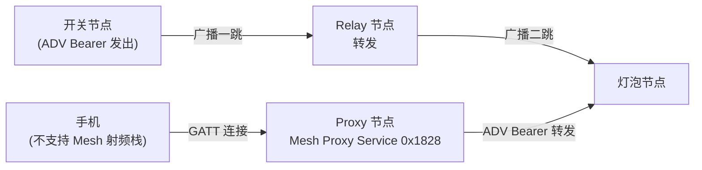
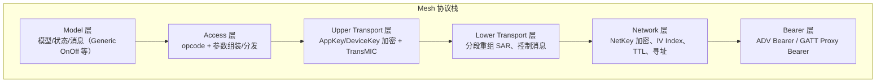
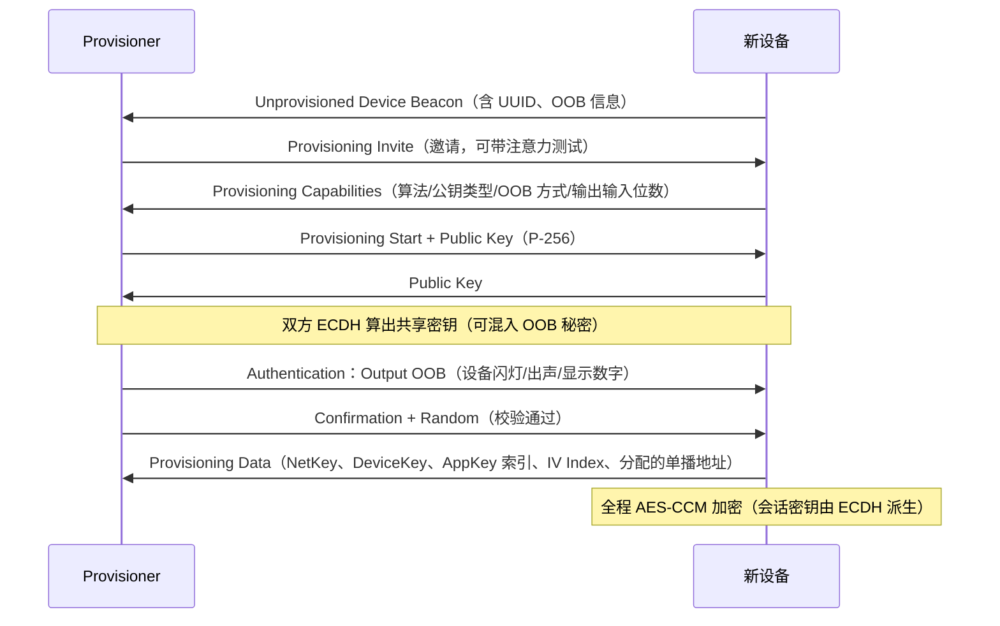

# Mesh 网络概述

> 🌳 知识树位置: 树干 → 枝干[无线关联] → 分枝[BLE] → 叶
> ⬆️ 父节点: [00-BLE概述](00-BLE概述.md)
> 规范原文缓存索引: [../../80-参考资料/README.md](../../80-参考资料/README.md)

---

蓝牙 Mesh（Mesh Profile Specification 1.0 于 2017 采纳，1.1 于 2023 修订）是**独立于 GATT 连接模型的多对多（many-to-many）网络**：节点之间不需要建立连接，靠"管理型泛洪（Managed Flooding）"把消息扩散全网。它与前几篇的"点对点连接"是平行的两套世界——唯一交集是：Mesh 消息既可以躺在 BLE 广播包里传播，也可以借一条普通 GATT 连接穿越"只有手机有 Mesh 射频"的死角。

## 一、与 BLE 单跳连接的关系

BLE 链路层是单跳的：连接或广播都只有一跳。Mesh 在其上加了一层"网络层"负责多跳转发：

| 承载（Bearer） | 载体 | 说明 |
|---|---|---|
| Advertising Bearer（ADV Bearer） | BLE 广播包（37/38/39 信道） | 专用 AD Type：Mesh Message = 0x2A、Mesh Beacon = 0x2B；无需连接，天然一收多转 |
| GATT Proxy Bearer | GATT 连接上的 Mesh Proxy Service（UUID 0x1828） | 手机/网关把 Mesh PDU 装进 Proxy PDU（Network PDU / Mesh Beacon / Proxy Configuration 三种类型）经连接注入网络 |

## 二、核心角色四件套

| 角色 | 功能 | 功耗特征 |
|---|---|---|
| Relay（中继） | 收到网络层 PDU 后 TTL 减 1 再泛洪转发（TTL≥2 才转；同一消息按缓存去重） | 常供电 |
| Proxy（代理） | GATT 与 ADV 两种承载间的桥接，跑 Mesh Proxy Service | 常供电或中功耗 |
| Friend（朋友） | 为 LPN 缓存消息（Friend Queue），在 LPN 轮询时下发 | 常供电，缓存有容量上限 |
| LPN（Low Power Node，低功耗节点） | 大部分时间休眠，Friendship 建立后周期性醒来收消息 | 电池供电（传感器典型） |

**Friendship 建立**：LPN 发 Friend Request（指定 Receive Window、队列需求、超时等），候选 Friend 回 Friend Offer（报价：Receive Window 大小、队列容量、RSSI），LPN 择一接受（Friend Poll / Friend Update 完成 friendship 建立）。之后 LPN 按轮询间隔醒来取 Friend Queue 里攒的消息；Friendship 断开有超时机制。细节见 Mesh Profile 的 Friendship 部分。

注意：一个节点可兼任多个角色（如 Relay+Proxy+Friend）；是否支持某角色在节点能力/配置里声明。

## 三、网络分层模型

### 3.1 Network 层 PDU 格式概貌

| 偏移 | 大小 | 字段 | 说明 |
|---|---|---|---|
| 0 | 1 bit | IVI | IV Index 最低位，接收端据此匹配当前/上一 IV Index |
| 0 | 7 bit | NID | 由 NetKey 派生（k2 算法）的网络标识，节点据此判断"是否认识这个网络" |
| 1 | 1 bit + 7 bit | CTL + TTL | CTL=1 为控制消息（走 DeviceKey、可免应用层加密）；TTL 每次转发减 1 |
| 2~4 | 3 字节 | SEQ | 序列号，防重放（同一 SRC 不允许重复） |
| 5~6 | 2 字节 | SRC | 源单播地址 |
| 7~8 | 2 字节 | DST | 目的地址（单播/组播/虚拟，见下表） |
| 9~ | 变长 | 传输 PDU + NetMIC | 下层运输 PDU + 网络层 MIC（CTL=0 为 4 字节，CTL=1 为 8 字节） |

整个 Network PDU 上限 **29 字节**——所以应用有效载荷极小，长内容必须靠分段。

**地址类型**：

| 地址范围 | 类型 |
|---|---|
| 0x0000 | 未分配（Unassigned） |
| 0x0001~0x7FFF | 单播（Unicast，每个 Element 一个） |
| 0x8000~0xBFFF | 虚拟（Virtual，16 字节 Label UUID 的哈希标签） |
| 0xC000~0xFFFF | 组播（Group，如 0xFFFF 全节点、0xC000 起 SIG 预留组） |

### 3.2 Lower Transport：分段重组（SAR）

| 形态 | 有效载荷上限 | 机制 |
|---|---|---|
| 未分段（Unsegmented） | 15 字节 | 单包直达，开销最小 |
| 分段（Segmented） | 12 字节 × (SegN+1) 段 | 每段带 SeqZero（同一上层数据的段组标识）+ SegO/SegN；接收端回 **Segment Acknowledgment**（CTL=1 控制消息）补齐丢段 |

### 3.3 Upper Transport 与双重加密设计

Mesh 的标志性安全设计：**一份数据，两层加密**。

| 层 | 密钥 | 保护内容 | MIC |
|---|---|---|---|
| 网络层 | **NetKey**（全网共用） | 源/目的地址、传输 PDU（含应用数据） | NetMIC 4/8 字节 |
| 应用层 | **AppKey**（按应用绑定） | Access Payload（opcode + 参数） | TransMIC 4/8 字节 |
| 特殊 | **DeviceKey**（每节点独有） | 配置消息（Configuration Model） | 同应用层 |

意义：中继节点只有 NetKey——它能"看懂"路由信息并转发，却**永远解不开应用数据**；不同应用（灯光 AppKey1、门锁 AppKey2）互相隔离，灯光节点就算被攻破也动不了门锁。加密算法为 AES-CCM。

### 3.4 Access 与 Model 层

Access 层把 Upper Transport 解出的 payload 按 opcode 分发给对应 Model。**消息模型三概念**：

- **Element（元素）**：节点上可独立寻址的最小单元，每个 Element 一个单播地址。一个灯泡可以是 1 个 Element（含开关+亮度两个模型），也可以拆成 2 个。
- **Model（模型）**：某类功能的定义 = 状态（State）+ 消息（Opcode）+ 行为。分 Server（持有状态、响应消息）/ Client（发命令）两侧。
- **State（状态）**：如 Generic OnOff 的 OnOff 布尔值、Generic Level 的 int16。

**发布-订阅（Publish/Subscribe）**：发送者向一个组地址/虚拟地址"发布"，所有订阅该地址的节点处理该消息。多对多的解耦核心——开关不需要知道有几盏灯、灯的地址是什么。

**SIG 基础模型示例——Generic On/Off**：

| 消息 | Opcode | 方向 |
|---|---|---|
| Generic OnOff Get | 0x8201 | Client → Server |
| Generic OnOff Set | 0x8202 | Client → Server（要求回 Status） |
| Generic OnOff Set Unacknowledged | 0x8203 | Client → Server（不回，靠重复发布保证可靠） |
| Generic OnOff Status | 0x8204 | Server → Client（当前状态 + 目标状态 + 剩余时间） |

Set 消息带 **Transaction Number + 源地址** 做事务去重：泛洪导致重复包很正常，按 (SRC, TID) 窗口内去重即可幂等。Foundation Model 层另有 Configuration Server/Client（组网后改订阅表、发布地址、加 AppKey）与 Health Model，配置类消息用 DeviceKey 加密。

## 四、安全体系：Provisioning 配网流程

新设备出厂是"白板"，必须由 **Provisioner（配网者，通常手机/网关）** 执行配网（Provisioning）才能入网：

**认证 OOB（Out of Band）方式**（防 MITM 的关键，思想与 BLE 配对 MITM 同源，见 [06-SMP安全与配对](06-SMP安全与配对.md)）：

| 方式 | 形式 | 例 |
|---|---|---|
| Output OOB | 设备"输出"秘密：闪灯次数/蜂鸣次数/振动/显示数字/字符串 | 灯闪 3 下，用户在 App 输入 3 |
| Input OOB | 用户"输入"秘密：按按键/敲键盘 | 用户按设备按钮 |
| Static OOB | 预置静态密钥（出厂贴纸/二维码） | 扫描设备底部二维码 |
| No OOB | 无认证（同"Just Works"，无 MITM 保护） | 开发调试 |

配网完成后设备获得：NetKey（网络身份）、DeviceKey（独有配置密钥）、初始 AppKey、IV Index 快照与一个单播地址段。此后换 AppKey/加网络走 Configuration Model 的 Key Refresh / NetKey 管理。

**IV Index 与 IV Update 流程**：IV Index 是全网共享的 32 位计数器，参与 nonce 构成防重放。节点在 Normal Operation 至少 **96 小时** 后可进入 IV Update In Progress（IV Index 递增用于发送，同时仍容忍旧值接收，防个别节点时钟落后），再经至少 96 小时回到 Normal。规范还允许"IV Recovery"恢复长期离线节点（约束见 Mesh Profile）。

## 五、场景与限制

| 维度 | 评价 |
|---|---|
| 规模 | 数百节点级成熟；泛洪的重复包随密度上升，超大规模需仔细规划 Relay 密度 |
| 延迟 | 每跳转发有排队与扫描间隔开销，多跳链路延迟抖动明显；不适合高实时控制 |
| 时延 vs 确定性 | 管理型泛洪无路由建立，鲁棒但非确定延迟 |
| 与 Zigbee 对比一句话 | Zigbee 是"建路由表的网状网"（AODV 式，延迟低但路由维护复杂），蓝牙 Mesh 是"管理型泛洪"（零路由状态、部署简单，代价是重复包与调度开销） |
| 典型场景 | 智能照明、楼宇传感器网络、工业监控（低速率、广覆盖、电池设备多） |

1.1 版补充了定向转发（Directed Forwarding）、基于 EDCA 的子集等改进以缓解规模/延迟问题，详见 Mesh Protocol 1.1。

## 六、实现栈

| 栈 | 说明 |
|---|---|
| Zephyr BLE Mesh | Zephyr RTOS 内置，1.0/1.1 特性覆盖广，开源参考实现地位 |
| Nordic Mesh | Nordic nRF Connect SDK 的 Mesh 库（底层与 Zephyr 同源体系） |
| Silicon Labs Mesh | Gecko SDK 内置，照明市场出货量大 |
| ESP-IDF BLE Mesh | Espressif 提供 esp_ble_mesh（基于 Zephyr Mesh 移植） |

芯片侧任何支持 BLE 广播 + 足够 Flash/RAM 的 SoC 都能跑（Mesh 不需要特殊射频功能；LPN 特性对睡眠功耗有要求）。与 USB 的关联点：USB 网关/HAT 类设备常以"Provisioner + Proxy"角色把 Mesh 网络接入主机（见 [00-无线概览与USB交汇](../00-无线概览与USB交汇.md)）。

## 七、与 HomeKit / Matter 的关系

三者不是竞争同一层的协议：Matter 是**应用层**智能家居标准，跑在 Wi-Fi/Thread/以太网上（配网引导用 BLE），其底层网状网是 Thread（802.15.4），不是蓝牙 Mesh；HomeKit 是苹果生态的应用标准，其 BLE 直连用苹果自有的 HAP 规范，也不采用蓝牙 Mesh。蓝牙 Mesh 的定位是"SIG 自家"的照明/传感网络；实践中常见 **蓝牙 Mesh ↔ Matter 桥接设备**（把照明子网作为 Matter 端点暴露给全屋系统），以及 Mesh + GATT 双栈产品。产品选型时先定应用层生态（Matter/HomeKit），再倒推底层网络，避免"用蓝牙 Mesh 却进不了 Matter 生态"的错位。

## 相关节点

- [03-广播与连接](03-广播与连接.md) —— ADV Bearer 依赖的扩展广播/广播集机制
- [04-ATT与GATT](04-ATT与GATT.md) —— GATT Proxy Bearer 的载体（Mesh Proxy Service）
- [06-SMP安全与配对](06-SMP安全与配对.md) —— 配对 MITM/OOB 思想同源，但密钥体系完全独立
- [00-BLE概述](00-BLE概述.md) —— 分支总览
- [00-无线概览与USB交汇](../00-无线概览与USB交汇.md) —— USB 网关接入无线子网的交汇视角
