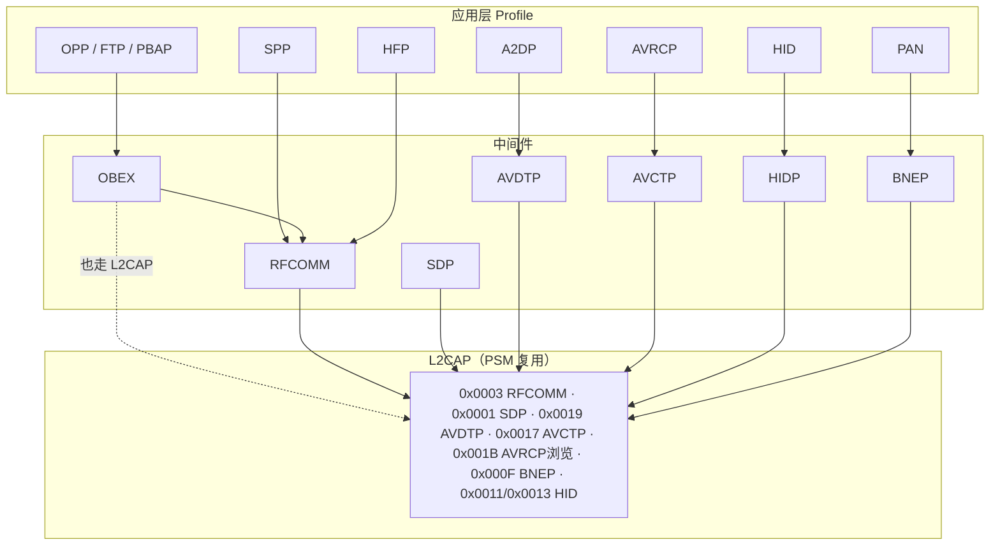
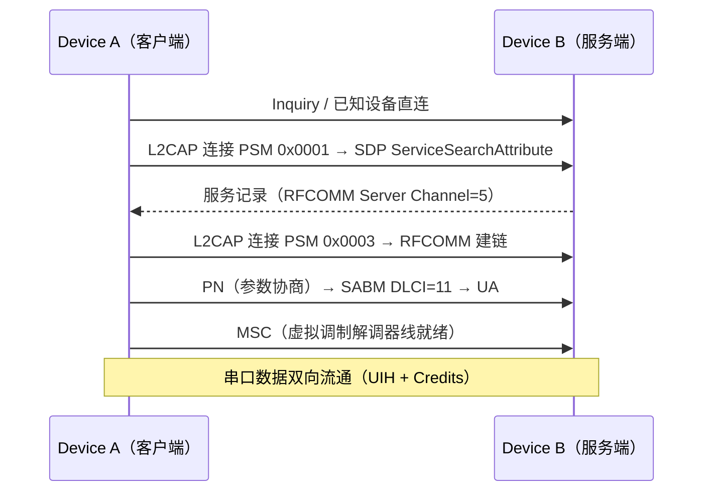
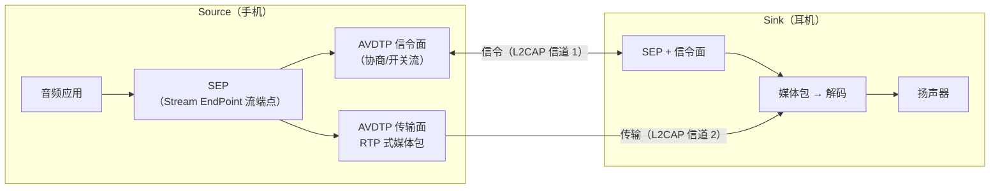
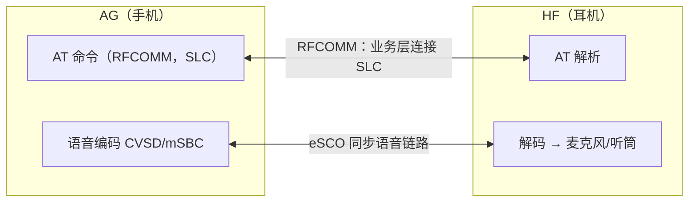

# 经典蓝牙 Profile 详解

> 🌳 知识树位置: 树干 → 枝干[无线关联] → 分枝[BLE] → 叶
> ⬆️ 父节点: [00-BLE概述](00-BLE概述.md)
> 规范原文缓存索引: [../../80-参考资料/README.md](../../80-参考资料/README.md)

---

[08-经典蓝牙与BLE对比](08-经典蓝牙与BLE对比.md) 给了两套栈的总对照，本篇深入 BR/EDR（Basic Rate / Enhanced Data Rate）一侧**每个 Profile 的运行机制**：SDP 如何找到服务、RFCOMM 如何仿真串口、A2DP 如何协商编码器、HFP 如何跑 AT 命令。总览图先立骨架，再逐个拆解。

## 一、协议栈总览

## 二、SDP：服务发现协议

SDP（Service Discovery Protocol）让设备在**建立业务连接之前**回答两个问题："你有什么服务？服务跑在哪个信道/PSM？"它本身是客户端-服务器模型：持有服务的一方是 Server，L2CAP PSM **0x0001** 固定专用。

### 2.1 服务记录与属性

每个服务是一条 **服务记录（Service Record）**：32 位 ServiceRecordHandle + 属性表（属性 ID → 数据元素 Data Element）。关键属性：

| 属性 ID | 名称 | 例（SPP 记录） |
|---|---|---|
| 0x0000 | ServiceRecordHandle | 0x00010001 |
| 0x0001 | ServiceClassIDList | SerialPort（UUID） |
| 0x0004 | ProtocolDescriptorList | L2CAP/RFCOMM + **Server Channel=5** |
| 0x0009 | BluetoothProfileDescriptorList | SPP 版本 1.2 |
| 0x0100 | ServiceName | "My Serial Port" |

数据元素是自描述 TLV：类型（UUID/无符号整数/字符串/序列…）+ 大小索引 + 值；UUID 搜索时用 128 位完整 UUID 或 16/32 位别名。浏览按 BrowseGroupList 层级展开。

### 2.2 SDP PDU 概貌

PDU 头：PDU ID（1）+ Transaction ID（2）+ Parameter Length（2）+ 参数（响应可能带 Continuation State 续传）。

| PDU ID | 名称 | 用途 |
|---|---|---|
| 0x01 | SDP_ErrorResponse | 错误报告 |
| 0x02 / 0x03 | ServiceSearchRequest / Response | 按 UUID 模式找服务，返回记录句柄 |
| 0x04 / 0x05 | ServiceAttributeRequest / Response | 按句柄取指定属性 |
| 0x06 / 0x07 | ServiceSearchAttributeRequest / Response | 一次完成"搜索+取属性"（最常用） |

## 三、RFCOMM：串口仿真

RFCOMM 基于 ETSI TS 07.10（GSM 串口复用标准）裁剪，跑在 L2CAP PSM **0x0003** 上，向上提供多达 60 条虚拟串口（Server Channel 0~30，两个方向）。

### 3.1 帧结构与 DLCI

| 字段 | 说明 |
|---|---|
| Address | EA(1) + CR(1) + **DLCI（6 bit）**；DLCI = 2 × ServerChannel + 方向位，标识一条数据链路连接（DLC, Data Link Connection） |
| Control | UIH（0xEF，带校验不重传，数据帧主流）、SABM（建链请求 0x2F/0x3F）、UA（应答 0x63/0x73）、DISC |
| Length | 1~2 字节，EA 位指示是否续字节 |
| Data | 有效载荷（受 MFS 限制） |
| Credits | 信用流控（Credit-based Flow Control，RFCOMM 特有扩展）：每个 UIH 帧头带 1 字节信用数，收发互赠 |
| FCS | 帧校验（UIH 仅覆盖 Address+Control） |

**MX 帧（Multiplex Control，Control=0xE3 等的 DLCI=0 控制链路）**：PN（DLC 参数协商：帧大小、优先级、是否信用流控）、MSC（Modem Status：DTR/DSR/RTS/CTS 虚拟调制解调器线）、RPN（远端端口设置：波特率/校验位——仅语义传递，实际链路速率由蓝牙决定）、Test、NSC（不支持的命令）。

## 四、SPP：Serial Port Profile

SPP 定义"蓝牙串口线"：两个角色 **Device A（发起方）/ Device B（接受方）**，语义上对应 DTE/DCE 的对称仿真（无主从业务差异，链路主从由建连方决定）。

注意模式：端口仿真层（Port Emulation）在两端各自向本地应用呈现"一个 COM 口"，映射行为（波特率等）只是兼容语义。工业适配器、POS、单片机透传模块至今仍以 SPP 为最通用通道（iOS 除外——苹果不开放经典 SPP，这也是很多外设"安卓能用 iPhone 不能"的根因）。

## 五、A2DP：高级音频分发

A2DP（Advanced Audio Distribution Profile）定义**单声道/立体声高质量音频**单向流：**Source（源，手机）→ Sink（汇，耳机）**。传输协议 AVDTP（Audio/Video Distribution Transport Protocol，L2CAP PSM **0x0019**）分两个角色面：

### 5.1 SEP 与流建立过程

每个编码器实例注册为一个 SEP（带 TSEP 类别 Source/Sink）。信令命令（信号信道，命令/响应配对）：

| 命令 | 作用 |
|---|---|
| DISCOVER | 列出对端所有 SEP |
| GET_CAPABILITIES / GET_ALL_CAPABILITIES | 取某 SEP 支持的编码能力（Service Capabilities：媒体编解码、内容保护 SCMS-T、延迟上报等） |
| SET_CONFIGURATION | 选定编码器 + 填入 **Codec Specific Information Elements**（如 SBC 的 bitpool）→ SEP 进入 Configured |
| OPEN | 建立传输信道（第二条 L2CAP） |
| START / SUSPEND / CLOSE | 流控 |
| RECONFIGURE | 在流中途改编码参数（如降 bitpool） |
| DELAY_REPORT | Sink 上报链路延迟（AVDTP 1.3+，供视频唇音同步） |

### 5.2 编码器协商

| 编码 | 地位 | 说明 |
|---|---|---|
| SBC | **必选** | 子带编码，44.1 kHz Joint Stereo 高质量档 ~328 kbps；bitpool 越大质量越高 |
| MPEG-1,2 Audio / MPEG-2,4 AAC | SIG 可选 | AAC 常见于苹果生态 |
| aptX / aptX HD / aptX Adaptive | 厂商扩展（高通，Vendor Specific + Company ID） | 低延迟与自适应码率（公开资料：Adaptive 数十至数百 kbps 动态） |
| LDAC | 厂商扩展（索尼） | 三档 ~330/660/990 kbps，Hi-Res 认证路线 |
| LHDC | 厂商扩展（SAVITECH 等联盟） | 高码率低延迟路线 |

协商规则：Source 汇总两边 GET_CAPABILITIES 的交集，选一个双方都支持的编码写进 SET_CONFIGURATION；厂商编码走 Vendor Specific A2DP Codec（媒体载荷格式由厂商定义）。音频流媒体包带简单 RTP 式头部（版本/序号/时间戳）。

## 六、AVRCP：媒体控制面

> 📎 规范原文已缓存（evolve #15）：[AVRCP-1.6.3.pdf](../../80-参考资料/bluetooth/AVRCP-1.6.3.pdf)（绝对音量/浏览/播放列表，AVC 命令经 AVCTP PSM 0x0017）。

AVRCP（Audio/Video Remote Control Profile）跑在 AVCTP（PSM **0x0017**）上，与 A2DP 并行：A2DP 管"数据面"，AVRCP 管"控制面"。

| 版本 | 关键能力 |
|---|---|
| 1.0 | 基本穿透命令（Pass-Through：播放/暂停/快进，源自 AV/C） |
| 1.3 | 元数据（曲目名/艺术家/专辑/播放时间）+ 事件通知机制（Register Notification） |
| 1.4 | **浏览信道（Browsing，独立 L2CAP，PSM 0x001B）**、多播放器选择、**绝对音量（Absolute Volume）** |
| 1.5/1.6 | 多播放器/浏览目录细节完善（UID Counter、Cover Art 引用等），1.6 为当前主流实现版本 |

- **绝对音量**：手机侧 CT 发 `SetAbsoluteVolume`（0~127），耳机侧 TG 用 `VOLUME_CHANGED` 通知回推——解决"耳机旋钮与手机音量条各自为政"的经典痛点。
- **与 A2DP 协作**：暂停/播放经 AVRCP 翻译成 A2DP 的 SUSPEND/START；播放进度靠 AVRCP 通知驱动。二者角色配对：A2DP Source ↔ AVRCP Controller（CT），A2DP Sink ↔ AVRCP Target（TG）。

## 七、HFP：免提

> 📎 规范原文已缓存（evolve #14）：[HFP-1.10.pdf](../../80-参考资料/bluetooth/HFP-1.10.pdf)（现行最新版；AT 命令全表/eSCO 参数见原文第 4~5 章）。

HFP（Hands-Free Profile）管**双向语音**：**AG（Audio Gateway，音频网关——通常是手机）** 与 **HF（Hands-Free，免提设备——车载/耳机）**。语音不走 ACL，而走 **eSCO（Extended Synchronous Connection-Oriented）** 同步链路，保留时隙、带有限重传，天然抗抖动。

- **SLC（Service Level Connection）建立**：RFCOMM 建链后 AT+BRSF（交换双方特性位图）→ AT+CIND（呼叫指示状态）→ AT+CMER（订阅事件）→（三方通话时 AT+CHLD=?）→ SLC 就绪。
- **音频链路建立**：AG 或 HF 发起（AT+BCC / HCI Setup eSCO），随后**编码协商**：AG 通知可用编码（AT+BIA 时代的 +BCS 流程），HF 以 AT+BCS 确认——CVSD（窄带 8 kHz/64 kbps）或 **mSBC 宽带语音（Wide Band Speech，16 kHz，HFP 1.6 引入）**；更新版本增加超宽带（SWB，32 kHz，见 HFP 1.9），具体以所用版本规范为准。
- **常用 AT 命令**：ATD/ATA（拨/接）、AT+CHLD（呼叫保持/切换）、AT+CLCC（列当前呼叫）、AT+BTRH（保持状态）、AT+NREC（回声消除开关）、AT+BIA（ indicator 订阅）、AT+BIEV（HF Indicator 事件，如电量）。

## 八、经典 HID

人机接口设备在 BR/EDR 上走 **HID Profile**：两条 L2CAP 信道——PSM **0x0011 控制**（HID Control：协议/模式管理）与 PSM **0x0013 中断**（HID Interrupt：报告数据走这里，低延迟单向为主）。上层 HIDP 复用 USB HID 的报告描述符（Report Descriptor）体系——所以 USB 键鼠固件改造成蓝牙 HID 成本很低（与 [07-HOGP](07-HOGP-HIDoverGATT.md)、USB HID 三方同源）。

| 事务 | 信道 | 用途 |
|---|---|---|
| GET_REPORT / SET_REPORT | 控制 | 读/写报告（LED 状态等） |
| GET_PROTOCOL / SET_PROTOCOL | 控制 | Boot（引导）协议 ↔ Report 协议切换 |
| SET_IDLE / SET_PASSTHROUGH | 控制 | 速率与穿透控制 |
| DATA 报告 | 中断 | 键盘/鼠标数据持续上报 |

**与 BLE HOGP 的差异**：

| 维度 | 经典 HID | HOGP（HID over GATT） |
|---|---|---|
| 传输 | BR/EDR ACL，PSM 0x11/0x13 专用信道 | LE ACL + GATT HID Service（0x1812） |
| 配对 | SSP（见 06 篇 + 下文 GAP） | SMP（LE 配对/bonding） |
| 描述符 | HID 报告描述符（HIDP 直传） | Report Map 特征值（同一描述符格式） |
| 功耗 | 高（BR/EDR 信标/sniff 仍重） | 低（LE 休眠机制），电池键鼠首选 |
| 重连 | 主机侧虚拟电缆逻辑 + page | GAP 目录重连 + LL 自动连接机制 |
| BIOS 级兼容 | 老平台 Boot 协议可被原生支持 | 需平台固件支持（新平台普遍支持） |

**虚拟电缆（Virtual Cable）**：HID 用"信任换持久"的机制——配对 bond 后两端保存链路密钥，逻辑上等同插了根不存在的电缆；任一端可发起重连（HID 主机主动 page，或设备唤醒后请求重连），断电重开无需任何用户操作。SPP 也借同一思想描述"无线串口线"。

## 九、OPP / OBEX / FTP：对象交换

OBEX（Object Exchange，源自 IrDA）跑在 RFCOMM 上（也可直连 L2CAP），提供会话式对象传输：CONNECT / PUT / GET / SETPATH / DISCONNECT，对象类型靠 MIME 头声明。

| Profile | 用途 | 角色 |
|---|---|---|
| OPP（Object Push Profile） | 推送名片（vCard）、日历（vCalendar）、图片到对端 | Push Client → Push Server（服务端只收不浏览） |
| FTP（File Transfer Profile） | 文件系统浏览：列目录（SETPATH）、取放文件 | Client ↔ Server（完整文件夹语义） |
| PBAP（Phone Book Access） | 车机拉取手机通讯录（vCard 2.1/3.0 流），典型车载场景 | PSE（Phone Book Server）↔ PCE |

OPP 是早期"蓝牙传文件"的本体；PBAP 与 MAP（短信访问）让 OBEX 族在车载场景长盛不衰。

## 十、PAN / NAP

PAN（Personal Area Networking Profile）基于 BNEP（Bluetooth Network Encapsulation Protocol，L2CAP PSM **0x000F**）在蓝牙上承载以太网 II 帧：PANU 是终端用户节点；GN 提供小组自组织转发；**NAP（Network Access Point）** 是最常见用例——手机开"蓝牙网络共享"，把一台设备的 IP 流量桥接到蜂窝网（类似 USB NCM/ECM 的无线镜像，见 USB 网络类文档）。因速率与并发能力有限，如今多被 Wi-Fi 热点取代。

## 十一、GAP（经典版）：发现、连接与配对回顾

| 机制 | 说明 |
|---|---|
| Inquiry（查询） | 发起端发 ID 包扫全频段，可发现设备回 FHS 包（含时钟偏移、class of device）；访问码 GIAC 0x9E8B33（通用）/LIAC（受限） |
| Inquiry Scan | 可发现端周期监听；发现模式分 Non-discoverable / Limited / General |
| Page / Page Scan | 已知地址建链：page 端按 FHS 中的跳频信息追叫，Page Scan 端应答后进入主从协商 |
| 连接模式 | Active / Sniff（省电降频）/ Hold / Park——语音外场景几乎靠 Sniff 省电 |
| 可配对性 | Pairable / Non-pairable 独立于可发现性 |
| SSP（Secure Simple Pairing） | ECDH P-256 密钥交换 + 四种关联模型：Numeric Comparison / Just Works / Passkey Entry / OOB；配对细节与链路密钥体系见 [06-SMP安全与配对](06-SMP安全与配对.md)（该篇聚焦 LE，SSP 与 LE SC 同用 ECDH 但独立执行） |

## 十二、双模设备 Profile 组合实战

**耳机/音箱（必备三件套）**：A2DP（媒体流）+ AVRCP（播放控制/绝对音量）+ HFP（通话）。三者独立建连：来电时切到 HFP 的 eSCO 语音链路，挂断回 A2DP；mic 采集只在 HFP 路径存在——"听歌高音质、通话窄语音"的体验差异正是 A2DP(SBC/aptX) 与 HFP(CVSD/mSBC) 两条链路的切换痕迹。新平台再加 LE Audio（BAP/TMAP）成为"四件套"。

**键鼠（二选一）**：经典 HID 或 HOGP 通常**只实现其一**——两者并存会带来双倍配对状态与重连仲裁复杂度，且电池产品没有双栈功耗预算。选型逻辑：追求 BIOS 级即插即用/老主机兼容 → 经典 HID；追求长续航/新生态（iPad、Android 平板）→ HOGP。部分游戏外设做双模切换（物理开关二选一）而非同时在线。

## 相关节点

- [08-经典蓝牙与BLE对比](08-经典蓝牙与BLE对比.md) —— 两套栈总对照（本篇的上游导读）
- [06-SMP安全与配对](06-SMP安全与配对.md) —— LE 配对细节；经典 SSP 与之对照阅读
- [07-HOGP-HIDoverGATT](07-HOGP-HIDoverGATT.md) —— 经典 HID 的 LE 对应物
- [09-LEAudio与LC3](09-LEAudio与LC3.md) —— A2DP/HFP 的 LE Audio 演进方向
- [01-蓝牙体系架构与HCI](01-蓝牙体系架构与HCI.md) —— 下方 L2CAP/控制器基础
- [05-蓝牙控制器类-HCIoverUSB](../../20-枝干-设备类协议/其他设备类/05-蓝牙控制器类-HCIoverUSB.md) —— 经典栈经 USB 接主机控制器的形态
