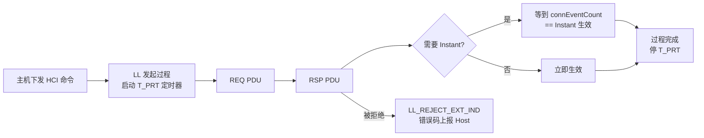
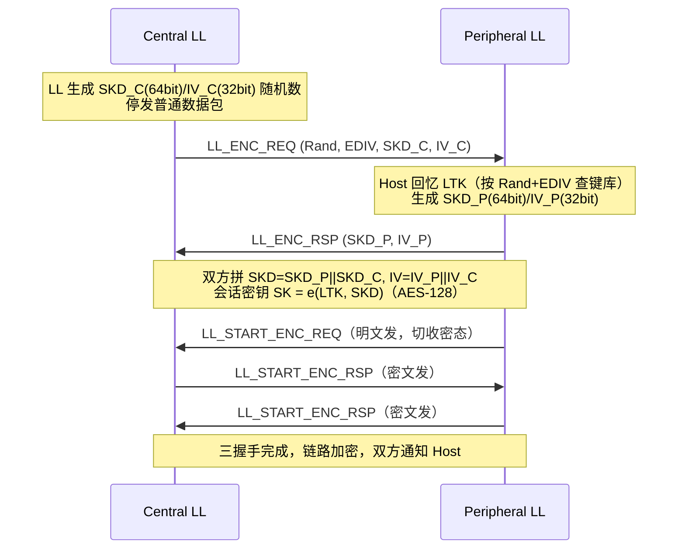

# LLCP 控制过程全表（LL Control PDU 与控制过程）

> 🌿 知识树位置: 树干 → 枝干[无线关联] → 分枝[BLE] → 叶[12-LLCP控制过程全表]
> ⬆️ 父节点: [02-链路层与物理层](02-链路层与物理层.md)
> 📎 规范依据: Bluetooth Core 6.0（2024-08-27）Vol 6 Part B §2.4.2（PDU 定义）、§4.6（FeatureSet）、§5.1~5.5（控制过程/超时/冲突），本地缓存见 [../../80-参考资料/README.md](../../80-参考资料/README.md)

---

LL Control PDU（LLCP）是 BLE 连接的"带外管理帧"：LLID=11 的数据信道 PDU，载荷为 1 字节 Opcode + 定长 CtrData。它管理链路本身的一切——参数、信道图、加密、PHY、DLE、CIS、功控、测距。本文是 [02-链路层与物理层](02-链路层与物理层.md) 第六节 LLCP 简表的"附录化"全量版。

## 一、LL Control PDU 全表（Opcode 0x00~0x3C）

下表逐条来自 Core 6.0 Vol 6 Part B Table 2.22（位级 CtrData 布局见规范 §2.4.2 各小节，本文只给"方向+用途一句话"）。方向列：C=仅 Central 发起，P=仅 Peripheral 发起，双=任一方发起。

| Opcode | 名称 | 方向 | 用途一句话 |
|---|---|---|---|
| 0x00 | LL_CONNECTION_UPDATE_IND | C→P | 即时更新 connInterval/Latency/SupervisionTimeout（带 Instant，见 §3.1） |
| 0x01 | LL_CHANNEL_MAP_IND | C→P | 即时更新数据信道图（AFH 剔除坏信道，带 Instant） |
| 0x02 | LL_TERMINATE_IND | 双 | 断链，携带原因码（断链可随时发起，优先级最高） |
| 0x03 | LL_ENC_REQ | C→P | 加密启动第一步：携带 Rand+EDIV（Host 侧密钥索引）与 SKD_C、IV_C |
| 0x04 | LL_ENC_RSP | P→C | 回 SKD_P、IV_P，双方拼出会话密钥种子 |
| 0x05 | LL_START_ENC_REQ | P→C（无 CtrData） | Peripheral 已算好会话密钥，明文发出此包并准备收密文 |
| 0x06 | LL_START_ENC_RSP | 双（无 CtrData） | 密文三握手的后两步，收发各一次，完成即加密生效 |
| 0x07 | LL_UNKNOWN_RSP | 双 | 对端不认识该 Opcode 时回应，UnknownType=收到的 Opcode |
| 0x08 | LL_FEATURE_REQ | C→P | Central 侧 FeatureSet 位图（见 §5 特征位图） |
| 0x09 | LL_FEATURE_RSP | P→C | Peripheral 侧 FeatureSet 位图 |
| 0x0A | LL_PAUSE_ENC_REQ | C→P（无 CtrData） | 暂停加密（换 LTK 不断链的第一阶段） |
| 0x0B | LL_PAUSE_ENC_RSP | P→C（无 CtrData） | 确认暂停；随后自动重新走 Start 加密流程 |
| 0x0C | LL_VERSION_IND | 双 | 版本交换：Version/Company_Identifier/Subversion（值见 Assigned Numbers） |
| 0x0D | LL_REJECT_IND | 双 | 拒绝请求（旧式，1 字节 ErrorCode） |
| 0x0E | LL_PERIPHERAL_FEATURE_REQ | P→C | Peripheral 发起的特性交换（4.2+ 特性位） |
| 0x0F | LL_CONNECTION_PARAM_REQ | 双 | 4.1+ 参数协商：Interval_Min/Max、Latency、Timeout、偏好周期、锚点偏移表 |
| 0x10 | LL_CONNECTION_PARAM_RSP | 双 | 对协商窗口的回应（不含最终参数，最终由 Central 用 0x00 下发） |
| 0x11 | LL_REJECT_EXT_IND | 双 | 扩展拒绝：RejectOpcode + ErrorCode（可精确拒绝某个 Opcode） |
| 0x12 | LL_PING_REQ | 双 | 空包探活：验证加密链路上 MIC 校验通路（对应 HCI LE Ping） |
| 0x13 | LL_PING_RSP | 双 | PING 应答（无 CtrData） |
| 0x14 | LL_LENGTH_REQ | 双 | DLE 协商：MaxTx/RxOctets + MaxTx/RxTime（见 §3.4） |
| 0x15 | LL_LENGTH_RSP | 双 | DLE 协商应答，携带本端实际采用值 |
| 0x16 | LL_PHY_REQ | 双 | PHY 偏好声明：TX_PHYS/RX_PHYS 位图（1M/2M/Coded） |
| 0x17 | LL_PHY_RSP | P→C | Central 发起时 Peripheral 的 PHY 偏好回应 |
| 0x18 | LL_PHY_UPDATE_IND | C→P | 裁定结果 PHY_C_TO_P / PHY_P_TO_C + Instant，Instant 处生效 |
| 0x19 | LL_MIN_USED_CHANNELS_IND | P→C | Peripheral 声明至少需要 N 个可用信道（法规/实现约束） |
| 0x1A | LL_CTE_REQ | 双 | 请求对端回一个带 CTE 的包（测向用，见 [13-测向与信道探测](13-测向与信道探测.md)） |
| 0x1B | LL_CTE_RSP | 双 | 带 Constant Tone Extension 的应答包 |
| 0x1C | LL_PERIODIC_SYNC_IND | C→P | PAST：把周期广播同步信息（SyncInfo）直接推给连接对端 |
| 0x1D | LL_CLOCK_ACCURACY_REQ | 双 | 查询对端睡眠时钟精度 SCA（对应 HCI LE Request Peer SCA） |
| 0x1E | LL_CLOCK_ACCURACY_RSP | 双 | 回报本端 SCA，可据此收紧/放宽锚点窗口 |
| 0x1F | LL_CIS_REQ | C→P | 建立 CIS：CIG/CIS 编号、ISO 间隔、BN/FT/NSE、PHY、时间窗 |
| 0x20 | LL_CIS_RSP | P→C | 接受（回传收紧后的时间窗）或随后用 0x11 拒绝 |
| 0x21 | LL_CIS_IND | C→P | 最终裁定 CIS 锚点时刻 + CIG/CIS_Sync_Delay，收到即建流 |
| 0x22 | LL_CIS_TERMINATE_IND | 双 | 拆除一条 CIS（CIS_ID + Instance_ID + 原因） |
| 0x23 | LL_POWER_CONTROL_REQ | 双 | 5.2+ 功控：请求对端按目标 RSSI 调整发射功率 |
| 0x24 | LL_POWER_CONTROL_RSP | 双 | 回报调整后的 RSSI/Gain/功率档 |
| 0x25 | LL_POWER_CHANGE_IND | 双 | 主动通告本端发射功率变化（Apptype/Phy/Tx Power） |
| 0x26 | LL_SUBRATE_REQ | 双 | 5.3+ 子速率连接：按倍数稀疏收发（省电） |
| 0x27 | LL_SUBRATE_IND | C→P | 子速率裁定结果 |
| 0x28 | LL_CHANNEL_REPORTING_IND | 双 | 6.0：开关对端信道分类报告的使能与触发参数 |
| 0x29 | LL_CHANNEL_STATUS_IND | 双 | 6.0：上报测得的信道质量状态（配合 AFH） |
| 0x2A | LL_PERIODIC_SYNC_WR_IND | C→P | PAST 写入变体（写者非接收者场景，配合 0x1C 二选一） |
| 0x2B | LL_FEATURE_EXT_REQ | 双 | 请求读取对端第 1 页及以上扩展 FeatureSet（bit63 置位时用） |
| 0x2C | LL_FEATURE_EXT_RSP | 双 | 回指定页的扩展 FeatureSet |
| 0x2D | LL_CS_SEC_RSP | 双 | CS 安全启动应答（CS 角色交换确认，见 [13-测向与信道探测](13-测向与信道探测.md)） |
| 0x2E | LL_CS_CAPABILITIES_REQ | 双 | 交换 CS 能力（支持的模式/序列长度/天线数等） |
| 0x2F | LL_CS_CAPABILITIES_RSP | 双 | CS 能力应答 |
| 0x30 | LL_CS_CONFIG_REQ | 双 | 写入一组 CS 配置（模式组合、信道选择、序列类型等） |
| 0x31 | LL_CS_CONFIG_RSP | 双 | CS 配置确认 |
| 0x32 | LL_CS_REQ | 双 | 启动一次 CS 过程（含起止参数） |
| 0x33 | LL_CS_RSP | 双 | CS 过程启动确认 |
| 0x34 | LL_CS_IND | C→P | 携带 CS 过程锚点 Instant，Instant 处开始执行 |
| 0x35 | LL_CS_TERMINATE_REQ | 双 | 请求终止 CS 过程 |
| 0x36 | LL_CS_FAE_REQ | 双 | 请求对端回报 FFO 激励误差表（频率校准数据） |
| 0x37 | LL_CS_FAE_RSP | 双 | FAE 表应答 |
| 0x38 | LL_CS_CHANNEL_MAP_IND | 双 | CS 专用信道图更新（72 个 CS 信道，独立于数据信道图） |
| 0x39 | LL_CS_SEC_REQ | 双 | CS 安全启动请求（防中继的角色挑战） |
| 0x3A | LL_CS_TERMINATE_RSP | 双 | CS 终止确认 |
| 0x3B | LL_FRAME_SPACE_REQ | 双 | 6.0：协商更短/更长的帧间隔（替代默认 150µs，见 [14-RF物理层参数全表](14-RF物理层参数全表.md)） |
| 0x3C | LL_FRAME_SPACE_RSP | 双 | 帧间隔协商应答 |
| 0xF0~0xFB | 保留 | — | 留给规范开发（specification development purposes） |
| 其余 | 保留 | — | 收到不支持的 Opcode 必须回 LL_UNKNOWN_RSP |

> 注：Vol 6 Part B 对大表格的 PDF 排版偶有错位，上表 Opcode↔名称映射已逐段核对；个别 CtrData 字节级布局未在本文展开，位级见 Core 6.0 Vol 6 Part B §2.4.2。

## 二、过程通用规则

- **一次一个**：每设备每连接同时只能发起一个 LL 控制过程（ACL Termination 除外）；但可以在"响应对端过程"的同时发起自己的过程。
- **应答超时**：过程启动时启动 **T_PRT（Procedure Response Timeout）定时器**，每个排队发送的 LLCP 都会复位它；**到 40 秒视为链路丢失**，退出 Connection 态并通知 Host（§5.2）。注意 Connection Update 与 Channel Map Update 两个过程**没有**超时规则（它们靠 Instant 兜底）。
- **Instant（生效时刻）**：connEventCount 按 mod 65536 比较；Central 选 Instant 时应至少预留 6 个连接事件（考虑 subrating/latency 后对端还能听到）。
- **不认识就问**：收到不支持/非法的 LLCP 回 LL_UNKNOWN_RSP；参数越界可就地取最接近合法值继续，或用 LL_REJECT_IND / LL_REJECT_EXT_IND 拒绝。

## 三、主要过程时序

### 3.1 连接参数更新（Connection Update / 参数请求协商）

新规范（4.1+）优先走"协商"：任一方发 LL_CONNECTION_PARAM_REQ（给出 Interval_Min/Max 窗口、Latency、Timeout、偏好周期与 6 个锚点偏移 Offset0~5），对端 LL_CONNECTION_PARAM_RSP 收窄窗口；最终仍由 **Central 发 LL_CONNECTION_UPDATE_IND**（WinSize、WinOffset、Interval、Latency、Timeout、Instant）拍板。Peripheral 若不支持协商特性，只能走 L2CAP CoC 信令向 Host 汇报，由 Central 的 Host 触发 0x00。

生效规则：从 Instant 前一个连接事件起，双方必须"按时到场"；Instant 处切换 connIntervalOLD→NEW，监督定时器在 Instant 复位；若 peripheral latency 变大，同一 Instant 内还要迁移锚点（WinSize/WinOffset 描述第一个新锚点窗口）。

### 3.2 加密建立全流程（Encryption Start，LTK 的起点在 SMP）

前置：配对/绑定已在 Host 侧产出 LTK（流程见 [06-SMP安全与配对](06-SMP安全与配对.md)）。LL 层收到 Host 的 LE_Enable_Encryption 后：

失败分支：对端不支持加密→LL_REJECT_IND（0x1A Unsupported Remote Feature）；Host 无 LTK→拒绝码 PIN or Key Missing（0x06）。握手期间收到任何"意外的"数据 PDU，立即断链，原因码 Connection Terminated Due to MIC Failure（0x3D）——这是防重放/防注入的硬规则。

**换钥不断链（Encryption Pause）**：换新 LTK 时 Central 先发 LL_PAUSE_ENC_REQ/RSP 冻结加密（期间禁止明文数据），再自动重跑一遍上面的 Start 流程。LE Ping 的 authenticatedPayloadTO 定时器（默认 30 s）在暂停期间继续走。

### 3.3 PHY 更新（PHY Update）

Central 发起：LL_PHY_REQ → LL_PHY_RSP → Central 裁定发 LL_PHY_UPDATE_IND（PHY_C_TO_P、PHY_P_TO_C、Instant）。Peripheral 发起：LL_PHY_REQ → Central 直接 LL_PHY_UPDATE_IND（省掉 RSP）。裁定规则：取双方偏好位图的交集；无交集则该方向不变。Instant 处双方向切换新 PHY；若没选新 PHY（两边都没变）则无 Instant、立即完成。CIS 的 PHY 独立于 ACL，不受此过程影响。

### 3.4 DLE（Data Length Update）

任一方发 LL_LENGTH_REQ（本端 connMaxTx/RxOctets + connMaxTx/RxTime），对端回 LL_LENGTH_RSP 并可借机抬价。REQ 一到（或识别出对端的 RSP）立即更新对端能力参数，新参数只作用于**尚未排队**的新包。默认载荷 27 B（connInitialMaxTxOctets=27）；DLE 上限 251 B。对端不支持 LE Coded 时 MaxRxTime/MaxTxTime ≤ 2128 µs。DLE 无 Instant，协商完成即用。

### 3.5 CIS 建立（CIS Creation，LE Audio 的入口）

仅 Central 可发起：LL_CIS_REQ（CIG_ID/CIS_ID、CIS_Offset_Min/Max 窗口、ISO_Interval、BN/FT/NSE/MPT、Framing、PHY）→ Peripheral 接受回 LL_CIS_RSP（收紧后的时间窗，必须完全落在 REQ 窗口内且按 ISO_Interval 对齐）→ Central 发 LL_CIS_IND（最终锚点时刻 + CIG_Sync_Delay/CIS_Sync_Delay）。收到 LL_CIS_IND 时双方停掉 T_PRT、按 cisEventCounter=0 建流；收到对端第一条 CIS PDU 才算"已建立"。拒绝路径一律 LL_REJECT_EXT_IND（如 0x1A、0x30 Parameter Out of Mandatory Range）。应用全景见 [09-LEAudio与LC3](09-LEAudio与LC3.md)。

### 3.6 其他高频过程速记

| 过程 | 时序 | 备注 |
|---|---|---|
| 特性交换 | FEATURE_REQ→RSP | 建链后尽早做；bit63 置位说明有扩展页（FEATURE_EXT_REQ/RSP） |
| 版本交换 | VERSION_IND→VERSION_IND | 双方各发一次，无显式请求 |
| PING | PING_REQ→RSP | 验证加密链路活着；配合 authenticatedPayloadTO（默认 30 s） |
| SCA 询问 | CLOCK_ACCURACY_REQ→RSP | 应答值不得低于当前在用精度；不宜每秒超过一次 |
| 信道图更新 | CHANNEL_MAP_IND（带 Instant） | Instant 前用旧图，Instant 起用新图并做 CSA 重映射 |
| 功控 | POWER_CONTROL_REQ→RSP | 配合 LL_POWER_CHANGE_IND 通告，见 [14-RF物理层参数全表](14-RF物理层参数全表.md) 的功率分类 |
| 子速率 | SUBRATE_REQ→IND | 5.3+，按倍数"隔 N 个事件收发一次" |
| 帧间隔 | FRAME_SPACE_REQ→RSP | 6.0 新增，把默认 150 µs 帧间隔改成更短/更长 |
| CTE 请求 | CTE_REQ→CTE_RSP | 拒绝用 REJECT_EXT_IND（0x20/0x1E/0x2A），见 [13-测向与信道探测](13-测向与信道探测.md) |

## 四、过程冲突与 Instant 相关断链

两个过程"不兼容"的情形（§5.3）：都带 Instant；都是 CS Configuration 过程；都是 CS Procedure Repeat Termination；一方是 Frame Space Update 与另一 Frame Space Update / CIS 建立撞车。处理规则：

- 设备 A 已在过程 X 中，收到对端发来的不兼容过程 Y 的首包：
  - 若 A 已向对端发过 X 的 PDU → 立即断链（原因码见下）；
  - A 是 Central → 用 REJECT_EXT_IND/REJECT_IND 拒掉 Y，继续 X；
  - A 是 Peripheral → 放弃 X，服从 Central 的 Y，只处理随后的拒绝通知。
- 错误码：同过程自撞（或 ConnUpdate 撞 ConnParamReq）用 **0x23 LMP Error Transaction Collision / LL Procedure Collision**；其余用 **0x2A Different Transaction Collision**。

## 五、FeatureSet 特征位图（LL_FEATURE_REQ/RSP CtrData）

Core 6.0 Vol 6 Part B Table 4.10（本表为位号→特征名摘录；"Send to Peer" 约束略，位级语义见规范）：

| 位 | 特征 | 位 | 特征 |
|---|---|---|---|
| 0 | LE Encryption | 25 | Periodic Advertising Sync Transfer - Recipient |
| 1 | Connection Parameters Request procedure | 26 | Sleep Clock Accuracy Updates |
| 2 | Extended Reject Indication | 27 | Remote Public Key Validation |
| 3 | Peripheral-initiated Features Exchange | 28 | CIS - Central |
| 4 | LE Ping | 29 | CIS - Peripheral |
| 5 | LE Data Packet Length Extension | 30 | Isochronous Broadcaster |
| 6 | LL Privacy | 31 | Synchronized Receiver |
| 7 | Extended Scanning Filter Policies | 32 | CIS (Host Support) |
| 8 | LE 2M PHY | 33 | LE Power Control Request |
| 9 | Stable Modulation Index - Transmitter | 34 | LE Power Control Request（与 bit33 必须同值） |
| 10 | Stable Modulation Index - Receiver | 35 | LE Path Loss Monitoring |
| 11 | LE Coded PHY | 36 | Periodic Advertising ADI support |
| 12 | LE Extended Advertising | 37 | Connection Subrating（Host Controlled） |
| 13 | LE Periodic Advertising | 38 | Connection Subrating (Host Support) |
| 14 | Channel Selection Algorithm #2 | 39 | Channel Classification |
| 15 | LE Power Class 1 | 40/41 | Advertising Coding Selection / (Host Support) |
| 16 | Minimum Number of Used Channels procedure | 42 | Decision-Based Advertising Filtering |
| 17 | Connection CTE Request | 43 | PAwR - Advertiser |
| 18 | Connection CTE Response | 44 | PAwR - Scanner |
| 19 | Connectionless CTE Transmitter | 45 | Unsegmented Framed Mode |
| 20 | Connectionless CTE Receiver | 46 | Channel Sounding |
| 21 | Antenna Switching During CTE Transmission (AoD) | 47 | Channel Sounding (Host Support) |
| 22 | Antenna Switching During CTE Reception (AoA) | 48 | Channel Sounding Tone Quality Indication |
| 23 | Receiving Constant Tone Extensions | 56~62 | 保留（规范开发用） |
| 24 | Periodic Advertising Sync Transfer - Sender | 63 | LL Extended Feature Set（支持 64+ 位特征者必置） |
| — | — | 64/65 | Monitoring Advertisers / Frame Space Update |

LL_FEATURE_RSP 的 FeatureSet[0] 是"双方交集"语义（双方都必须支持的特性），FeatureSet[1..7] 是发送方自己的能力——调试嗅探器抓包时注意这一差别。

## 相关节点

- [02-链路层与物理层](02-链路层与物理层.md) —— LLCP 所在的数据 PDU 头与包格式（本文是其第六节的展开）
- [03-广播与连接](03-广播与连接.md) —— CONNECT_IND 与连接建立
- [06-SMP安全与配对](06-SMP安全与配对.md) —— LTK/Rand/EDIV 从哪来
- [09-LEAudio与LC3](09-LEAudio与LC3.md) —— CIS/CIG 建立后承载什么
- [13-测向与信道探测](13-测向与信道探测.md) —— CTE_REQ/RSP 与 CS 系列 LLCP 的完整应用
- [14-RF物理层参数全表](14-RF物理层参数全表.md) —— 功控与 PHY 切换背后的射频约束
