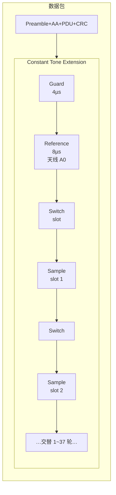
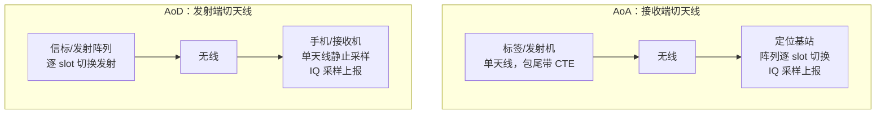
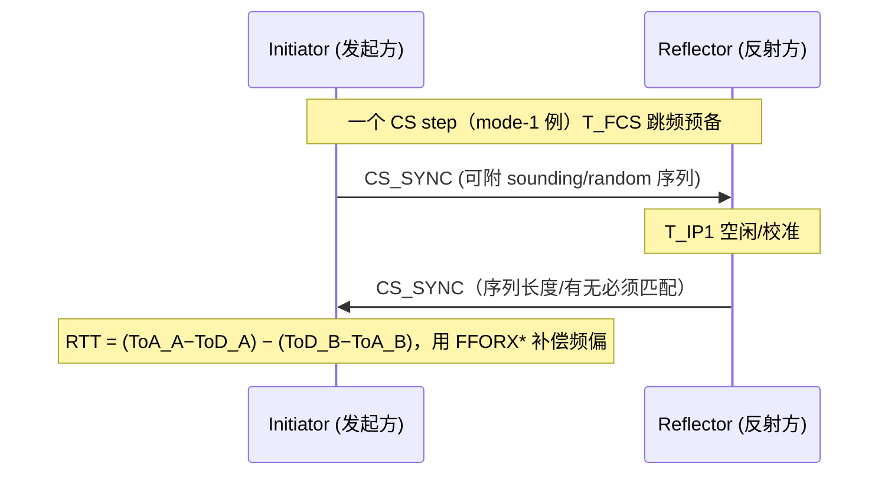
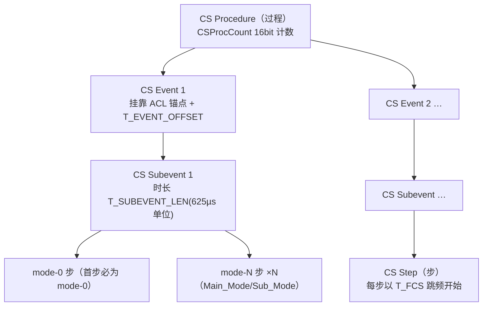

# BLE 测向（AoA/AoD）与信道探测（Channel Sounding）

> 🌿 知识树位置: 树干 → 枝干[无线关联] → 分枝[BLE] → 叶[13-测向与信道探测]
> ⬆️ 父节点: [00-BLE概述](00-BLE概述.md)
> 📎 规范依据: Bluetooth Core 6.0（2024-08-27）——测向：Vol 6 Part B §2.1.5/§2.5（CTE）+ Part A §5（天线切换）；信道探测（CS）：Vol 6 Part H（新分卷）+ Part B §2.4.2.45~2.4.2.58/§4.5.18/§5.1.25~5.1.27 + Part A §3.4/§5.3/§6，本地缓存见 [../../80-参考资料/README.md](../../80-参考资料/README.md)

---

BLE 的两条"定位/测距"支线：**测向（Direction Finding，5.1 引入）**靠天线阵列+IQ 采样解出**角度**；**信道探测（Channel Sounding，CS，6.0 新增）**靠双设备对射信号直接测**距离**。前者解决"目标在哪个方向"，后者解决"目标有多远"——数字钥匙、Find My 类硬件寻找器是两者的典型落地。

## 一、AoA/AoD 测向：Constant Tone Extension（CTE）

### 1.1 CTE 物理结构

CTE 是追加在包尾（CRC 之后）的一段**恒定单音**：内容为不加白化的一串连续 '1'。1 Msym/s GFSK、调制指数 0.5 时，连续发 '1' 就是恒定正频偏——即载波偏上约 **+250 kHz** 的单音（fd = h×fsym/2 = 0.5×1 MHz/2 = 250 kHz），天线阵列能在这个稳定相位上做相干采样。

| 参数 | 值 | 说明 |
|---|---|---|
| 总时长 | 16 ~ 160 µs | CTEInfo 的 CTETime 字段，以 8 µs 为单位，取值 2~20（其余保留） |
| Guard period | 4 µs | 防御段，切换天线只允许发生在它和 switch slot 内 |
| Reference period | 8 µs | 参考段，固定用切换序列的第 1 根天线，采 8 个 IQ 样点 |
| Switch/Sample slot | 各 1 µs 或 2 µs | 交替排列；2 µs 为必选，1 µs 为可选（选了则所有支持 CTE 的 PHY 都得支持） |
| CTEType | 0=AoA / 1=AoD(1µs) / 2=AoD(2µs) | 3 保留 |
| 白化 | 不做 | CTE 不参与 CRC/MIC 计算 |
| 限制 | 不得出现在等时信道包上；**LE Coded PHY 上没有 CTE** | Part B §2.1.5/§2.2 原文明确 |



### 1.2 AoA 与 AoD 的分工

| 方法 | 谁切天线 | 场景特征 |
|---|---|---|
| **AoA**（Angle of Arrival） | **接收端**切（发射端单天线不切换） | 标签便宜（单天线发射），定位器/基站做阵列——资产追踪、室内定位经典拓扑 |
| **AoD**（Angle of Departure） | **发射端**切（接收端单天线即可，可不切换） | 信标侧做阵列，手机侧便宜——导航类广播场景（常配连接less CTE 挂在周期广播上） |

IQ 采样规则（Part B §2.5.4）：参考段内**每微秒采 1 个 IQ 样点**（共 8 个），每个 sample slot 采 1 个；2 µs slot 时建议采在后 1 µs。总样点数 9~82（2 µs 槽 1~37 个、1 µs 槽 2~74 个）。规范还给出采样窗建议：每个 1 µs 周期开头 0.125 µs 与结尾 0.125 µs 之外取 0.75 µs 窗口采样，保证样点间一致性好。CRC 错的包也**可以**做 IQ 采样（丢 CRC 不丢相位）。

三个常见坑：CTE 不参与 CRC/MIC 计算（截掉它不影响链路层校验）；CTE 不能跑在 LE Coded PHY 上（远距与测向互斥，只能 1M/2M）；等时信道（CIS/BIS，LE Audio）的包禁止携带 CTE。



### 1.3 从相位差到角度

两天线间距 d 的阵列收到波长 λ 的平面波，来波方向角 θ 时两阵元相位差：

```
Δφ = 2π · d · sin(θ) / λ   →   θ = arcsin( Δφ · λ / (2π·d) )
```

- 2.4 GHz 时 λ≈12.2 cm，工程上常取 d≈λ/2≈5~6 cm（d 过大出现相位模糊，过小则分辨率差）。
- **数值例**：d=5 cm、来波 θ=30° 时，Δφ = 2π×0.05×sin30°/0.1224 ≈ 1.28 rad ≈ 73.6°——阵列测量的是这个相位差，逐 slot 采样后按天线分组求平均相对相位（MRP）再反解 θ；规范规定的测试判据（95% 相对相位偏差 ≤±0.52 rad 等）保证了样点可用于此类解算。
- 多 slot/多天线数据融合：同一根天线在多个 sample slot 的相位取平均（Arg(Σe^iφ) 形式，Part A §5.2.1 定义），等效压制高斯噪声——这也是"CTE 越长精度越好"的原因。
- 规范把"原始 IQ→相对相位→每根天线的平均相对相位（MRP）"的定义与**测试通过判据**写在 Vol 6 Part A §5.2（如 95% 的相对相位偏差落在 ±0.52 rad 内、MRPD ∈ ±1.125 rad），并给出标准测试切换模式（2 天线 A0,A1,A0,A0；3/4 天线见 Table 5.2）。**角度解算算法本身不在规范内**，由厂商/上层实现（MUSIC、加权最小二乘等）。
- 精度影响因素：天线阵列的幅度/相位一致性（校准表）、IQ 采样质量（4.0 以上偏置）、多径反射（室内主敌）、CTE 时长与 slot 精度、阵列孔径（天线数）。

### 1.4 配套的 LLCP 与 HCI

| 层 | 机制 | 内容 |
|---|---|---|
| LLCP | LL_CTE_REQ（0x1A）→ LL_CTE_RSP（0x1B） | 连接态：任一方请求对端回一个带 CTE 的包；条件不满足回 LL_REJECT_EXT_IND（0x20/0x1E/0x2A），见 [12-LLCP控制过程全表](12-LLCP控制过程全表.md) |
| LLCP | LL_PERIODIC_SYNC_IND（0x1C） | 连接less CTE（周期广播带 CTE）+ PAST 转移同步 |
| HCI | LE_Set_Connection_CTE_Receive_Parameters、LE_Set_Connection_CTE_Transmit_Parameters、LE_Connection_CTE_Request_Enable、LE_Connectionless_CTE_Transmit / _Receive、LE_Set_Connectionless_CTE_Sampling_Enable、LE_Antenna_Information | 配置切换模式、slot 时长、使能采样上报（Vol 4 Part E §7.8） |
| HCI 事件 | LE Connection IQ Report（连接态采样结果）、LE Connectionless IQ Report（周期广播采样结果）、LE CTE Request Failed | IQ 样点流式上报：包统计 + 通道索引 + RSSI + 天线编号 + I/Q 样点数组 |
| 特征位 | FeatureSet bit17~23 | 连接 CTE 请求/应答、连接less 收发、AoD 发切/AoA 收切、IQ 采样能力 |

### 1.5 天线阵列与解算实践（工程知识，非规范内容）

- **阵列几何**：线性阵（ULA）只解一个维度的角度且存在 ±θ 镜像模糊；矩形阵/均匀圆阵（UCA）可解方位角+俯仰角。天线间距常取 d≈λ/2≈5~6 cm；d 越大分辨率越高，但相位差超过 ±π 出现解模糊（需多间距组合或连续性约束消解）。
- **开关时序**：切换序列（antenna switching pattern）由 Host 配置并循环使用；Part A Table 5.1 强制支持长度：2 天线 1~4、3 天线 1~8、4 天线 1~12；天线只能在 guard period 与 switch slot 内换（换件噪声不能污染 sample slot）。
- **精度账本**：规范侧给的是"能解算的原始材料"（IQ 样点质量与切换时序），最终角度精度由阵列一致性校准（幅度±1 dB、相位±5° 量级的工程目标）、多径环境、CTE 时长/样点数共同决定——室内多径下"米级定位"是合理预期，Free-space 标定环境可到分米级。

## 二、Channel Sounding（CS，Core 6.0 新增）

### 2.1 两大测距法：PBR 与 RTT

| 方法 | 原理 | 优点 | 局限 |
|---|---|---|---|
| **RTT**（Round-Trip Time，step mode-1） | A 发 CS_SYNC 包、B 秒回，测 ToA/ToD 差得往返时间，减去固定收发偏移 T_SY_CENTER_DELTA = T_SY+T_RD+T_IP1 | 只要包级时间戳，最抗多径漂移 | 精度受时基采样分辨率限制（故规范又定义基于 sounding/random 序列的**分数级** timing 精化，Part H §3.2~3.4） |
| **PBR**（Phase-Based Ranging，step mode-2） | 多个频率点上测信道相位（CS tone 交换，双方报 IQ/PCT），相位随频率的变化率对应传播时延，解出距离 | 分数级精度高（毫米级理论分辨率） | 存在相位-距离多值模糊（需多频解模糊）；对多径相位失真敏感 |

规范明确：**距离解算算法不在规范内**，只给出数学表示（Vol 1 Part A §9.2）：对称信道下 CH(f) 为信道相位、LO(f) 为双方本振相位差，双方测得 INIT(f)=CH(f)−LO(f)、REFL(f)=CH(f)+LO(f)——两式结合可消掉 LO(f)，再以跨频率的相位斜率估时延。



### 2.2 层级与规模参数

角色：发起 CS 过程的一方是 **Initiator**，应答方是 **Reflector**（可经 LL_CS_SEC_REQ/RSP 交换角色，且每次 CS 交换由 DRBG 随机化，防预测）。



规模上限（Part B §4.5.18）：每过程 ≤32 个 subevent；每 subevent 2~160 步；每过程 ≤256 步；每 subevent 首步必须是 mode-0。subevent 间留时间空隙以利共存。事件按 T_EVENT_INTERVAL（LE 连接间隔倍数）周期重入，可配 N_PROCEDURE_COUNT 个连续过程实例。

### 2.3 四种 step 模式

| 模式 | 测什么 | 交换内容 | 必选性 |
|---|---|---|---|
| mode-0 | 双方**频偏**校准（FFO），Initiator 用它补偿后续步的频率/时间误差 | CS_SYNC_0_I → CS_SYNC_0_R（CS_SYNC+CS tone，T_FM=80 µs 测频段） | 必选 |
| mode-1 | **RTT** | CS_SYNC 包对（可带 sounding/random 序列） | 必选 |
| mode-2 | **PBR** 相位旋转 | 纯 CS tone（时长 (T_SW+T_PM)×(N_AP+1)，T_PM ∈ {10,20,40} µs，40 必选；尾部 tone extension slot 用 ASK、有无发射由 DRBG 决定） | 必选 |
| mode-3 | RTT+相位二合一 | CS_SYNC 后接 CS tone | 可选 |

一次 CS 过程最多两种非 mode-0 模式（Main_Mode + Sub_Mode），合法组合：1/2/3 单独、2+1、2+3、3+2（Table 4.11）；Sub_Mode 插入节奏由 DRBG 随机化（Main_Mode_Min/Max_Steps）。跳频准备期 T_FCS 合法值 15/20/30/40/50/60/80/100/120/150 µs 十档（Table 4.3，150 µs 为必选档），一次 CS 过程内固定用同一档；T_IP1/T_IP2 类似（145 µs 档对 T_IP1 必选）。

射频侧配套（Part A）：CS 用 **72 个专用信道**（2402+k MHz，k=2~22 与 26~76，避开广播信道频点）；CS_SYNC 包可跑 LE 1M/2M/**2M 2BT**（BT=2.0，仅 CS 可用）三种 PHY；CS tone 是**未调制单音**（ASK 仅用于 extension slot 的有/无）；要求发射**稳定相位**（T_PM_MEAS 期间 95% 去趋势相位残差 ≤20°）与天线路径切换 N_AP≤4（1:1/1:N/N:1/2:2 配置）。

### 2.4 安全特性：为什么 CS 敢说"防中继"

- **NADM 攻击检测指标**（Part H §3.5）：接收机把收到的 GFSK 信号与"已知数据重构的参考相位信号"比对，差异+误码率折算成 NADM 值：0x00 Attack extremely unlikely → 0x06 Attack extremely likely，0xFF Unknown（不支持 NADM 处理时上报）。物理层篡改（提前应答、信号注入）会抬高该值。
- **DRBG 随机化**（Part H §4.8）：信道选择（CSA #3）、序列、tone extension 有无、角色交换时机都由双方共享种子的伪随机函数驱动，攻击者无法预测下一步在哪跳、哪回。
- **双向 IQ + 频偏交叉校验**：mode-0 的 FFO 测量与 FAE 表让时间/频率造假残留可检测的痕迹；mode-2 双端相位天然要求真实往返。
- **可信度输出**：上述值聚合后交上层"attack detector"判定威胁等级（算法规范外）。诚实声明：规范给的是"检测原材料"，不是完整反中继协议——业务侧（如 CCC 数字钥匙）还要叠认证与策略。

### 2.5 配套 LLCP/HCI 与应用

| 层 | 机制 | 内容 |
|---|---|---|
| LLCP | 0x2E~0x3A 共 13 条 LL_CS_* | 能力交换、配置、启动/终止、FAE 表、CS 信道图（见 [12-LLCP控制过程全表](12-LLCP控制过程全表.md)） |
| HCI | LE_CS_Read_Remote_Supported_Capabilities、LE_CS_Create_Config / Remove_Config、LE_CS_Set_Channel_Classification、LE_CS_Set_Procedure_Parameters、LE_CS_Procedure_Enable、LE_CS_Test（另含 Security Start 系列） | Vol 4 Part E；对应 HCI 事件回报 IQ/RTT 样本与 NADM |
| 特征位 | bit46/47 Channel Sounding (Host Support)、bit48 Tone Quality Indication | bit63 扩展页机制承载更多 |

CS 事件/子事件的调度参数在 CS Configuration 与 CS Start 过程中协商（Part B §4.5.18）：

| 参数 | 含义 |
|---|---|
| T_PROCEDURE_INTERVAL | 相邻 CS 过程实例间隔（LE 连接间隔的倍数） |
| N_PROCEDURE_COUNT | 连续执行的 CS 过程实例个数 |
| T_EVENT_OFFSET | CS 事件起点相对 ACL 锚点的微秒偏移 |
| T_EVENT_INTERVAL | 相邻 CS 事件间隔（LE 连接间隔的倍数）；CS 事件可以超出单个连接间隔 |
| T_SUBEVENT_LEN / T_SUBEVENT_INTERVAL | 子事件最大时长 / 起点间隔（625 µs 单位） |
| N_SUBEVENTS_PER_EVENT | 每个 CS 事件内的子事件数 |

### 2.6 应用与 UWB 对比（一句话版）

应用：**CCC 数字钥匙（Digital Key 3.0 选定 BLE CS 做精测距）**、Apple Find My 类"精确查找"、门禁/保险柜/防丢器；测向（CTE）则统治室内定位基建（AoA 锚点阵列）。对比 **UWB**（802.15.4z，500 MHz+ 带宽）：UWB 测距精度与抗多径天生更强（约 ±10 cm 级 vs CS 约 ±0.5~1 m 级工程表现，具体见各家实测），但 CS 复用既有 BLE 芯片、成本与部署门槛低一个量级——"够用且便宜"是 CS 的立足点。

### 2.7 天线路径与天线配置（Part A §5.3）

| 项 | 规范内容 |
|---|---|
| N_AP（天线路径数） | 1~4；一条"路径"= Initiator 某天线 × Reflector 某天线的组合（AP1~AP4） |
| 配置类别（ACI） | 1:1（双方单天线）、1:N_AP、N_AP:1、2:2（N_AP=4） |
| 用途 | mode-2/3 的相位测量在每个天线路径上重复（(T_SW+T_PM)×(N_AP+1) 的 +1 即尾部 tone extension slot），多路径数据可解更稳的相位斜率并辅助校准 |

### 2.8 数据产出与测试模式（HCI 侧）

| 机制 | 内容 |
|---|---|
| HCI_LE_CS_Subevent_Result / _Continue | 每个子事件结束后把各步的测量结果流式上报 Host：RTT（ToD/ToA）、IQ（相位+幅度）、NADM、测量频点等（分片续传） |
| HCI_LE_CS_Procedure_Enable_Complete | 一次 CS 过程（实例）执行完毕的通知 |
| HCI_LE_CS_Test / _Test_End(_Complete) | 线路/射频测试专用模式（类似常规 BLE 的 Direct Test Mode），产测与认证用 |

### 2.9 测向 vs 测距：怎么选

| 维度 | CTE 测向（5.1） | CS 信道探测（6.0） |
|---|---|---|
| 输出 | 方向角（需要阵列+解算） | 距离（双方交互+上层解算） |
| 硬件代价 | 定位端多天线阵列+开关 | 兼容现有 BLE 射频（需相位/频偏校准），无阵列也可用 |
| 承载 | 连接包或周期广播的 CTE | 专用 LL_CS_* 过程+72 专用信道 |
| 典型生态 | 室内定位（AoA 基站）、Find My 方向箭头 | CCC 数字钥匙 3.0、Find My 距离档、无钥匙门禁 |

两者互补：方向+距离联合输出才是完整定位（"在哪个方向、多远"）。

## 相关节点

- [02-链路层与物理层](02-链路层与物理层.md) —— 包格式与三档 PHY（CTE 不支持 Coded PHY）
- [12-LLCP控制过程全表](12-LLCP控制过程全表.md) —— LL_CTE_*/LL_CS_* 的 Opcode 与过程规则
- [14-RF物理层参数全表](14-RF物理层参数全表.md) —— CS tone 的相位稳定性与频率精度要求
- [00-BLE概述](00-BLE概述.md) —— 版本演进中 5.1（测向）与 6.0（CS）的位置
- [../00-无线概览与USB交汇](../00-无线概览与USB交汇.md) —— 无线定位技术谱系中的 BLE
