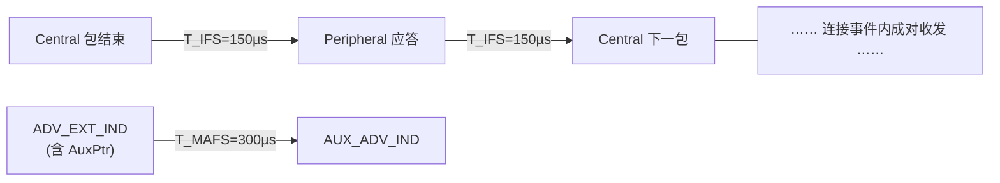

# BLE 射频物理层参数全表（Vol 6 Part A 提取）

> 🌿 知识树位置: 树干 → 枝干[无线关联] → 分枝[BLE] → 叶[14-RF物理层参数全表]
> ⬆️ 父节点: [02-链路层与物理层](02-链路层与物理层.md)
> 📎 规范依据: Bluetooth Core 6.0（2024-08-27）Vol 6 Part A（Physical Layer Specification）§2~§5 + Part B §4.1（帧间隔），本地缓存见 [../../80-参考资料/README.md](../../80-参考资料/README.md)。本文所有"规范值"均自该 PDF 提取；标注"工程估算"的除外。

---

这是 [02-链路层与物理层](02-链路层与物理层.md) 第二、七节的"仪表盘级"展开：发射、接收、定时、吞吐、链路预算——拿它对照芯片 datasheet 或量产测试（OTA/传导）指标最顺手。

## 一、频段与信道（Part A §2）

- 工作频段：**2400~2483.5 MHz ISM**，40 个射频信道，中心频率 2402+2k MHz（k=0..39），间隔 2 MHz。
- **CS 专用 72 信道**（6.0）：2402+k MHz，k∈{2..22} ∪ {26..76}，间隔 1 MHz——信道探测（见 [13-测向与信道探测](13-测向与信道探测.md)）独有的窄格信道。

## 二、发射参数（Part A §3）

### 2.1 发射功率与功率等级

最大设定下的辐射发射功率须在 **0.01 mW（−20 dBm）~ 100 mW（+20 dBm）**之间（天线接口处，无接口按 0 dBi 参考天线折算）。功率等级（Table 3.1）：

| Power Class | 要求（Pmax = 最大辐射功率） |
|---|---|
| 1 | 100 mW（+20 dBm）≥ Pmax > 10 mW（+10 dBm） |
| 1.5 | 10 mW（+10 dBm）≥ Pmax > 2.5 mW（+4 dBm） |
| 2 | 2.5 mW（+4 dBm）≥ Pmax > 1 mW（0 dBm） |
| 3 | 1 mW（0 dBm）≥ Pmax ≥ 0.01 mW（−20 dBm） |

- 相邻两个可调功率档差应 ≤ **8 dB**（LE Power Control Request 可用时"should"）。
- 高功率近距离会饱和对端接收机——6.0 强调用功控而非蛮力（LL_POWER_CONTROL_REQ，见 [12-LLCP控制过程全表](12-LLCP控制过程全表.md)）。
- 特征位 bit15 "LE Power Class 1" 声明支持 +20 dBm 档。

### 2.2 调制特性（§3.1）

| 参数 | 规范值 | 备注 |
|---|---|---|
| 调制方式 | GFSK，BT = 0.5 | '1'=正频偏，'0'=负频偏 |
| 调制指数 | 0.45 ~ 0.55 | "稳定调制指数"发射机：0.495~0.505（可声明特征 bit9/bit10） |
| 最小频偏 Fmin | ≥ 80% 满频偏；且 ≥ **185 kHz**（1 Msym/s）、≥ **370 kHz**（2 Msym/s） | 对应调制指数恰为 0.5 时偏差 250/500 kHz |
| 符号定时精度 | 优于 **±50 ppm** | 晶振选型直接约束（见 §7） |
| 过零误差 | ≤ ±1/8 符号周期 | |
| LE 2M 2BT（CS 专用） | BT = 2.0，符号中心最小频偏 ≥ 420 kHz | 仅 CS_SYNC 包可用 |
| CS SNR 输出控制 | SOI 0~4 → 18/21/24/27/30 dB | 可选；控制误差 ≤3 dB（95% 步） |

### 2.3 频率容限（§3.3）

| 参数 | 规范值 |
|---|---|
| 包内中心频率偏差（初始偏移+漂移合计） | ≤ **±150 kHz**（≈±61 ppm @2.44 GHz） |
| 包内最大频漂 | ≤ ±50 kHz |
| 最大漂移速率 | ≤ 400 Hz/µs |

### 2.4 杂散发射（§3.2）

| 调制 | 频偏 | 邻道功率（1 MHz 带宽） |
|---|---|---|
| 1 Msym/s（1M/Coded） | ±2 MHz | ≤ −20 dBm |
| 1 Msym/s | ≥ ±3 MHz | ≤ −30 dBm |
| 2 Msym/s（2M/2M 2BT） | ±4、±5 MHz | ≤ −20 dBm |
| 2 Msym/s | ≥ ±6 MHz | ≤ −30 dBm |

允许 3 个 1 MHz 宽的例外频段（中心在整数 MHz 上，绝对值 ≤−20 dBm）。带外杂散按销售国法规（FCC/ETSI）。6 dB 带宽 ≥500 kHz（FCC 15.247 路线）。

## 三、接收参数（Part A §4）

### 3.1 灵敏度（Table 4.2，Core 6.0 版）

| PHY | 参考灵敏度 | 备注 |
|---|---|---|
| LE 1M / LE 2M（未编码） | **−70 dBm** | 实际灵敏度按 BER 与最大载荷长度分级：载荷 1~37 B 时 BER≤0.1%，128~255 B 时 BER≤0.017% |
| LE Coded S=2（500 kb/s） | **−75 dBm** | |
| LE Coded S=8（125 kb/s） | **−82 dBm** | **6.0 已由旧版 −80 dBm 收紧为 −82 dBm**（引用旧文献注意） |

芯片实测灵敏度通常显著优于规范值（1M 典型 −90~−97 dBm，datasheet 值），规范值是互操作底线。

### 3.2 抗干扰性能（Tables 4.3~4.6）

测量条件：有用信号 −67 dBm（未编码）/ −72 dBm（S=2）/ −79 dBm（S=8），BER ≤0.1%。注意 PDF 表格易错位，下表数值已按原始提取顺序核对（干扰类型→比值一一对应）。

| 干扰类型 | LE 1M | LE 2M | Coded S=2 | Coded S=8 |
|---|---|---|---|---|
| 同频 C/I | 21 dB | 21 dB | 17 dB | 12 dB |
| 邻道（1 MHz @1M / 2 MHz @2M） | 15 dB | 15 dB | 11 dB | 6 dB |
| 次邻道（2 MHz @1M / 4 MHz @2M） | −17 dB | −17 dB | −21 dB | −26 dB |
| 三邻道（3 MHz @1M / 6 MHz @2M） | −27 dB | −27 dB | −31 dB | −36 dB |
| 镜频干扰 | −9 dB | −9 dB | −13 dB | −18 dB |
| 镜频±1 MHz（@1M）/±2 MHz（@2M） | −15 dB | −15 dB | −19 dB | −24 dB |

- 允许 5 个"杂散响应信道"不达上表（1 Msym/s 时距有用信号 2 MHz、2 Msym/s 时 4 MHz 处，镜频除外），放宽为 C/I = −17 dB。
- 干扰信号：有用信号用 PRBS9，干扰用 PRBS15（参考信号定义 §4.6：调制指数 0.5±1%、BT 0.5±1%、码率 ±1 ppm）。

### 3.3 带外阻塞（Table 4.7，有用信号=灵敏度+3 dB，中心 2426 MHz）

| 干扰频率 | 干扰电平 | 分辨率带宽 |
|---|---|---|
| 30 MHz ~ 2000 MHz | −30 dBm | 10 MHz |
| 2003 ~ 2399 MHz | −35 dBm | 3 MHz |
| 2484 ~ 2997 MHz | −35 dBm | 3 MHz |
| 3000 MHz ~ 12.75 GHz | −30 dBm | 25 MHz |

允许 10 个整数 MHz 中心的例外频点（至少 7 个可放宽到 −50 dBm，最多 3 个更低）。

### 3.4 互调与最大输入（§4.4/§4.5）

| 项目 | 条件/要求 |
|---|---|
| 互调 | 有用信号 f0（灵敏度+6 dB）；正弦 f1 = −50 dBm、调制干扰 f2 = −50 dBm，满足 f0 = 2f1−f2 且 \|f2−f1\| = n×1 MHz（1M，n=3/4/5）或 n×2 MHz（2M）；三选一满足即可 |
| 最大可用输入电平 | −10 dBm 输入时 BER ≤0.1%（强信号饱和裕量） |
| RSSI 精度 | ±6 dB（should，支持 RSSI 时） |

### 3.5 参考信号定义（§4.6，所有收发测量的"标尺"）

| 参数 | 规范值 |
|---|---|
| 调制 | GFSK |
| 调制指数 | 0.5 ± 1%（标准调制指数）；0.5 ± 0.5%（稳定调制指数） |
| BT | 0.5 ± 1% |
| 数据码率 | 1 Mb/s ±1 ppm（LE 1M）、2 Mb/s ±1 ppm（LE 2M）、500 kb/s ±1 ppm（S=2）、125 kb/s ±1 ppm（S=8） |
| 调制数据 | 有用信号 PRBS9；干扰信号 PRBS15 |
| 频率准确度 | 优于 ±1 ppm（测试信号源要求，非被测件要求） |

## 四、包定时（Part B §4.1 + Part A）

| 计时参数 | 值 | 说明 |
|---|---|---|
| T_IFS（ACL/CIS 帧间隔） | 默认 **150 µs** | T_IFS_ACL_CP / T_IFS_ACL_PC / T_IFS_CIS 按 RX 方 PHY 选值；6.0 起可用 Frame Space Update 过程（LL_FRAME_SPACE_REQ/RSP）协商改短/改长 |
| T_IFS_150 | 150 µs（固定） | 广播应答、扫描、PAwR 等不可协商场合 |
| T_MAFS（Minimum AUX Frame Space） | **300 µs** | AuxPtr 指向的辅助包最小间隔 |
| T_MSS_CIS / T_MSS_150 | 默认 150 µs | CIS/BIS 子事件间最小间隔（CIS 可协商） |
| 锚点接收窗口 | connWinSize × 1.25 ms，上限 10 ms | 连接建立/参数迁移时第一个包的到达窗口 |
| Radio wake-up | 实现相关，无规范值 | 控制器须在锚点前完成频率校准+AGC；低功耗设计把唤醒时间压到 µs~百 µs 级，具体见芯片手册 |

补充两张定时相关的表。

**最大空口包时间**（按 [02-链路层与物理层](02-链路层与物理层.md) 包格式推算，DLE=251 B+4 B MIC；Coded 一行为规范原文）：

| PHY | 最大包时间 | 推算依据 |
|---|---|---|
| LE 1M | ≈2120 µs | 8+32+16+2040+24 bit = 2120 bit ÷ 1 Mb/s；与 connMaxTxTime 上限一致 |
| LE 2M | ≈1064 µs | 前导/头按 2M 时序折算，载荷减半 |
| LE Coded | 462 ~ 17040 µs | Part B Table 2.1 原文（S=2/S=8 合并范围） |

**睡眠时钟精度 SCA 分档**（HCI/LLCP 用 0x00~0x07 表达，Vol 4 Part E；连接参数里 Peripheral 最低须 ±500 ppm）：

| 编码 | 0x00 | 0x01 | 0x02 | 0x03 | 0x04 | 0x05 | 0x06 | 0x07 |
|---|---|---|---|---|---|---|---|---|
| 精度 | 500 ppm | 250 ppm | 150 ppm | 100 ppm | 75 ppm | 50 ppm | 30 ppm | 20 ppm |

SCA 决定 Peripheral 锚点漂移窗口：connInterval=1 s、SCA=±50 ppm 时最大漂移 ±50 µs——这就是"低功耗为什么费接收窗口"的算术，也是 LL_CLOCK_ACCURACY_REQ/RSP 存在的理由（对端换了好晶振就收紧窗口省电）。

## 五、空中数据率与有效吞吐对照

| PHY | 空口码率 | 空口净荷速率（去 FEC 开销后） | 应用层吞吐（工程估算，1 包/事件理想化） | 说明 |
|---|---|---|---|---|
| LE 1M | 1 Mb/s | 1 Mb/s | ~0.6~0.8 Mb/s | 计入接入地址/前导/CRC/帧间隔与重传 |
| LE 2M | 2 Mb/s | 2 Mb/s | ~1.3~1.6 Mb/s | 帧头开销比例同 1M，包时间减半 |
| LE Coded S=2 | 1 Msym/s + FEC（S=2，符号组 P=1） | 500 kb/s | ~0.3~0.4 Mb/s | FEC 扩展 2 倍，覆盖换取可靠 |
| LE Coded S=8 | 1 Msym/s + FEC（S=8，符号组 P=4） | 125 kb/s | ~0.07~0.1 Mb/s | 8 倍扩展；包最长 17040 µs，连接间隔下限也随之抬高 |

> 空口净荷速率是定义值（S=2/S=8 编码后数据速率 500/125 kb/s，规范原文）；"应用层吞吐"为按 DLE=251 B、无干扰、无重传的典型链路估算值，**非规范数据**，实际取决于连接间隔、MTU、事件内包数（MD 位滚动）。

吞吐三杠杆，按影响排序：**连接间隔**（7.5 ms 间隔下事件密度翻倍再翻倍）、**DLE**（27 B→251 B 使单包有效载荷占比从 ~50% 提到 ~93%）、**PHY**（2M 使包时间减半，T_IFS 占比反而上升）。BLE 5 起还允许一个连接事件内塞多组"包+应答"，逼近空口极限。

## 六、链路预算估算示例（工程估算）

自由空间路径损耗 FSPL(dB) ≈ 40.2 + 20·log₁₀(d/m)（f=2450 MHz）。预算 = TX 功率 + 天线增益和 − FSPL − 灵敏度 + 衰落裕量。

| 场景 | 配置 | 计算 | 可达距离（视距） |
|---|---|---|---|
| 典型穿戴 | TX +4 dBm，0 dBi×0 dBi，1M 实测灵敏度 −90 dBm，裕量 20 dB | FSPL = 4+0−(−90)−20 = 74 dB | d ≈ 10^((74−40.2)/20) ≈ **49 m** |
| Class 1 上限 | TX +20 dBm，规范底线灵敏度 −70 dBm，裕量 10 dB | FSPL = 20−(−70)−10 = 80 dB | d ≈ **98 m（"100 m"级宣传的出处）** |
| Class 1 + 实测 | TX +20 dBm，1M 实测灵敏度 −90 dBm，裕量 20 dB | FSPL = 20−(−90)−20 = 90 dB | d ≈ 10^((90−40.2)/20) ≈ **309 m（"300 m"级）** |
| 远距 beacon | TX +20 dBm，Coded S=8 实测灵敏度 −100 dBm，裕量 20 dB | FSPL = 20−(−100)−20 = 100 dB | d ≈ 10^((100−40.2)/20) ≈ **977 m ≈ 1 km+（空旷视距）**；室内多径下大幅缩水 |

结论：规范灵敏度（−70/−75/−82）只是互操作底线，**实际覆盖由芯片灵敏度+天线增益+环境决定**；广告里"数百米/1 km"基本都建立在 Coded PHY 与实测灵敏度之上。

## 七、PCB 设计要点（由规范反推）

- **晶振精度**：符号定时 ±50 ppm + 中心频率偏差（含漂移）±150 kHz（≈±61 ppm）→ 晶振选 ±20~±40 ppm 档（含焊接偏移与温漂预算），留出 AGC/频偏跟踪吃掉剩余。廉价 ±50 ppm 晶振在宽温下会顶到规范红线。
- **天线匹配**：50 Ω 参考阻抗下做 π 型匹配（串联 L + 并联 C×2），VSWR < 2；净空区（keep-out）≥ 规定的天线半波长比例，远离电池/USB 连接器金属体。外接天线产品按有效天线增益折算 EIRP（功率上限约束的是"辐射功率"而非芯片引脚功率）。
- **谐波与杂散**：满足 §2.4 邻道 −20/−30 dBm 需要良好的电源去耦与屏蔽；2 次谐波（4.8 GHz）是常见翻车点（ETSI 限值更紧）。
- **镜像抑制**：镜频 C/I 仅 −9 dB（1M），低中频/零中频架构的镜像校准必须做；PCB 布局避免让 Wi-Fi 2.4G PA 输出走线耦合进 BLE LNA。
- **CTE/CS 附加要求**（做测向/测距产品）：天线阵列幅度/相位一致性校准（测向精度主导因素）；CS 要求发射稳定相位（Part A §3.4：95% 去趋势相位残差 ≤20°）与 FAE 表校准——射频前端相位噪声预算比普通 BLE 严格一档。
- **测试条件**（Part A 附录 A）：全部规范值只在厂商声明的正常工作条件（温度/湿度/标称供电电压）下有效——量产 OTA 测试的温箱范围要与声明对齐，否则 −70 dBm 灵敏度指标无意义。

## 相关节点

- [02-链路层与物理层](02-链路层与物理层.md) —— 三档 PHY 与包格式的概述版
- [12-LLCP控制过程全表](12-LLCP控制过程全表.md) —— 功控/PHY 切换/DLE 的过程层机制
- [13-测向与信道探测](13-测向与信道探测.md) —— CTE 与 CS 对射频的附加要求
- [../../10-树干-USB核心/03-物理层与电气特性](../../10-树干-USB核心/03-物理层与电气特性.md) —— 有线 PHY 的眼图/幅度确定性对照
- [../../80-参考资料/README.md](../../80-参考资料/README.md) —— Core 6.0 原文缓存索引
