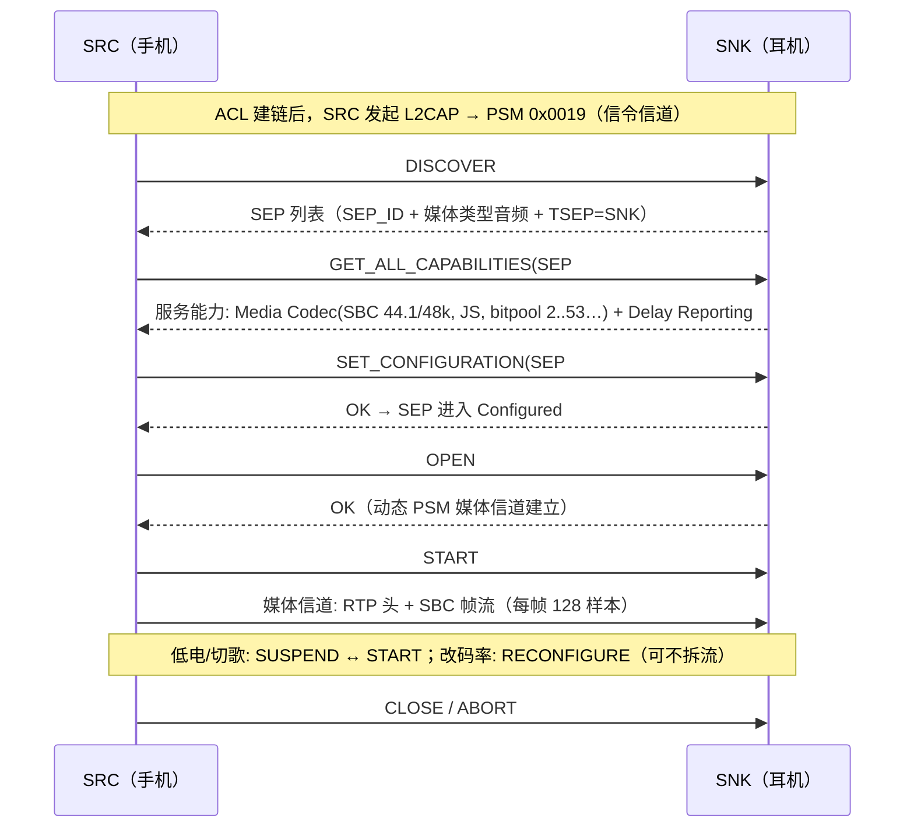
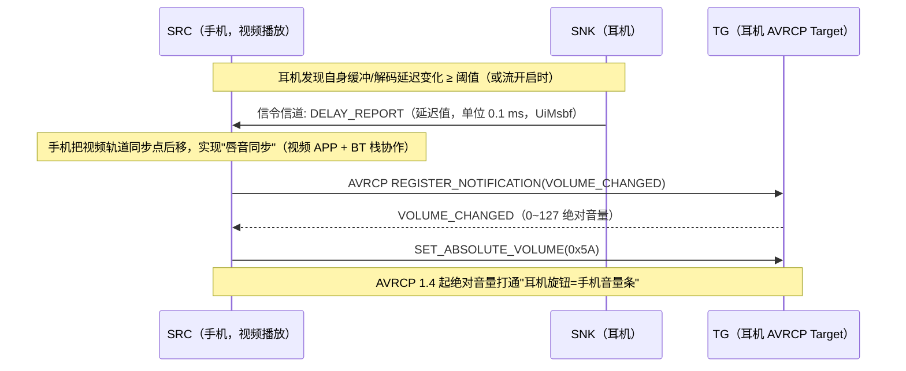

# A2DP 编解码与 AVDTP 参数详解（SBC/AAC 位级、厂商编码、延迟上报）

> 🌳 知识树位置: 树干 → 枝干[无线关联] → 分枝[BLE] → 叶[15-A2DP编解码与AVDTP参数]
> 本文是 [11-经典蓝牙Profile详解](11-经典蓝牙Profile详解.md) 第五章（A2DP）的规范级深化：只讲"信令怎么走、参数位怎么填"。
> 规范原文缓存: [../../80-参考资料/bluetooth/A2DP-1.4.1.pdf](../../80-参考资料/bluetooth/A2DP-1.4.1.pdf)（2025-06-30 版，含 SBC/MPEG/AAC 编码互操作全表）；编解码信息元素格式另见 AVDTP 规范 §8.21.5（[../../80-参考资料/bluetooth/AVDTP-1.3.pdf](../../80-参考资料/bluetooth/AVDTP-1.3.pdf) 已缓存）。缓存索引: [../../80-参考资料/README.md](../../80-参考资料/README.md)
> 上游基础: [11-经典蓝牙Profile详解](11-经典蓝牙Profile详解.md)、[08-经典蓝牙与BLE对比](08-经典蓝牙与BLE对比.md)

## 1. AVDTP：三个信道与一套信令

AVDTP（Audio/Video Distribution Transport Protocol，L2CAP PSM **0x0019**）在 SRC（源，手机）与 SNK（汇，耳机）间最多跑三类 L2CAP 信道：

| 信道 | PSM | 用途 |
|---|---|---|
| 信令信道 | 0x0019（固定） | Discover/配置/开关流的全部命令-响应对；一对设备只有一条 |
| 媒体信道 | 动态分配 | OPEN 后建立，承载 RTP 式媒体包（版本/序号/时间戳/SSRC 头 + 编码载荷） |
| 恢复/报告信道 | 动态分配（可选） | Recovery（丢包重传，需能力协商）/ Reporting（时间戳报告）信道；另有 Content Protection（SCMS-T 内容保护）随能力协商挂在媒体信道上 |

信令命令集（Signal Identifier，命令/响应配对；数值已与 AVDTP 1.3 规范 Table 8.6 逐项核对）：

| 代码 | 命令 | 作用 |
|---|---|---|
| 0x01 | DISCOVER | 列出对端全部 SEP（Stream Endpoint，流端点） |
| 0x02 / 0x0C | GET_CAPABILITIES / GET_ALL_CAPABILITIES | 取某 SEP 的服务能力（后者含厂商扩展能力） |
| 0x03 | SET_CONFIGURATION | 选中 SEP 并填入编码参数（Codec Specific Information Elements）→ 进入 Configured |
| 0x04 | GET_CONFIGURATION | 读回当前配置 |
| 0x05 | RECONFIGURE | 流中途只改编码参数（如降 bitpool，不动传输信道） |
| 0x06 / 0x08 | OPEN / CLOSE | 建立 / 拆除媒体（及恢复、报告）信道 |
| 0x07 / 0x09 | START / SUSPEND | 流的走/停（RTP 流继续存在但暂停发包） |
| 0x0A | ABORT | 任意状态强制回 IDLE |
| 0x0B | SECURITY_CONTROL | 内容保护（SCMS-T）的鉴权载荷交换 |
| 0x0D | DELAY_REPORT | SNK 上报链路延迟（AVDTP 1.3 起，见第 8 节） |

## 2. SEP 与 TSEP：编解码器实例的"插座"

- **SEP（Stream Endpoint）**：设备向对端暴露的一个可配置流端点，一个编码器实例对应一个 SEP；`DISCOVER` 拿到的每个 SEP 带 SEP_ID（6 bit）。ATRAC 这类"一版本一 SEP"的编码（A2DP 1.4.1 §4.6.2.1），支持多版本就要开多个 SEP。
- **TSEP（Type of SEP，AVDTP 1.3 起）**：0x00=SRC（能发出流）、0x01=SNK（能收流）——双模/中继设备的 SEP 表里明确标方向，是 LE Audio 之前"角色发现"的雏形。
- 流状态机：IDLE → Configured → Open → Streaming（SUSPEND/START 往返；CLOSE/ABORT 回退）。
- 不启用 Multiplexing 能力时，一对设备同时只有一条传输会话（一套媒体信道），想双编码并发就得开复用能力——现实设备几乎不开。

## 3. 服务能力类别（GET_ALL_CAPABILITIES 返回的内容）

| 类别码 | 名称 | 内容 |
|---|---|---|
| 0x01 | Media Transport | 基础传输能力（几乎必带） |
| 0x02 | Reporting | 报告信道 |
| 0x03 | Recovery | 丢包恢复窗口参数 |
| 0x04 | Content Protection | 如 SCMS-T（DRM 旗标） |
| 0x05 | Header Compression | RTP 头压缩 |
| 0x06 | Multiplexing | 多会话复用 |
| 0x07 | Media Codec | 媒体类型 + **Audio Codec Type** + 编码信息元素（本文主角） |
| 0x08 | Delay Reporting | AVDTP 1.3 新增，SNK 才会声明 |

Audio Codec Type 取值（Bluetooth Assigned Numbers）：**0x00 SBC、0x01 MPEG-1,2 Audio、0x02 MPEG-2,4 AAC、0x03 ATRAC family、0xFF 厂商专属**。能力查询时可置多个位（one-hot 位图），`SET_CONFIGURATION` 时每个字段**只允许置一位**（A2DP 1.4.1 §4.3.2 明文）。

## 4. SBC 位级表（必选编码，A2DP 1.4.1 §4.3 + Figure 4.1）

编码信息元素共 **4 字节**：

| 位置 | 字段 | 值 |
|---|---|---|
| Octet0 b7..b4 | 采样频率 | b7=16k、b6=32k、b5=**44.1k**、b4=**48k**（SNK 必选 44.1/48；SRC 至少其一） |
| Octet0 b3..b0 | 声道模式 | b3=MONO、b2=DUAL、b1=STEREO、b0=**JOINT STEREO**（SNK 全必选） |
| Octet1 b7..b4 | 块长 | b7=4、b6=8、b5=12、b4=**16**（双侧全必选） |
| Octet1 b3..b2 | 子带数 | b3=4、b2=**8**（SRC 必须支持 8） |
| Octet1 b1..b0 | 分配法 | b1=SNR、b0=**LOUDNESS**（SRC 至少支持 Loudness） |
| Octet2 | 最小 bitpool | 独立 8 位 UiMsbf：**合法范围 2~250** |
| Octet3 | 最大 bitpool | 同上；SNK 至少须支持 2 到"High Quality bitpool"（下表）；能力查询时表示"允许区间"，配置时表示"INT 想用的值" |

现网最常见的一条 SBC 配置即 `21 15 02 35`（BlueZ 默认）——逐字节回读：0x21=44.1k+Joint Stereo，0x15=块 16+8 子带+Loudness，min bitpool=2，max bitpool=53。

关键规则（A2DP 1.4.1 §4.3.2.7/§4.3.4）：码率上限 **单声道 320 kb/s、双声道 512 kb/s**；bitpool 可在流中动态改（不需 SUSPEND）；其它参数变更走 RECONFIGURE/GAVDP 流程。

**推荐参数档（Table 4.7，block=16、subbands=8、Loudness）**——"328/345 kbps 高音质"的官方出处：
> 🔍 对抗抽查（evolve #27）：Table 4.7 的 bitpool 53/51 与 328/345 kb/s 已与 A2DP 1.4.1 缓存原文逐值比对一致。

| 档位 | 模式 | 采样率 | bitpool | 帧长（字节） | 码率 |
|---|---|---|---|---|---|
| Middle Quality | Mono | 44.1k / 48k | 19 / 18 | 46 / 44 | 127 / 132 kb/s |
| Middle Quality | Joint Stereo | 44.1k / 48k | 35 / 33 | 83 / 79 | 229 / 237 kb/s |
| **High Quality** | Mono | 44.1k / 48k | 31 / 29 | 70 / 66 | 193 / 198 kb/s |
| **High Quality** | **Joint Stereo** | **44.1k** | **53** | **119** | **328 kb/s** |
| **High Quality** | **Joint Stereo** | **48k** | **51** | **115** | **345 kb/s** |

工程速记：8 子带 JS 帧长 = 4 + 8 + ceil((8 + 块长×bitpool)/8)，帧含 块长×子带=128 样本；帧长×帧率×8 即码率。真机常见上限即 bitpool 53（许多耳机把 max bitpool 广播为 53）；社区"**SBC-XQ**"玩法是让 SRC 越过 53 用到对端实际可解码的更大 bitpool（如 76 → 512 kb/s，SNK 对 512 kb/s 的强制要求见 A2DP 老版本互操作条款）——非保证互操作，属灰色优化。

## 5. AAC 位级表（可选编码，A2DP 1.4.1 §4.5 + Figure 4.5）

编码信息元素共 **8 字节**。注意：**A2DP 1.4.1（2025）重排了位段**，而现网设备按 1.3 布局互通——两版对照如下（1.3 列为 Android/BlueZ 实现惯例，规范细节见规范）：

| 字段 | A2DP 1.3（部署基线） | A2DP 1.4.1（缓存规范 Table 4.14~4.20） |
|---|---|---|
| Object Type（Octet0） | b7=**MPEG-2 AAC LC（必选）**、b6=MPEG-4 LC、b5=MPEG-4 SBR、b4=MPEG-4 LD | b7=MPEG-2 LC（必选）、b6=MPEG-4 LC、b5=LTP、b4=scalable、b3=HE-AAC 等扩展；**b0=MPEG-D DRC**（新增，不支持 MPEG-2 LC 时才可置 1） |
| 采样频率（16 位位图，Octet1~2） | 0x8000=8k、…、0x0100=44.1k、0x0080=48k、…、0x0010=96k | 同布局：Octet1 b7..b0=8k/11.025k/12k/16k/22.05k/24k/32k/44.1k，Octet2 b7..b4=48k/64k/88.2k/96k（SNK 必选 44.1/48） |
| 声道（Octet2） | b1=1 声道、b0=2 声道 | **重排**：b3=1ch、b2=2ch、b1=5.1、b0=7.1（新增多声道；SNK 必选 1/2ch） |
| VBR | 与码率同字段最高位 | Octet3 b7=VBR（SNK 必选支持 VBR） |
| 码率 | 23 位 UiMsbf，单位 b/s；CBR=平均码率，VBR=每帧峰值码率；0=未知 | Octet3 b6..b0 + Octet4 + Octet5，23 位 UiMsbf，语义同左 |
| 其余 | 保留 | Octet6~7 保留 |

载荷格式：MPEG-4 **LATM**（muxConfigPresent=1）；发 MPEG-2 AAC LC 时 SRC 须先改写编解码信息转成 MPEG-4 LC 再打包（A2DP 1.4.1 §4.5.4 原文要求）。苹果生态大量使用 AAC（典型 SBR+LC 组合、VBR），这也是"iPhone 上 AAC 比 SBC 明显好"的规范层原因。

一条按 1.3 布局构造的 AAC 配置示例（教学用）：`80 01 01 04 E2 00 00 00` = MPEG-2 AAC LC（0x80）+ 44.1 kHz（0x0100）+ 2 声道（0x01）+ CBR 320 000 b/s（0x04E200）+ 保留零。抓包时用这 8 字节可快速校验对端字节序与字段理解是否一致。

## 6. MPEG-1,2 Audio（MP3）参数概貌（可选编码，A2DP 1.4.1 §4.4）

信息元素 **4 字节**：

| 位置 | 字段 | 值 |
|---|---|---|
| Octet0 b7..b5 | Layer | b7=Layer I、b6=Layer II、b5=Layer III（mp3；双侧各至少一） |
| Octet0 b4 | CRC 保护 | SNK 必选、SRC 可选 |
| Octet0 b3..b0 | 声道模式 | Mono/Dual/Stereo/Joint Stereo 位图 |
| Octet1 b5..b0 | 采样率 | 16k/22.05k/24k/32k/44.1k/48k（SNK 必选 44.1/48） |
| Octet1 MPF 位 | 载荷格式 | MPF-1 必选；MPF-2（Layer III 抗错封装）可选，置 1 表示支持（位位置见规范 Figure 4.4） |
| Octet2 b7 | VBR | SNK 必选、SRC 可选；置位时码率索引字段被忽略 |
| Octet2 b6..b0 + Octet3 | 码率索引位图 | 按 MP3 帧头 bitrate index 逐一置位（'1111' free format 不用；MPEG-1 Layer II 存在"码率×声道"组合限制，见其规范 §2.4.2.3） |

MP3 曾是 SBC 之外最早的 SIG 可选编码，现基本被 AAC 取代，抓包遇到即为老设备。

## 7. 厂商编解码：注册机制与公开参数

机制（A2DP §4.2.3/§4.7）：Audio Codec Type = **0xFF（Vendor Specific）**，编码信息元素开头为 **Vendor ID（Bluetooth 公司 ID）+ Vendor Codec ID**，其后参数格式厂商自定。对端在 GET_ALL_CAPABILITIES 时若认识这对 ID 即可选入 SET_CONFIGURATION；媒体包格式亦由厂商定义。常见厂商编码参数（**全部为厂商公开资料，非 SIG 规范数值**）：

| 编码 | 厂商 | 公开参数 | 备注 |
|---|---|---|---|
| aptX（经典） | APT/Qualcomm | 16-bit，44.1/48 kHz，352/384 kb/s 固定（4:1 ADPCM） | 专利授权制；延迟低于 SBC |
| aptX HD | Qualcomm | 24-bit/48 kHz，576 kb/s 固定 | aptX 的高码率版 |
| aptX Adaptive | Qualcomm | 最高 24-bit/96 kHz；约 279~420 kb/s 动态自适应 | 按 RF/内容动态调码率与量化，延迟亦动态 |
| LDAC | Sony | 最高 96 kHz/24-bit；330/660/990 kb/s 三档 + 自适应 | Hi-Res Audio Wireless 认证路线；安卓 8 起集成于 AOSP |
| LHDC（HWA 联盟） | Savitech/Hi-Res 联盟 | 最高 96 kHz/24-bit，约 900 kb/s 量级（LHDC 3.0/4.0/5.0 逐代提高） | 华为等采用过；认证体系独立 |
| Samsung Seamless（原 Scalable） | Samsung | 约 88.2~303 kb/s 自适应（官方公开值域） | 三星自家耳机/手机封闭生态 |

厂商编码互操作矩阵完全由授权清单决定：同一副耳机在小米/索尼/苹果手机上可选到的编码列表可以完全不同——这正是 SET_CONFIGURATION 前"能力交集"逻辑的后果。

## 8. 延迟上报与绝对音量：1.3/1.4 时代的体验补丁

- **DELAY_REPORT（AVDTP 1.3）**：只有声明了 Delay Reporting 能力（服务类别 0x08）的 SNK 才会发；手机据此校准 A/V 同步——蓝牙耳机看视频不对口型的历史遗留，靠它收敛。
- **绝对音量（AVRCP 1.4）**：范围 0x00~0x7F；与 A2DP 独立跑在 AVCTP（PSM 0x0017）上。两者与 1.3 之前"耳机只能相对音量、视频永远不同步"的裸 A2DP 时代形成对照。

## 9. 双模耳机的音频路径选择策略

双模（BR/EDR + LE）耳机如今面对两条音频管线：经典 A2DP（本文）与 LE Audio（LC3 + CIS，见 [09-LEAudio与LC3](09-LEAudio与LC3.md)）。选择发生在**手机侧协议栈策略 + 耳机侧能力广播**之间：

| 环节 | 经典 A2DP 路径 | LE Audio 路径 | 决策方 |
|---|---|---|---|
| 能力发现 | SDP 查 A2DP SNK 记录 + AVDTP 能力 | GATT 读 PACS（可发布编解码能力）/ASCS（SEP） | 双方 |
| 编码 | SBC/AAC/厂商（位级见上） | LC3（必选）+ 厂商扩展 | 能力交集 |
| 传输 | ACL + AVDTP 媒体信道（RTP） | CIS/ISO 流（可多路，左右分离） | 拓扑 |
| 语音 | 切 HFP eSCO（CVSD/mSBC） | TMAP 通话（LC3-SWB），不再换链路 | 场景 |
| 典型回退链 | —— | LE Audio 不可用/不稳 → 自动落回 A2DP | 平台策略 |

工程策略要点：① 通话场景优先级高于媒体——老平台即使 LE Audio 在放歌，来电仍会拉 HFP 链路（双链路并存仲裁）；② 手机平台普遍"LE Audio 可用则优先"，但厂商编码溢价（LDAC/aptX Adaptive 的高码率）仍是经典路径留存的理由；③ TWS 左右耳私享信道多在厂商私有 2.4G 协议上实现，手机只看到单耳"代理"，A2DP 位级参数（尤其 bitpool 上限）由代理耳机决定——这解释了为何不同 TWS 抓到的 SBC max bitpool 差异巨大。

## 10. 抓包排错清单（工程向）

按发生率排序的 A2DP 建流失败原因，逐项对照本文位级表即可定位：

| 症状 | 常见根因 |
|---|---|
| SET_CONFIGURATION 被拒 | 参数与 GET_CAPABILITIES 交集不符：某字段置了多个位（能力响应可多位、配置请求只许一位，第 3 节规则）；或对象类型位/采样位/通道位填错位段（AAC 尤甚，第 5 节两版布局差异） |
| 能连上但无声 | 媒体信道 RTP 头与编码信息元素不一致（如 SBC 实际 bitpool 与广播 max 不符）；或 SNK 只声明 Delay Reporting 却被 SRC 当作必配能力塞进 SET_CONFIGURATION |
| 只有单耳/卡顿 | Recovery 能力未协商就丢包；eSCO（HFP）与 ACL 抢时隙 |
| AAC 在安卓可用、特定耳机不可用 | 厂商对 Object Type 位（MPEG-2 LC vs MPEG-4 SBR）与通道位的实现分歧——用第 5 节示例字节比对两端 IE |
| 音量键不同步 | 对端 AVRCP < 1.4，绝对音量不存在；回退相对音量策略 |
| 视频对口型差 | SNK 不支持 Delay Reporting（AVDTP 1.3 前的老栈），只能靠平台静态延迟估计 |

工具侧： HCI 日志里 `AVDTP_SET_CONFIGURATION_CMD` 的 Configuration Object 直接按第 4~6 节字节表翻译；社区在线工具可自动解析 SBC/AAC 信息元素（btcodecs 类解析器，公开资料）。

## 相关节点

- 上游：[11-经典蓝牙Profile详解](11-经典蓝牙Profile详解.md)（A2DP/AVRCP/HFP 总览，本篇的第五章深化）、[08-经典蓝牙与BLE对比](08-经典蓝牙与BLE对比.md)
- 演进方向：[09-LEAudio与LC3](09-LEAudio与LC3.md)（LC3/CIS/TMAP——双模策略的另一端）
- 底座：[01-蓝牙体系架构与HCI](01-蓝牙体系架构与HCI.md)、[02-链路层与物理层](02-链路层与物理层.md)（ACL/eSCO/CIS 信道能力）
- USB 侧对照组：[../../20-枝干-设备类协议/其他设备类/05-蓝牙控制器类-HCIoverUSB.md](../../20-枝干-设备类协议/其他设备类/05-蓝牙控制器类-HCIoverUSB.md)、[../../20-枝干-设备类协议/其他设备类/10-AV设备类详解.md](../../20-枝干-设备类协议/其他设备类/10-AV设备类详解.md)（有线世界的另一套音视频类）
- 缓存索引：[../../80-参考资料/README.md](../../80-参考资料/README.md)
