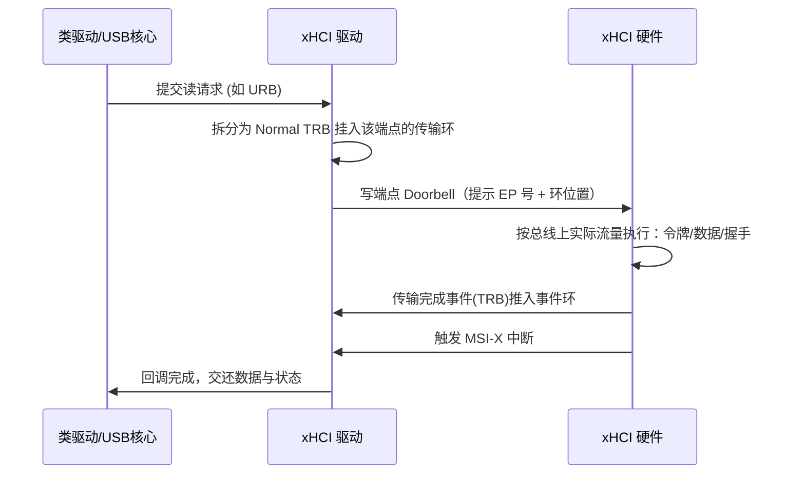
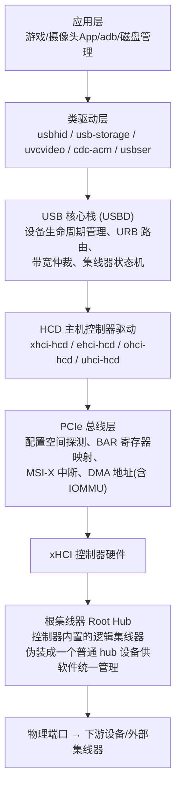

# 主机控制器栈全景

> 🌿 知识树位置: 树干 → 枝干[主机侧与实现] → 叶
> ⬆️ 返回: [../10-树干-USB核心/02-体系架构与分层模型.md](../10-树干-USB核心/02-体系架构与分层模型.md)

主机侧的一切复杂度，最终都收敛到一个芯片：**USB 主机控制器(Host Controller)**。它是 USB 规范与操作系统之间约定的"硬件契约"——每个控制器代际都对应一份公开的接口规范（HCI, Host Controller Interface），操作系统按规范写驱动，控制器厂商按规范做硬件。理解 HCI 的演进，就理解了"为什么你的电脑里有好几个 USB 控制器"这一常见现象。

## 一、主机控制器四代演进对照表

| 代际 | 接口全称 | 提倡者 | 适用速度 | 调度责任划分 | 数据结构 | 现状 |
|---|---|---|---|---|---|---|
| UHCI | 通用主机控制器接口(Universal Host Controller Interface) | Intel（联合 TS Labs） | LS/FS | **软件做调度多**：帧列表、队列头、传输描述符全部由软件排布，硬件只按帧执行 | 帧列表(Frame List) + 队列头(QH) + 传输描述符(TD) | 已淘汰，仅在旧平台/虚拟机中见到 |
| OHCI | 开放主机控制器接口(Open Host Controller Interface) | Compaq/Microsoft/National Semiconductor 等 | LS/FS | **硬件做调度多**：硬件自持周期/非周期队列，软件只需提交 ED/TD | 端点描述符(ED) + 传输描述符(TD) | 已淘汰 |
| EHCI | 增强主机控制器接口(Enhanced Host Controller Interface) | Intel 等组成的工业联盟 | **仅 HS**（高速） | 硬件执行周期(周期性)与非周期调度；FS/LS 设备被**移交**给伴随控制器 | 周期帧列表 + 异步队列；iTD/siTD/qTD | 仍存于旧平台；USB2 时代标配 |
| xHCI | 可扩展主机控制器接口(eXtensible Host Controller Interface) | Intel | **全部速度**（LS/FS/HS/SS/SSP，含 USB4 隧道的 USB3 功能） | 软件只负责"投递请求 + 敲门"，硬件自主调度执行 | TRB 环（传输环/命令环/事件环）+ 上下文结构 | 当前绝对主流 |

> 💡 术语提示：SS(SuperSpeed) 指 5Gbps 及以上代际；SSP(SuperSpeedPlus) 指 10Gbps 及以上的链路层增强版。

### 经典现象解释：为什么插一个 USB 1.1 设备会"跳到另一个控制器"？

在 EHCI 时代的主板上，芯片组通常同时存在 **1 个 EHCI 控制器 + N 个伴随控制器(Companion Controller, 即 UHCI/OHCI)**。EHCI 规范刻意**只定义高速信号处理**：

- 插入高速设备 → 端口路由(Route)到 EHCI；
- 插入全速/低速设备 → 复位探测(chirp 检测)发现设备不支持高速，硬件把端口**路由给伴随控制器**。

于是设备管理器里"USB 大容量存储设备"挂在 EHCI 下，而旁边的"USB 打印机"挂在 UHCI/OHCI 下——设备没变，是**端口所有权变了**。OS 看到的是物理上独立的多颗控制器。xHCI 出现后统一管理所有速度，这一现象基本消失（但同一主板往往有多个 xHCI 控制器对应不同物理口组，设备仍可能落在不同 xHCI 下）。

### 三代规范的数据结构风格对比

| 维度 | UHCI | OHCI | EHCI | xHCI |
|---|---|---|---|---|
| 调度列表 | 帧列表指向 QH/TD 链 | 周期/完成队列由硬件自持 | 周期帧列表 + 异步队列指针 | 环 + 上下文，硬件全权执行 |
| 软件工作量大头 | 排布每帧队列、回收 TD | 主要是提交/回收 ED/TD | 维护异步 QH 与周期 iTD | 填 TRB、敲 Doorbell |
| FS/LS 支持 | 原生 | 原生 | 转交伴随控制器 | 原生（统一上下文） |
| 编程复杂度焦点 | 帧内时隙手工安排 | 硬件状态机理解 | 混合路由与拆分事务 | 上下文与环的内存布局 |

## 二、xHCI 核心概念（当前主流）

xHCI 与前三代的本质区别：**把"软件排班"改成"软件下单、硬件执行"**。所有交互通过内存中的环形队列(Ring)与寄存器敲门(Doorbell)完成。

| 概念 | 英文 | 说明 |
|---|---|---|
| TRB | Transfer Request Block | 传输请求块，**16 字节**的定长命令/数据单元，是 xHCI 的"指令原子"。主机驱动把工作拆成一串 TRB 放进环里 |
| 传输环 | Transfer Ring | 每个端点(endpoint)一个环，存放该端点的传输 TRB；环尾用链路 TRB(Link TRB) 回卷成环形缓冲 |
| 命令环 | Command Ring | 全局唯一，承载控制器级命令（使能槽位、地址设备、配置端点、停止环等） |
| 事件环 | Event Ring | 控制器向软件汇报结果的环（传输完成事件、命令完成事件、端口状态变化事件）；可配置多个、按中断向量分组 |
| Doorbell 寄存器 | Doorbell Register Array | "敲门"寄存器：软件往环里追加 TRB 后，向对应 Doorbell 写目标(端点/命令)编号，硬件才开始取指执行 |
| 设备上下文 | Device Context / Slot Context / Endpoint Context | 控制器眼中"一台设备"的数据结构：槽位上下文描述设备级信息（地址、速度、路由），每个启用的端点有端点上下文（类型、包长、环指针、错误计数）。软件在**设备上下文基地址数组(Device Context Base Address Array)** 中登记索引 |

典型一次 bulk 传输的协作流程：



要点：

- 生产者-消费者模型靠 TRB 中的**周期位(Cycle Bit)** 区分"硬件可执行"与"软件未填充"，环回卷时翻转，无需软件加锁扫描。
- 环支持**流(Streams)**（SS 端点、配合 UAS 协议实现多队列命令并发），一个 bulk 端点可挂多个传输环，用 Stream ID 区分。
- 链路 TRB 使环物理上可不连续，硬件自动跳转。

### 2.1 常用命令 TRB 与设备槽位生命周期

xHCI 用"设备槽位(Slot)"统一管理一台设备从插入到移除的全生命周期，全程由命令环上的命令 TRB 驱动：

| 命令 TRB | 触发时机 | 作用 |
|---|---|---|
| Enable Slot | 插入事件后 | 控制器分配一个 Slot 编号 |
| Address Device | 复位完成后 | 执行 SET_ADDRESS 的硬件侧：装载输入上下文（含 Slot/EP0），分配设备地址 |
| Configure Endpoint | SET_CONFIGURATION 后 | 按配置描述符装载各端点上下文与传输环 |
| Evaluate Context | 接口/设置变更 | 让控制器重新读取更新后的上下文 |
| Reset / Stop / Set TR Dequeue | 错误恢复、清除 STALL、清队列 | 端点级运维操作 |
| Disable Slot | 拔出后 | 回收 Slot 与上下文内存 |

对应关系值得记住：**枚举流程（树干 [08-枚举流程与标准请求](../10-树干-USB核心/08-枚举流程与标准请求.md)）在 xHCI 下被拆解为上述命令序列**，SET_ADDRESS 这类总线事务由控制器硬件代为发出，软件只装载上下文。

### 2.2 MMIO 寄存器资源一览

| 寄存器组 | 代表成员 | 软件用途 |
|---|---|---|
| 能力寄存器(Capability) | HCSPARAMS、HCCPARAMS | 探测端口数/槽位数、支持的特性（如 64 位寻址、大包突发） |
| 操作寄存器(Operational) | USBCMD、USBSTS、CRCR、DCBAAP | 启停控制器、读状态、设命令环指针与设备上下文数组基地址 |
| 运行时寄存器(Runtime) | MFINDEX、Interrupter 组（IMAN/IMOD/ERSTBA…） | 微帧索引、事件环表绑定、中断合流(Interrupt Moderation)配置 |
| 门铃数组(Doorbell Array) | 每槽位/每端点一个 DWORD | "投递即敲门"的唯一通知通道 |

事件环通常绑定到 **MSI-X 中断向量**，可按中断器(Interrupter)划分到不同 CPU 核（高性能网卡式调优思路）。

## 三、主机侧软件栈层次



几个值得注意的点：

- **根集线器(Root Hub)**：控制器内部实现的虚拟集线器，向 USB 核心注册成一个标准的 1 端点 0 配置 hub 设备，使"枚举集线器—报告端口状态"的逻辑可以完全复用外部集线器代码。
- **类驱动**与 USB 核心的交互单位，在 Linux 中是 URB(USB Request Block)，在 Windows 中是 URB 结构（经 WDF/USB 目标设备抽象）——叫法不同，本质都是"一次传输请求"。
- HCD 与 HCI 规范一一对应：`xhci-hcd` 实现 xHCI，`ehci-hcd` 实现 EHCI……因此内核日志里看到加载哪个 hcd 模块，就能推断控制器的代际。

## 四、帧调度与带宽资源模型

USB 不是"能发包就行"的总线，主机侧必须保证**周期性传输的确定性**。两代模型差异巨大：

| 维度 | FS/HS（UHCI/OHCI/EHCI 模型） | SS/SSP（xHCI 时代） |
|---|---|---|
| 时间基准 | 1ms 帧 + 125µs 微帧 | 125µs 服务间隔(Service Interval) |
| 带宽预留 | 软件按 **bit time** 精确预算：同步与中断传输的 `wMaxPacketSize`×倍率 在每帧中预留时隙，插入前由 USB 核心做准入检查(带宽仲裁)，失败则配置被拒 | 无全局 bit-time 预算；硬件用**突发(Burst)**+链路层**信用(Credit)**流控填充线路，端点以 `wBytesPerInterval` 声明每服务间隔需求，主机控制器据此规划 |
| 非周期流量 | 填充周期时隙之外的剩余带宽 | 与周期流量在服务间隔内动态穿插 |
| 实际效果 | 总线利用率有限（HS 常见仅 ~60-80% 可用），插多了直接报"带宽不足" | 利用率高，"带宽不足"报错大幅减少 |

副作用：主机控制器驱动在为高速同步/中断端点做调度时，需要真实可用的时隙表——这就是为什么旧系统上"第二个摄像头插不进去"是带宽仲裁拒绝，而不是线坏了。

## 五、DMA 与内存一致性注意点

主机控制器是 PCI/PCIe 总线主控(Bus Master)，直接读写系统内存，软件侧有几类经典坑：

1. **两类 DMA 缓冲**
   - 一致性/相干缓冲(Coherent DMA)：供长期驻留的结构（TRB 环、上下文数组），CPU 与硬件同时可见，驱动用 `dma_alloc_coherent`（Linux）/ 常见属性分配（Windows）；
   - 流式缓冲(Streaming DMA)：数据区，每次传输前 map、完成后 unmap。
2. **缓存一致性问题**：x86 的 DMA 是缓存一致的，ARM/嵌入式平台通常**不是**。忘记 `dma_sync_*` 会导致 CPU 写了数据但硬件读到旧缓存（或反之）——"数据对一半"类疑难杂症的头号来源。
3. **IOMMU / DMAR**：现代平台开启 IOMMU 后，设备 DMA 地址与物理地址解耦，驱动必须使用 DMA 映射 API 返回的地址，绝不能把 `virt_to_phys` 的结果交给硬件；配置错误表现为控制器超时/主控错误(Master Abort)。
4. **对齐与驻留**：xHCI 要求 TRB、环段(Segment)、上下文结构按规范对齐（TRB/环段 16 字节，上下文 32/64 字节），且**传输期间内存必须驻留(pinned)**，不可被换出或随意释放。
5. **主机内存碎裂**：USB 核心常把大请求拆分到多个物理页并生成多个 TRB（配合链路 TRB），这也是"一次 huge 读请求实际产生多次总线传输"的原因。

## 六、HCD 初始化与设备插入全流程（以 Linux xHCI 为例）

```text
系统启动/模块加载阶段:
 1. PCI 探测 → 按 class/ID 匹配 xhci-pci 驱动
 2. 映射 MMIO BAR0，读能力寄存器（端口数/槽数/页大小）
 3. 复位控制器（USBCMD.HCRST），分配命令环/事件环/DCBAA(DMA 一致性内存)
 4. 写 DCBAAP/CRCR，使能中断器(IMAN/ERSTBA)，配置 MSI-X
 5. USBCMD.RUN=1 → 根集线器注册为 usb_hcd → hub 驱动接管端口

设备插入阶段:
 6. 端口状态变化事件 → 事件环报 Port Status Change
 7. 软件读 PORTSC 确认 CCS(存在)+PED/速度位 → 复位端口 → chirp 判速度
 8. Enable Slot → Address Device → usbcore 枚举(读描述符/SET_ADDRESS 语义由硬件代发)
 9. SET_CONFIGURATION → Configure Endpoint 装载各端点上下文 → 设备可用
```

理解这条链路的价值：**任何一步卡住，报错位置就指向对应层**（事件环无报文 → 电气/PHY；Enable Slot 后失联 → 上下文装载；Configure Endpoint 报参数错误 → 描述符非法）。

## 七、常见认知校准

- HCI 规范是**公开标准**（xHCI 发布于 usb.org），任何人可据此写驱动；这也是 Windows 8 起能内置 xHCI 驱动的原因。
- xHCI 控制器在 USB4 主机中依然存在：USB4 的 USB3 隧道在主机侧仍以 xHCI 控制器形态呈现给操作系统。
- "控制器代际"与"接口颜色"没有规范绑定，蓝口不一定是 3.x、3.x 口也不一定蓝。

## 相关节点

- [02-体系架构与分层模型](../10-树干-USB核心/02-体系架构与分层模型.md)：主机侧分层模型的规范层视角
- [09-集线器与连接管理](../10-树干-USB核心/09-集线器与连接管理.md)：根集线器与端口状态机细节
- [06-四种传输类型](../10-树干-USB核心/06-四种传输类型.md)：带宽预算的传输类型基础
- [02-操作系统USB支持](02-操作系统USB支持.md)：各 OS 如何组织上述层次
- [04-libusb与用户态访问](04-libusb与用户态访问.md)：绕过类驱动直接使用该栈
