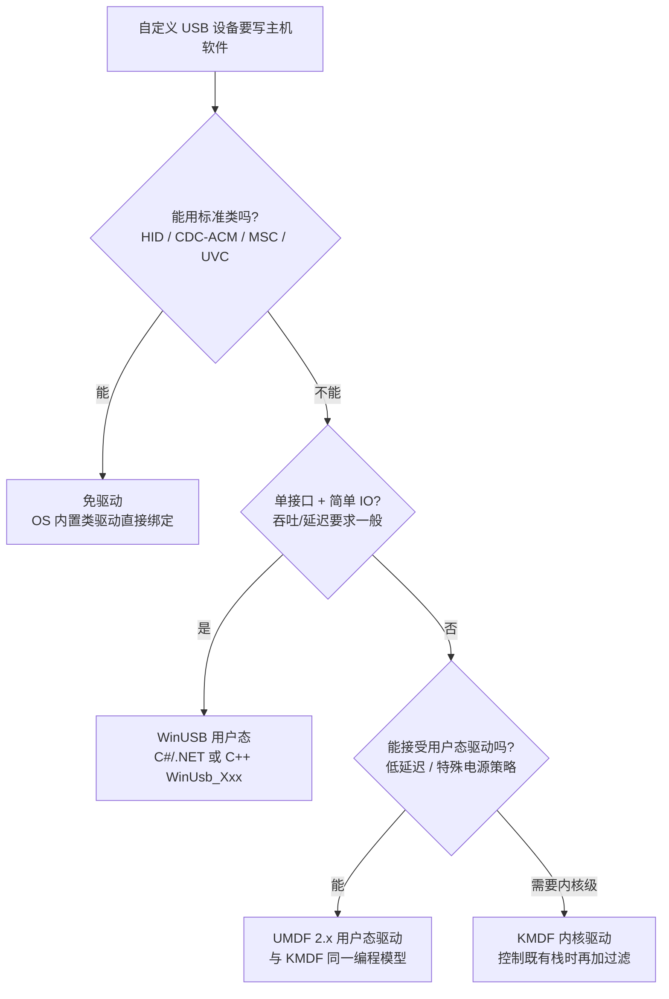
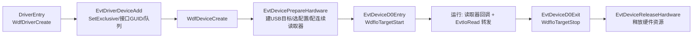

# Windows USB 驱动开发

> 🌿 知识树位置: 树干 → 枝干[主机侧与实现] → 叶
> ⬆️ 返回: [../10-树干-USB核心/02-体系架构与分层模型.md](../10-树干-USB核心/02-体系架构与分层模型.md) · 规范缓存索引: [../80-参考资料/README.md](../80-参考资料/README.md)
> 前置: [02-操作系统USB支持](02-操作系统USB支持.md)（WDF/WinUSB 全景）· [04-libusb与用户态访问](04-libusb与用户态访问.md)（跨平台替代方案）

写 Windows USB 驱动前先回答一个问题：**能不能不写**。标准类（HID/CDC-ACM/MSC/UVC）与配合 MS OS 描述符的 WinUSB 设备都免驱动；只有低延迟、特殊电源管理或需要过滤既有驱动栈的需求才落回内核。本文给出选型决策树、KMDF USB 目标模型的连续读取器骨架、免驱两条路线对比与电源/调试要点。API 细节随 WDK 版本演进，**以微软 Learn 官方文档为准**。

## 一、驱动选型决策树



各路线能力边界：

| 路线 | 运行层 | 签名/安装 | 典型场景 | 限制 |
|---|---|---|---|---|
| 标准类免驱 | OS 内置类驱动 | 无 | HID 数据采集、CDC 串口、UVC 摄像头 | 报文格式受类协议约束 |
| WinUSB 用户态 | 应用进程（winusb.dll → winusb.sys） | 设备端 MS OS 描述符或一条 INF 即可 | 示例设备、JTAG/ISP 工具、仪器控制 | 无内核电源/定时保证；与其它程序争设备 |
| UMDF 2.x 驱动 | 用户态 Host 进程（WUDFHost.exe） | 需驱动包签名 | 低吞吐但需统一安装/电源策略的成品设备 | 吞吐受用户态往返限制 |
| KMDF 驱动（含过滤） | 内核 | 需驱动包签名（HLK 之外建议 WHQL/证明签名） | 低延迟采集、DMA、过滤 usbccgp/类驱动 | 崩溃即蓝屏；开发成本最高 |

WinUSB 用户态最小调用链（C++，C#/.NET 经 P/Invoke 或官方 WinUSB 包装库同理，接口名以官方文档为准）：

```cpp
HANDLE h = CreateFile(L"\\\\?\\usb#vid_1234&pid_5678#...#{f72fe0d4-cbcb-402d-944e-ab0c1a2f4d2a}",
                      GENERIC_WRITE | GENERIC_READ, 0, NULL, OPEN_EXISTING,
                      FILE_ATTRIBUTE_NORMAL | FILE_FLAG_OVERLAPPED, NULL);
WINUSB_INTERFACE_HANDLE w;
WinUsb_Initialize(h, &w);                    /* 打开默认接口 */
UCHAR alt = 0; WinUsb_AbortPipe(w, 0x81);
ULONG len = 64; UCHAR buf[64];
WinUsb_ReadPipe(w, 0x81, buf, len, &len, NULL);   /* 批量/中断管道收包 */
WinUsb_Free(w); CloseHandle(h);
```

## 二、KMDF USB 目标模型

KMDF 把 USB 设备抽象成三个目标对象，驱动不碰 URB 而是对这些对象发请求：

| 对象 | 创建/获取 API | 含义 |
|---|---|---|
| `WDFUSBDEVICE` | `WdfUsbTargetDeviceCreate`（UMDF 2.x 用 `WdfUsbTargetDeviceCreateWithParameters`） | 整个 USB 设备的 I/O 目标；发控制请求、选配置 |
| `WDFUSBINTERFACE` | 选配置后由 `WDF_USB_DEVICE_SELECT_CONFIG_PARAMS` 得到；换设置用 `WdfUsbInterfaceSelectSetting` | 一个接口（alternate setting 已选定） |
| `WDFUSBPIPE` | `WdfUsbInterfaceGetConfiguredPipe` | 一条端点管道：读写/中断/等时都经由它 |

回调链与初始化次序：



### 2.1 连续读取器（Continuous Reader）骨架

中断 IN 端点的惯用法：框架预挂 N 个读请求在管道上，数据到达即回调，避免高频分配/提交。约 60~80 行可编译级骨架如下（**WDF 版本与 DDI 签名以官方文档为准**）：

```c
/* myusb.c —— KMDF USB 驱动骨架：中断 IN 走连续读取器，批量 IN 经 EvtIoRead 转发 */
#include <wdm.h>
#include <wdf.h>
#include <usb.h>

#define VENDOR_ID 0x1234
#define PRODUCT_ID 0x5678
#define BULK_BUF_MAX 4096

DEFINE_GUID(GUID_DEVINTERFACE_MYUSB, 0x11111111,0x2222,0x3333,0x44,0x44,0x55,0x55,0x55,0x55,0x55,0x55);

typedef struct _DEVICE_CONTEXT {
    WDFUSBDEVICE    UsbDevice;        /* WDF USB 目标三对象 */
    WDFUSBINTERFACE UsbInterface;
    WDFUSBPIPE      InterruptInPipe;  /* 连续读取器宿主 */
    WDFUSBPIPE      BulkInPipe;       /* EvtIoRead 转发目标 */
} DEVICE_CONTEXT, *PDEVICE_CONTEXT;

WDF_DECLARE_CONTEXT_TYPE_WITH_NAME(DEVICE_CONTEXT, GetDeviceContext)

/* 连续读取器收包回调（数据已在 buffer 中） */
static VOID EvtIntInReadComplete(WDFUSBPIPE Pipe, WDFMEMORY Buffer,
                                 size_t Offset, size_t NumBytesTransferred, PVOID Ctx)
{
    PDEVICE_CONTEXT ctx = GetDeviceContext((WDFDEVICE)Ctx);
    UNREFERENCED_PARAMETER(Pipe); UNREFERENCED_PARAMETER(ctx);
    /* 示例：直接取内存指针解析报告；生产代码应转投自有队列再由工作项处理 */
    UCHAR *p = (UCHAR *)WdfMemoryGetBuffer(Buffer, NULL) + Offset;
    UNREFERENCED_PARAMETER(p);
    /* 重新消费数据后无需重新提交：框架自动补挂下一个读请求 */
}

/* 读取器失败回调：返回 TRUE 让框架重试，返回 FALSE 停止读取器 */
static BOOLEAN EvtReadersFailed(WDFUSBPIPE Pipe, NTSTATUS Status, USBD_STATUS UsbdStatus)
{
    UNREFERENCED_PARAMETER(Pipe); UNREFERENCED_PARAMETER(UsbdStatus);
    return NT_SUCCESS(Status);
}

/* 队列读请求 → 批量 IN 管道 */
static VOID EvtIoRead(WDFQUEUE Queue, WDFREQUEST Request, size_t Length)
{
    PDEVICE_CONTEXT ctx = GetDeviceContext(WdfIoQueueGetDevice(Queue));
    WDF_MEMORY_DESCRIPTOR md;
    WDF_REQUEST_SEND_OPTIONS opt;
    NTSTATUS st;

    if (Length > BULK_BUF_MAX) { WdfRequestCompleteWithInformation(Request, STATUS_INVALID_PARAMETER, 0); return; }
    WDF_MEMORY_DESCRIPTOR_INIT_HANDLE(&md, WdfRequestGetOutputMemory(Request), NULL);
    st = WdfUsbTargetPipeFormatRequestForRead(ctx->BulkInPipe, Request, &md, NULL);
    if (!NT_SUCCESS(st)) { WdfRequestComplete(Request, st); return; }
    WDF_REQUEST_SEND_OPTIONS_INIT(&opt, WDF_REQUEST_SEND_OPTION_TIMEOUT);
    opt.Timeout = WDF_REL_TIMEOUT_IN_SEC(5);
    if (!WdfRequestSend(Request, WdfUsbTargetPipeGetIoTarget(ctx->BulkInPipe), &opt))
        WdfRequestCompleteWithInformation(Request, WdfRequestGetStatus(Request), 0);
}

static NTSTATUS EvtDeviceAdd(WDFDRIVER Driver, PWDFDEVICE_INIT pInit)
{
    WDF_OBJECT_ATTRIBUTES attrs;
    WDF_IO_QUEUE_CONFIG qCfg;
    WDF_PNPPOWER_EVENT_CALLBACKS pnp;
    WDFDEVICE device;
    NTSTATUS st;

    WDF_PNPPOWER_EVENT_CALLBACKS_INIT(&pnp);
    pnp.EvtDevicePrepareHardware = EvtDevicePrepareHardware;
    pnp.EvtDeviceReleaseHardware = NULL;             /* 简化骨架，生产需实现 */
    WdfDeviceInitSetPnpPowerEventCallbacks(pInit, &pnp);
    WdfDeviceInitSetExclusive(pInit, TRUE);          /* 独占打开，防多进程并发直访 */

    WDF_OBJECT_ATTRIBUTES_INIT_CONTEXT_TYPE(&attrs, DEVICE_CONTEXT);
    st = WdfDeviceCreate(&pInit, &attrs, &device);
    if (!NT_SUCCESS(st)) return st;
    st = WdfDeviceCreateDeviceInterface(device, &GUID_DEVINTERFACE_MYUSB, NULL);
    if (!NT_SUCCESS(st)) return st;

    WDF_IO_QUEUE_CONFIG_INIT_DEFAULT_QUEUE(&qCfg, WdfIoQueueDispatchSequential);
    qCfg.EvtIoRead = EvtIoRead;
    return WdfIoQueueCreate(device, &qCfg, WDF_NO_OBJECT_ATTRIBUTES, WDF_NO_HANDLE);
}

static NTSTATUS EvtDevicePrepareHardware(WDFDEVICE Device, WDFCMRESLIST R1, WDFCMRESLIST R2)
{
    PDEVICE_CONTEXT ctx = GetDeviceContext(Device);
    WDF_USB_DEVICE_SELECT_CONFIG_PARAMS sel;
    WDF_USB_CONTINUOUS_READER_CONFIG reader;
    NTSTATUS st;

    st = WdfUsbTargetDeviceCreate(Device, WDF_NO_OBJECT_ATTRIBUTES, &ctx->UsbDevice); /* UMDF2 用 WithParameters 版本 */
    if (!NT_SUCCESS(st)) return st;
    WDF_USB_DEVICE_SELECT_CONFIG_PARAMS_INIT_SINGLE_INTERFACE(&sel);
    st = WdfUsbTargetDeviceSelectConfig(ctx->UsbDevice, WDF_NO_OBJECT_ATTRIBUTES, &sel);
    if (!NT_SUCCESS(st)) return st;
    ctx->UsbInterface    = sel.Types.SingleInterface.ConfiguredUsbInterface;
    ctx->InterruptInPipe = WdfUsbInterfaceGetConfiguredPipe(ctx->UsbInterface, 0, NULL); /* 索引按自家描述符 */
    ctx->BulkInPipe      = WdfUsbInterfaceGetConfiguredPipe(ctx->UsbInterface, 1, NULL);
    if (ctx->InterruptInPipe == NULL || ctx->BulkInPipe == NULL) return STATUS_INVALID_DEVICE_STATE;

    /* 需要非默认 alternate setting 时在此用 WdfUsbInterfaceSelectSetting() 重选 */
    WDF_USB_CONTINUOUS_READER_CONFIG_INIT(&reader, EvtIntInReadComplete, Device, 8); /* 报文 8 字节 */
    reader.BufferCount = 8;                                    /* 预挂 8 个读请求 */
    reader.EvtUsbTargetPipeReadersFailed = EvtReadersFailed;
    return WdfUsbTargetPipeConfigContinuousReader(ctx->InterruptInPipe, &reader); /* 缓冲须为 MaxPacketSize 整数倍 */
}

NTSTATUS DriverEntry(PDRIVER_OBJECT DriverObject, PUNICODE_STRING RegistryPath)
{
    WDF_DRIVER_CONFIG cfg;
    WDF_DRIVER_CONFIG_INIT(&cfg, EvtDeviceAdd);
    return WdfDriverCreate(DriverObject, RegistryPath, WDF_NO_OBJECT_ATTRIBUTES, &cfg, WDF_NO_HANDLE);
}
```

配套还要在 `EvtDeviceD0Entry` 调 `WdfIoTargetStart(WdfUsbTargetPipeGetIoTarget(ctx->InterruptInPipe))`、在 `EvtDeviceD0Exit` 调 `WdfIoTargetStop(...)`（带等待在途 I/O 完成的标志，常量名以官方文档为准），读取器随 I/O 目标启停。若要换 alternate setting，用 `WdfUsbInterfaceSelectSetting` 重选后重新取管道。

## 三、免驱两条路线：INF vs MS OS 描述符

让 Windows 用 WinUSB 绑定自定义设备有两条路，本质都是把"设备要配 winusb"这件事告诉 PnP 管理器：

| 维度 | INF 路线 | MS OS 描述符路线（WCID / MS OS 2.0） |
|---|---|---|
| 配置位置 | 主机侧驱动包文件 | 设备固件（描述符里自声明） |
| 安装动作 | 需复制文件、可能弹"找到新硬件" | 插上即自动绑定，零 INF |
| 维护成本 | 每个新 VID/PID 改 INF | 固件不变即永不改 |
| 分发限制 | 驱动包建议签名 | 无主机侧包 |
| 适用 | 老系统兼容、需安装伴随软件的场景 | 现代固件设备首选 |

MS OS 2.0 描述符挂在 BOS 的 Platform Capability 上（`bcdUSB >= 0x0210`），声明 `compatibleID = "WINUSB"`；固件侧写法与 WebUSB 的 BOS 描述符构造同源，见 [../20-枝干-设备类协议/其他设备类/06-WebUSB与厂商自定义类.md](../20-枝干-设备类协议/其他设备类/06-WebUSB与厂商自定义类.md)。安装绑定机制与硬件/兼容 ID 匹配规则见 [02-操作系统USB支持](02-操作系统USB支持.md)。

## 四、电源：选择性挂起（Idle Usb）

KMDF 用框架空闲计时器实现 USB 选择性挂起：设备空闲超时后框架替你发 idle 通知，集线器把该口置挂起；对应规范语义见 [../10-树干-USB核心/10-电源管理与挂起唤醒.md](../10-树干-USB核心/10-电源管理与挂起唤醒.md)。骨架：

```c
/* EvtDeviceAdd 里，WdfDeviceCreate 之后调用 */
static NTSTATUS SetupIdle(WDFDEVICE Device)
{
    WDF_DEVICE_POWER_POLICY_IDLE_SETTINGS idle;
    NTSTATUS st;

    WDF_DEVICE_POWER_POLICY_IDLE_SETTINGS_INIT(&idle, IdleUsbSelectiveSuspend);
    idle.IdleTimeout = 5000;                       /* 空闲 5 s 申请挂起（毫秒） */
    idle.UserControlOfIdleSettings = IdleAllowUserControl;   /* 允许设备管理器/电源策略覆盖 */
    st = WdfDeviceAssignS0IdleSettings(Device, &idle);       /* 枚举常量名以官方文档为准 */
    if (!NT_SUCCESS(st)) return st;

    /* 设备固件已置 bmAttributes.bit5（远程唤醒）且需系统级(Sx)唤醒时，
     * 再用 WDF_DEVICE_POWER_POLICY_SX_WAKE_SETTINGS + WdfDeviceAssignSxWakeSettings 配置 */
    return st;
}
```

要点：

- **连续读取器会阻止空闲**：预挂的读请求让设备始终"有流量"，IdleTimeout 永远到不了。需要挂起时先 `WdfIoTargetStop`（或改用驱动托管的空闲计时，在业务静默点手动 `WdfDeviceStopIdle`/`WdfDeviceResumeIdle`）。
- 唤醒路径：设备拉 Resume → 框架恢复 D0 并重入 `EvtDeviceD0Entry`，读取器随 `WdfIoTargetStart` 重启，无需驱动写 WDM 电源 IRP。
- 复合设备的选择性挂起语义由 usbccgp 统一裁决，子驱动只需表达空闲意愿。

## 五、ETW 日志与调试（WPP）

WDK 的标准做法是 **WPP 跟踪**：在源码里写 `DoTraceMessage` 风格的记录点，编译期由 WPP 预处理器展开成 ETW 注册与格式化元数据，运行期用 `tracelog`/`logman`（或 TraceView）按 GUID/标志位收集、`tracefmt`/`netsh trace convert` 解码——开销低到可以留在发布版驱动里，出问题回放开关即可。最小接入：

```c
/* DriverEntry: */ WPP_INIT_TRACING(DriverObject, RegistryPath);   /* UMDF2 传上下文句柄 */
/* 卸载回调:   */ WPP_CLEANUP();
/* 任意记录点: */ DoTraceMessage(FLAG_INFO, "select config %!STATUS!", status);
```

动态调试另有两条腿：WinDbg 的 `!wdfkd.wdflogdump` 直接翻框架内建黑匣子日志（无需 WPP 预埋），`!wdfkd.wdfusbpipe`/`wdfusbinterface` 查管道状态；KMDF 的 Verification On（注册表/Verifier）可在对象误用、IRQL 违规时立即断下。抓协议层流量则回到 [../70-枝干-调试测试与安全/01-协议分析仪与抓包.md](../70-枝干-调试测试与安全/01-协议分析仪与抓包.md)（USBPcap/硬件分析仪）。

## 六、常见坑（按 WDF 语义）

| 坑 | 现象 | 正确姿势 |
|---|---|---|
| 设备访问互斥 | 两个应用同时打开设备接口，控制请求互相踩 | 驱动侧 `WdfDeviceInitSetExclusive(TRUE)`；或应用侧互斥打开；复合设备注意接口归属（usbccgp 拆分后按 MI_xx 各自绑定） |
| 取消 I/O | 拔线瞬间对已完成请求再回调/访问已释放内存 | WDF 队列在设备移除/队列清理时自动取消并完成请求；自管队列的长等待请求要 `WdfRequestMarkCancelable` + `EvtRequestCancel`；完成后的请求绝不再触碰 |
| "URB 复用"的误解 | 想照搬 WDM 手搓 URB 复用，KMDF 下没有抓手 | WDF 框架托管 URB：复用的是**请求对象**——完成后 `WdfRequestReuse` 再 `WdfUsbTargetPipeFormatRequestForWrite`/`WdfRequestSend`；需要 USB 3.x 流/自建 URB 才用 `WdfUsbTargetDeviceCreateWithParameters`（客户端契约版本）路径 |
| 连续读取器独占管道 | 读取器运行时对同一管道同步读失败/请求悬挂 | 文档明确：读取器运行期间不得对该管道 `WdfUsbTargetPipeReadSynchronously` 或 `WdfRequestSend`；要么停读取器，要么换管道 |
| 读缓冲不成包长整数倍 | `WdfUsbTargetPipeConfigContinuousReader` 返回 `STATUS_INVALID_BUFFER_SIZE` | 缓冲大小按管道 MaxPacketSize 取整；短包由框架置 `USBD_SHORT_TRANSFER_OK` 语义兜底 |
| 空闲计时不触发 | 设备从不挂起 | 检查连续读取器是否未停、应用是否持有接口；必要时改驱动托管计时 |
| 回调 IRQL 误用 | 在读取器回调里 sleep/等待 | 各回调的 IRQL 约束不同（以官方文档为准），耗时处理一律转投队列/工作项 |

## 相关节点

- [02-操作系统USB支持](02-操作系统USB支持.md)：Windows 栈全景、绑定规则、错误码速查
- [04-libusb与用户态访问](04-libusb与用户态访问.md)：不需要驱动的跨平台替代
- [../20-枝干-设备类协议/其他设备类/06-WebUSB与厂商自定义类.md](../20-枝干-设备类协议/其他设备类/06-WebUSB与厂商自定义类.md)：MS OS 描述符/WinUSB 免驱的固件侧实现
- [../10-树干-USB核心/10-电源管理与挂起唤醒.md](../10-树干-USB核心/10-电源管理与挂起唤醒.md)：选择性挂起的协议层语义
- [../70-枝干-调试测试与安全/01-协议分析仪与抓包.md](../70-枝干-调试测试与安全/01-协议分析仪与抓包.md)：驱动问题最终都要回到线上看
