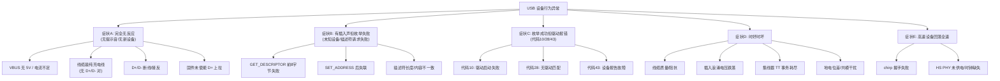
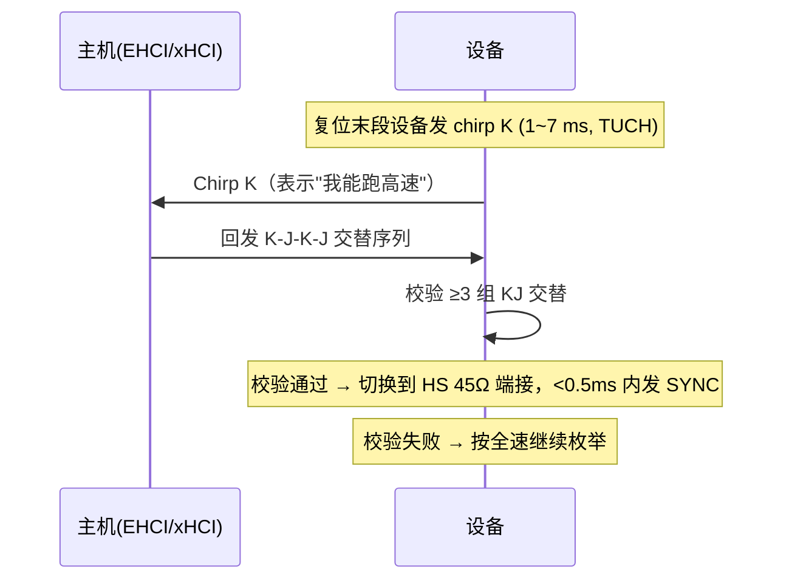

# 枚举失败排查手册

> 🌿 知识树位置: 树干 → 枝干[调试测试与安全] → 叶
> ⬆️ 返回: [../10-树干-USB核心/08-枚举流程与标准请求.md](../10-树干-USB核心/08-枚举流程与标准请求.md)

枚举是设备上线的第一关，也是固件/硬件问题的集中暴露区。本手册按**症状 → 故障树 → 验证手段**组织，配合抓包（见 [01-协议分析仪与抓包](01-协议分析仪与抓包.md)）使用。

## 一、总故障树



## 二、症状 A：完全无反应

主机端毫无感知（无插入提示音、无任何新设备）。这是**物理层/供电层**问题，协议还没开始。

| 检查点 | 方法 | 判定 |
|---|---|---|
| VBUS 有无 5V | 万用表测设备端 VBUS-GND | <4.4V 视为异常；无电压查主机口/线缆 |
| 电流预算 | 主机口标称 500mA(FS)/900mA(HS)；键盘类应 <100mA | 设备需求 > 口供电能力 → 上电即掉 |
| 线缆类型 | 换一根**确定带数据芯**的线；万用表通断测 D+/D- | 市售大量"充电线"只有 2 芯 |
| D+/D- 接反/断线 | 万用表从 A 口到 B 口逐芯通断；示波器看差分幅度 | FS 设备插入后 D+ 应被拉高 ~3.3V（D- 拉高 = LS） |
| 固件上拉 | 重烧固件，确认 pull-up 使能代码在初始化序列末尾 | 无上拉主机永远不会检测到插入 |

> 💡 快速二分：把设备插到**另一台电脑/另一个口**。两边都无反应 → 设备/线缆问题；一边有 → 主机口/系统问题。

## 三、症状 B：有插入声但枚举失败

主机检测到了插入（说明 VBUS 与上拉正常），但配置未完成。**按枚举阶段切分定位**：

### 3.1 第一段：GET_DESCRIPTOR 前 8 字节失败

主机复位设备后第一件事是 `GET_DESCRIPTOR(Device, wLength=8 或 64)`，取回设备描述符前 8 字节以得知 `bMaxPacketSize0`。

| 可能原因 | 机理 | 验证 |
|---|---|---|
| **EP0 max packet 配置错误** | 固件以 8/16/32 应答但按 64 打包，或反之 → 主机等待字节数不匹配 | usbmon 看该事务 DATA 长度；对照 bMaxPacketSize0 |
| **时钟不准（HSI 偏差）** | USB 数据速率容差约 ±0.25%，内部 RC 振荡器（如 STM32 HSI 出厂 ±1%）超差 → CRC/位填充错 → 主机静默丢包重试至超时 | 换 HSE 晶振或启用 CRS 时钟恢复；示波器测帧间隔是否为 1.000ms± |
| CRC / 位填充错误 | 信号质量差（线劣化、布局干扰）→ 主机收包即弃 | 抓包只见重发同令牌；换短线直插验证 |
| 固件未武装 EP0 | setup 中断路径太慢或描述符缓存未就绪 | 抓包：设备只 NAK 无 DATA；见 [../60-枝干-主机侧与实现/03-设备端固件栈.md](../60-枝干-主机侧与实现/03-设备端固件栈.md) 时序节 |

### 3.2 第二段：SET_ADDRESS 后失联

`SET_ADDRESS` 的地址必须在 **status 阶段完成后**生效。自研/魔改协议栈常见 bug：在 data 或 status 期间就切换地址 → 主机用新地址发请求时设备还在监听 0（或已切新地址却按 0 应答）→ 后续所有请求超时，Windows 报"未知设备"。

验证：抓包看 `SET_ADDRESS` 之后的 GET_DESCRIPTOR 用的是哪个地址、有无应答。硬件 IP（STM32/CH32 内置 IP、TinyUSB）已按规范处理，此坑主要出现在裸栈移植。

### 3.3 第三段：描述符返回不一致

| 症状 | 常见根因 |
|---|---|
| `GET_DESCRIPTOR(CONFIG)` 实际返回长度 < 请求值且 < `wTotalLength` | 固件按单块发送，未实现"分次取完"（wTotalLength > EP0 包长时主机多次请求拼接） |
| 返回长度 ≠ `wTotalLength` | 描述符数组改了长度没改 wTotalLength 常量 |
| `bLength` 与实体不符 | 手工增删描述符后首字节忘改 → 主机解析错位，后续描述符全乱 |
| `bNumEndpoints` ≠ 端点描述符数量 | 同上，接口内数量不符 → 驱动绑定失败 |
| 复合设备 CDC 无 IAD | Windows `usbccgp.sys` 无法拆分 → 代码 10（见 3.4） |

## 四、症状 C：Windows 代码 10 / 28 / 43 逐条路径

| 代码 | 本质 | 排查路径 |
|---|---|---|
| **10** 无法启动 | 驱动找到了、加载了，但启动失败 | ① CDC 复合设备 → 查 IAD 与 bDeviceClass=0xEF/0x02/0x01；② INF 接口数/类码与描述符不一致；③ 用 UsbTreeView 比对描述符与 INF 声明；④ 换 WinUSB(用户态)验证硬件本身没问题 |
| **28** 无驱动 | 没有任何 INF 匹配 VID/PID 或兼容 ID | ① `pnputil /enum-devices` 看硬件 ID 是否符合预期（VID/PID 写错常见）；② 自定义设备 → 装 WinUSB（设备端 WCID/Zadig，见 [../60-枝干-主机侧与实现/04-libusb与用户态访问.md](../60-枝干-主机侧与实现/04-libusb与用户态访问.md)）；③ 检查组策略是否拦截安装 |
| **43** 报告故障 | 驱动报告致命错误（常在配置/初始化阶段协议级失败） | ① 抓包看 SET_CONFIGURATION 之后主机还有什么请求、设备如何答；② 常见：类请求（如 HID SET_REPORT、CDC SET_LINE_CODING）未实现被 STALL；③ 供电不稳导致配置后掉线重连循环 |

> Linux 侧对应物：`dmesg` 中 `usb 1-2: device descriptor read/64, error -71` 类消息；错误码 -71(协议错误)、-110(超时)、-32(管道断，STALL/断开) 覆盖同样问题。

## 五、症状 D：时好时坏

最难缠的一类，按概率排序：

1. **线缆质量/阻抗**：长线、廉价线、接头氧化 → 眼图余量不足，温度/姿态变化触发误码。换原装短线验证是第一步。
2. **插入浪涌**：设备输入电容大 → 插入瞬间 VBUS 跌落 → 主机口或设备自身掉电复位 → "时好时坏"。示波器触发在插入瞬间测 VBUS 跌落深度（>0.5V 量级即可疑）；设备侧加 inrush 限流/缓启动。
3. **集线器 TT 事务耗尽**：多个全速设备挂同一高速 hub 的单 TT(Transaction Translator) 下，周期+批量事务排队超限 → 偶发丢包/延迟超标。换多 TT hub 或分散端口。
4. **地电位差**：两台设备各自接不同电源地，地间电位差在 GND 线上形成电流 → 信号共模漂移。特征：跨机器连接时坏、隔离后好。用隔离器/光耦方案验证。

## 六、症状 E：高速设备回落全速

HS 设备枚举成 "Full Speed"（Windows 设备管理器/UsbTreeView 直接显示速度）。HS 检测靠 **chirp 握手**：



| 回落原因 | 验证手段 |
|---|---|
| chirp 幅度/时长不达标（PHY 供电低、时钟不准） | 示波器看复位末段 D+ 有无 1~7 ms 的 K 电平（Chirp），随后主机 KJ 交替（每拍 40~60 µs） |
| 主机口本身是 FS-only（老 UHCI/OHCI、劣质 hub、充电口） | 换确认 HS 的主机口直插 |
| **HS PHY 未供电/时钟缺失**：OTG_HS 内置 PHY 只能 FS；外接 ULPI PHY 缺 60MHz 时钟 → 静默回落 | 查 PHY 电源与时钟、ULPI 寄存器读回 |
| EMI/长走线使高速眼图闭合 | 眼图测试（认证级）或缩短走线 |

注意：回落全速**不是错误**，功能仍可用；只有带宽敏感场景（摄像头、U 盘速度）才暴露。

## 七、工具对照表

| 症状/疑点 | 首选工具 | 备选 |
|---|---|---|
| VBUS/通断 | 万用表 | 带电流显示的充电头 |
| D+/D- 波形、chirp、幅度 | 示波器（≥20MHz 带宽） | 逻辑分析仪（FS/LS 波形） |
| 枚举序列、描述符内容 | usbmon/USBPcap + Wireshark | lsusb -v / UsbTreeView（结果侧） |
| 线级重试/NAK/toggle | 硬件协议分析仪（Beagle 480 级） | —— |
| 驱动层状态 | dmesg / 设备管理器事件 / PnPUtil | USBView 树 |
| 温度/姿态相关 | 接触良好夹具 + 恒温箱 | 按压线缆复现 |

## 八、printf 调试法（固件侧）

没有分析仪时的最后武器：在 EP0 处理函数中打日志。

```c
void ep0_setup_handler(const usb_setup_t *s) {
    printf("[EP0] bm=%02x bReq=%02x wVal=%04x wIdx=%04x wLen=%u\r\n",
           s->bmRequestType, s->bRequest,
           s->wValue, s->wIndex, s->wLength);
    /* 典型正常序列（2.0）：
       [EP0] bm=80 bReq=06 wVal=0100 wIdx=0000 wLen=64   GET_DESC DEVICE
       [EP0] bm=00 bReq=05 wVal=0007 wIdx=0000 wLen=0    SET_ADDRESS 7
       [EP0] bm=80 bReq=06 wVal=0100 wIdx=0000 wLen=18   GET_DESC DEVICE
       [EP0] bm=80 bReq=06 wVal=0200 wIdx=0000 wLen=255  GET_DESC CONFIG
       [EP0] bm=80 bReq=06 wVal=0300 wIdx=0000 wLen=255  GET_DESC STRING 0
       [EP0] bm=00 bReq=09 wVal=0001 wIdx=0000 wLen=0    SET_CONFIG 1     */
}
```

日志与实际抓包对照，第一处"少了一步/多了一步"就是断点。注意 printf 目的地不能与调试中的 USB 口相同（用 UART/SWO/半主机调试）。

## 九、修复清单 Checklist

- [ ] VBUS 实测 4.75~5.25V，设备峰值电流 ≤ 口供电能力
- [ ] 数据线确认带 D+/D-（通断测量）
- [ ] FS/LS 时钟源满足 ±0.25% 容差（晶振或 CRS，勿裸用 HSI）
- [ ] 上拉使能在 EP0/描述符就绪之后
- [ ] `bLength`/`wTotalLength`/`bNumEndpoints` 与实体一致（脚本自动校验）
- [ ] 复合设备：IAD 存在、bDeviceClass=0xEF/0x02/0x01
- [ ] SET_ADDRESS 在 status 后生效
- [ ] 所有被驱动会使用的类请求（GET_REPORT/SET_LINE_CODING…）有实现，不支持的按规范 STALL
- [ ] 描述符长度恰为 MPS 整数倍的接口考虑 ZLP 语义
- [ ] HS 设备：PHY 供电/时钟确认，逻辑分析仪确认 chirp 握手成功

## 相关节点

- [../10-树干-USB核心/08-枚举流程与标准请求.md](../10-树干-USB核心/08-枚举流程与标准请求.md)：标准枚举序列
- [../10-树干-USB核心/07-描述符详解.md](../10-树干-USB核心/07-描述符详解.md)：字段级合法性
- [../10-树干-USB核心/09-集线器与连接管理.md](../10-树干-USB核心/09-集线器与连接管理.md)：插入检测与复位时序
- [01-协议分析仪与抓包](01-协议分析仪与抓包.md)：本手册的取证工具
- [../60-枝干-主机侧与实现/03-设备端固件栈.md](../60-枝干-主机侧与实现/03-设备端固件栈.md)：固件侧时序要求
