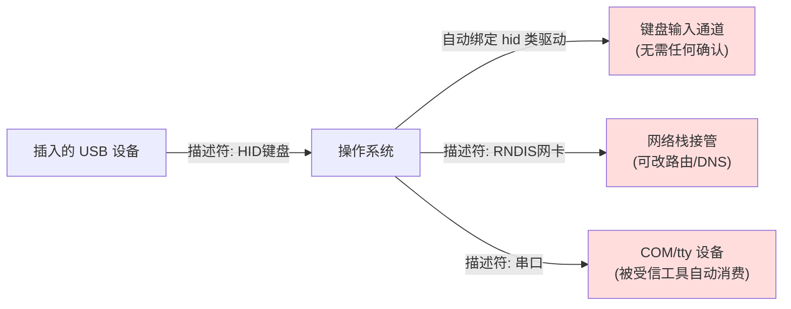

# USB 安全与 BadUSB

> 🌿 知识树位置: 树干 → 枝干[调试测试与安全] → 叶
> ⬆️ 返回: [../10-树干-USB核心/01-概述与版本演进.md](../10-树干-USB核心/01-概述与版本演进.md)

USB 的安全模型建立在一个假设上：**设备是无害的外设，主机是可信的裁判**。BadUSB 类攻击证明这个假设可以整体推翻——协议本身不验证设备固件，主机只看描述符说话。

> ⚠️ **合法边界声明**：本文所有技术内容仅用于防御视角的理解与获授权的安全测试。对未授权设备实施 HID 注入、固件重编程等操作在多数司法辖区构成违法。渗透测试必须持有书面授权与明确范围。

## 一、威胁模型：主机信任设备的崩塌

USB 枚举只回答"你是什么"（描述符），从不回答"你真的按你说的固件在跑吗"：



三重放大效应：

1. **类驱动自动绑定**：HID/网卡/存储驱动零交互加载；
2. **HID 输入免鉴权**：操作系统对"键盘"输入完全信任，可直接执行任意命令序列；
3. **固件不可见**：OS 只见描述符不见固件，无法判断 U 盘是否被重编程。

## 二、BadUSB 历史脉络

| 时间 | 事件 | 意义 |
|---|---|---|
| 2010+ | Hak5 **Rubber Ducky**（橡皮鸭）商用化 | 把"HID 注入"做成标准渗透测试工具，配套 **Ducky Script** 脚本语言 |
| 2014 | Karsten Nohl 与 Jakob Lell 在 Black Hat 公开 **BadUSB** 研究（柏林 SRLabs/安全研究实验室） | 证明可对 U 盘主控（如 Phison 群联 PS2251 系列）**重编程固件**，使其枚举成键盘等任意设备，且常规格式化/杀毒无法清除 |
| 2016+ | Bash Bunny、O.MG 线缆等衍生硬件 | 攻击平台化：多形态伪装（网卡/串口/HID）、无线遥控 |
| 至今 | 真实攻击案例（金融业、政府递送攻击） | 从概念验证走向在野利用，推动零信任外设管控 |

**Phison 主控重编程的原理层理解**（仅作防御视角概述）：多数低成本 U 盘主控的固件存于片内 Flash，厂商私有刷写工具/固件升级接口缺乏签名校验，攻击者可用该通道写入改版固件，让同一物理设备按需在"存储设备 / 键盘 / 网卡"间切换。防御要点由此推论：**无法从描述符判断设备真实身份 → 必须依赖外设准入与白名单，而非"看起来是 U 盘"**。具体攻击固件制作不在本文范围。

## 三、Ducky Script 示例（教学演示）

合法教育用途：演示 HID 注入的形态（打开记事本输入提示文字）。**请在自己的测试机上运行**。

```
REM 教学演示：仅展示键盘注入的形态
DELAY 2000
GUI r
STRING notepad
ENTER
DELAY 800
STRING 演示文字：这台机器的外设策略需要检查！
ENTER
```

要素：`DELAY` 等待系统就绪 → `GUI r`（Win+R）→ 输入命令 → 回车。真实攻击即是把"输入文字"替换为下载执行、加用户、改策略等命令序列——防御视角要理解的是：**速度与拟人性极强，人工拦截几乎不可能，必须设备层管控**。

## 四、攻击面分类表

| 攻击面 | 机理 | 典型场景/概念 | 主防线 |
|---|---|---|---|
| **HID 注入** | 伪装键盘/鼠标，免鉴权注入击键 | Rubber Ducky、Bash Bunny | 设备白名单、HID 数量/类型管控 |
| **伪装网卡** | 枚举为 RNDIS/ECM 以太网适配器，主机自动上网 | 恶意 DHCP/DNS 劫持框架概念：接管解析流量做中间人 | 网络侧：禁用自动新网卡、VPN 强制 |
| **伪装串口** | 枚举 CDC-ACM，利用"串口即运维通道"的惯性 | 面向嵌入式/工控主机的本地提权场景（受信工具自动连接串口执行特权命令） | 串口工具白名单、设备准入 |
| **DMA 攻击** | 经 Thunderbolt/PCIe 直通内存，绕过 OS | Thunderspy 类研究：读改内存、提取密钥 | **内核 DMA 保护(Kernel DMA Protection)** + IOMMU/VT-d、Thunderbolt 安全级别 |
| **PD 电压攻击** | 恶意源/汇违反 PD 状态机，过压/过流 | 烧毁受电设备 | PD 认证设备、具 OVP 保护的产品 |
| **线缆植入** | 线缆内嵌无线模块与微型 MCU | O.MG 线缆概念：外观普通、可远程 HID 注入 | 物理审计、线缆入库管理、WiFi 监测 |

补充：**Juice Jacking**（充电桩数据窃取）属于数据线攻击面，公共充电口用纯充电线/数据阻断器规避（见防御节）。

## 五、为什么固件级攻击难检测

- **OS 盲区**：驱动栈在描述符层工作，固件完整性不在任何协议环节被验证；
- **无固件签名生态**：消费级 USB 外设极少做安全启动(Secure Boot)；
- **持久性与复染**：被重编程的设备换电脑后重新感染——"格式化 U 盘"只清数据分区，不触碰主控固件；
- **外观不可辨**：恶意设备与正品外观完全一致。

结论：单机软件防御（杀软）对该类攻击基本无效，防御必须落在**接入管控**层。

## 六、防御体系

### 6.1 USBGuard（Linux 设备级白名单）

USBGuard 基于 udev/netlink 实现"插入即裁决"，规则语言按设备属性匹配，默认拒绝是核心思想：

```
# /etc/usbguard/rules.conf  —— 自上而下首个匹配生效，建议兜底 block

# 1) 允许内部根集线器
allow id 1d6b:0002 name "xHCI Root Hub"

# 2) 允许指定序号的员工键盘鼠标（接口级约束：只许 HID Boot 键盘/鼠标）
allow id 046d:c52b serial "12345678" name "USB Receiver" \
     with-interface { 03:01:01 03:01:02 }

# 3) 允许公司采购批次 U 盘
allow id 0781:55a3 serial "AA0102030405" with-interface 08:06:50

# 4) 兜底：其余全部拒绝
block
```

配套命令：`usbguard list-devices`（查看裁决状态）、`usbguard allow-device <id>`（临时放行）、`usbguard watch`（实时监听）。策略可由集中管理端下发。

### 6.2 Windows 组策略设备安装限制

路径：`计算机配置 → 管理模板 → 系统 → 设备安装 → 设备安装限制`：

- **"阻止安装未由其他策略设置描述的设备"** = 默认拒绝的总开关；
- **"允许安装与这些设备 ID 匹配的设备"** = 白名单（可精确到硬件 ID `USB\VID_046D&PID_C52B`，或按安装类 `{36fc9e60-...}`（USB）/ `{4d36e96b-...}`（HID）放行整类）；
- 配合注册表 `Start=4` 禁用可移动存储类驱动、或 Intune/MDM 等效策略做规模化下发；
- 效果：白名单外的设备插入即被拒（设备管理器代码 28/策略拦截），HID 注入无从绑定驱动。

### 6.3 macOS

- 原生**无**按 VID/PID 的设备安装白名单；可用 MDM 配置描述文件限制可移动介质挂载、限制 `kext`/`DriverKit` 驱动装载；
- 应用层由**沙盒 entitlement** 收口：`com.apple.security.device.usb` 控制哪些 App 能访问 USB；
- 高安全环境以 Apple Silicon 的启动安全策略 + 第三方 DEXT 过滤驱动实现外设准入。

### 6.4 Linux udev 策略（轻量替代）

```
# 只允许 plugdev 组读某个已知加密狗，其余该 VID 全拒
SUBSYSTEM=="usb", ATTRS{idVendor}=="1234", ATTRS{idProduct}=="5678", GROUP="plugdev", MODE="0660"
SUBSYSTEM=="usb", ATTRS{idVendor}=="1234", MODE="0000"
```

### 6.5 组织级与物理层管控

| 措施 | 说明 |
|---|---|
| **数据阻断器(Data Blocker/USB Condom)** | 物理断开 D+/D-，只留 VBUS/GND——公共充电口标配 |
| 纯充电线策略 | 高风险岗位统一使用 2 芯充电线 |
| 端口物理封锁 | 端口锁、封条、BIOS 禁用未用控制器 |
| **NAC / 外设准入** | EDR 设备控制模块（按 VID/PID/序号/类审批）、接入交换机侧策略联动 |
| 打印机/扫描仪外设网关 | 外设经协议网关接入，主机不直连 USB |

## 七、审计与取证

- **Windows**：事件查看器 `Microsoft-Windows-Kernel-PnP`（设备配置事件）、`DriverFrameworks-UserMode` 日志；设备历史可用注册表 `SYSTEM\CurrentControlSet\Enum\USB` 与 `USBSTOR`（取证经典：谁插过什么 U 盘、序号与时间）；
- **Linux**：journalctl 中 udev 事件（`udevadm monitor` 实时）；usbmon 流量**不持久**（内存环形缓冲，重启即失）→ 需要留存时把 USBPcap/usbmon 输出或 USBGuard 日志接入 **SIEM**（osquery 的 `usb_devices` 表是常用采集面）；
- **取证要点**：HID 注入不留文件痕迹，唯一线索是设备枚举记录与时间窗内的键击结果——设备枚举日志的留存等级应高于普通外设。

## 相关节点

- [../60-枝干-主机侧与实现/02-操作系统USB支持.md](../60-枝干-主机侧与实现/02-操作系统USB支持.md)：各平台驱动绑定机制（攻击的落点）
- [../60-枝干-主机侧与实现/04-libusb与用户态访问.md](../60-枝干-主机侧与实现/04-libusb与用户态访问.md)：用户态访问与攻击工具同源
- [../10-树干-USB核心/08-枚举流程与标准请求.md](../10-树干-USB核心/08-枚举流程与标准请求.md)：枚举为何无法验证固件
- [01-协议分析仪与抓包](01-协议分析仪与抓包.md)：恶意设备行为的观测手段
- [../10-树干-USB核心/09-集线器与连接管理.md](../10-树干-USB核心/09-集线器与连接管理.md)：插入事件的底层来源
