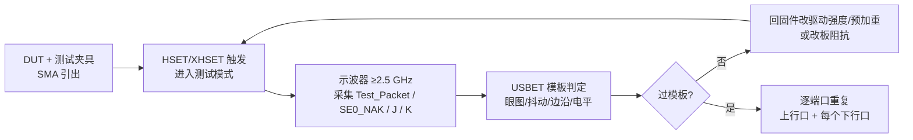

# 合规测试实操

> 🌿 知识树位置: 树干 → 枝干[调试测试与安全] → 叶
> ⬆️ 返回: [03-USB-IF合规认证](03-USB-IF合规认证.md)（做什么）· 测试模式原理: [../10-树干-USB核心/12-TestMode与调试模式.md](../10-树干-USB核心/12-TestMode与调试模式.md)
> 规范缓存: [../80-参考资料/usb-core/USB2-Electrical-Compliance-v1.08.pdf](../80-参考资料/usb-core/USB2-Electrical-Compliance-v1.08.pdf)（USB 2.0 Electrical Compliance Test Specification v1.08, 2026-04；usb.org 官方下载）· 索引: [../80-参考资料/README.md](../80-参考资料/README.md)

[USB-IF 合规认证](03-USB-IF合规认证.md) 讲清了"要测什么"，本叶把它落到"怎么做"：夹具与示波器怎么摆、被测设备（DUT）怎么进测试模式、USBCV 怎么跑、没有认证预算时 15 项自查怎么执行。限值条目全部对齐 USB2 Electrical Compliance Specification v1.08（缓存于 [../80-参考资料/usb-core/](../80-参考资料/usb-core/)，下称"合规规范"），测试模式机制细节见 [../10-树干-USB核心/12-TestMode与调试模式.md](../10-树干-USB核心/12-TestMode与调试模式.md)。

## 一、电气合规

### 1.1 实验室配置：夹具与示波器

合规规范 §4.1 对高速信号质量测试的配置要求：

| 设备 | 要求 | 说明 |
|---|---|---|
| 示波器 | 带宽 ≥2.5 GHz，50 Ω 输入 | 高速眼图/边沿测量底线；SS/SSP/USB4 需更高带宽与专用接收机 |
| 连接线缆 | 高品质 SMA 同轴线 | 连接夹具，尽量短 |
| 测试夹具 (fixture) | 按被测口类型选型（常规/OTG 等） | 把板级连接器引到 SMA 口；含 45 Ω 精密负载、DCR 测量与 72.5 Ω 校准点 |
| 分析软件 | **USBET**（USB-IF） | 对采集波形做模板/幅度/抖动/单调性自动判定，区分 near-end / far-end 设置 |
| 主机侧工具 | **HSET / XHSET**（xHCI 主机用 XHSET） | 驱动被测主机/集线器的端口进入测试模式、挂起/复位端口 |

测量点与模板的对应（合规规范 §3.2 EL_3~EL_7）：设备**非 captive 线缆**上行口在 **TP3** 用 **Template 1**（近端）；**captive 线缆**设备在 **TP2** 用 **Template 2**（远端，含线缆影响）；Hub/主机下行口在 **TP2** 用 **Template 1**。眼图垂直开口内还要求波形单调（EL_7）。

### 1.2 USB 2.0：五种测试模式实操

DUT 进入测试模式的载体是标准请求 `SET_FEATURE(TEST_MODE)`（wIndex 高字节放选择器），见 [../10-树干-USB核心/12-TestMode与调试模式.md](../10-树干-USB核心/12-TestMode与调试模式.md)。设备固件必须实现"状态阶段 ACK 后 3 ms 内切换收发器"，且**退出只能断电/拔插**——实操前先在自家固件上验证这条路径。

| 模式 | 选择器 | 实操步骤（合规规范 §4） |
|---|---|---|
| Test_J / Test_K | 01H / 02H | 进模式 → 接 45 Ω 对地理想端接 → 测 D+（J）或 D−（K）静态电平；再测"未驱动线 0 V ±20 mV"（EL_9） |
| Test_SE0_NAK | 03H | 进模式 → 把 DUT 从系统隔离（保持供电）→ 接数据发生器发 IN 包 → 扫幅度验证 Squelch：>150 mV 必须接收（回 NAK），<40 mV 必须静默（EL_16/17） |
| Test_Packet | 04H | HSET 触发 → 隔离 DUT（保持总线供电）→ 示波器采集重复测试包 → USBET 按近/远端设置判眼图、抖动、边沿（§4.1.1 标准流程） |
| Test_Force_Enable | 05H | 仅 Hub 下行口：HSET 置模式 → 上行口发 Test_Packet → 在下行口采波形（§4.1.2） |

**HSET 触发法**（无分析仪时的主机侧入口）：HSET/XHSET 枚举出 DUT 后，选中目标设备/端口 → 选择测试模式（Test_Packet、Test_J、Test_K、SE0_NAK、SINGLE_STEP_SET_FEATURE 等）→ Execute，工具即经 USB 栈发出对应请求并把端口切换到测试态；测试中 DUT 对主机"失联"是正常现象。响应时序测试用 `SINGLE_STEP_SET_FEATURE`：逐包单步执行，采 3 个包测 SYNC（32 bit）/EOP（8 bit）与 Setup→Data 响应间隔 88~192 bit（EL_21~EL_25，§4.5.1）。

**无 HSET 时的自制触发**：任何能发标准请求的主机都行（另一块开发板、libusb 脚本、分析仪流量注入）。libusb 版骨架：

```python
# enter_test_mode.py —— 让高速设备进入指定测试模式（pip install libusb / pyusb）
import usb.core
dev = usb.core.find(idVendor=0x1234, idProduct=0x5678)
assert dev is not None, "DUT 未枚举"

# SET_FEATURE(TEST_MODE)：bmRequestType=0x00, bRequest=0x03,
# wValue=0x0002(TEST_MODE)，测试选择器放 wIndex 高字节
def enter_test(selector: int):
    dev.ctrl_transfer(bmRequestType=0x00, bRequest=0x03,
                      wValue=0x0002, wIndex=(selector << 8) & 0xFF00, data_or_wLength=0)

enter_test(0x04)   # 01H=Test_J, 02H=Test_K, 03H=Test_SE0_NAK,
                   # 04H=Test_Packet, 05H=Test_Force_Enable(仅Hub下行口)
print("已进入测试模式；此后设备对主机失联属正常，恢复需断电/拔插")
```

注意：请求发完即结束——测试模式下设备不再应答任何流量；固件侧要保证"状态阶段 ACK 后 3 ms 内切换收发器"（这是自制触发时最常见的翻车点）。

### 1.3 USB 3.x：LTSSM Compliance Mode

USB 3.x 没有 SET_FEATURE(TEST_MODE)，电气测量改由链路训练状态机（LTSSM）承担，入口是测试仪发出的**合规入口 LFPS 图样**（§6, [../10-树干-USB核心/12-TestMode与调试模式.md](../10-树干-USB核心/12-TestMode与调试模式.md)）：

1. DUT 上电/热复位后进入 Polling；BERT（误码仪）发出合规 LFPS 序列；
2. DUT LTSSM 转入 **Compliance 状态**，按序发送合规图样 CP0~CP16（CP0 加扰数据图样承担 Gen1 眼图/抖动基础测量，后续 CP 覆盖回环 BER 与 Gen2 专用场景）；测试仪用"CP 跳转命令"在图样间**扫描切换**，逐项采集；
3. 接收端测试经 **Loopback**：BERT 先发均衡训练图样，再切已知图样统计 BER（Gen2 接收裕量）；Lane Margining 评估电压/时间裕量。

测试模式退出依旧只有复位/断电。逐图样编码与扫描时序以 USB 3.2/USB4 规范原文为准（缓存见 [../80-参考资料/README.md](../80-参考资料/README.md)）。

### 1.4 眼图模板与激励参数表概貌

合规规范把 USB2 高速指标折算成可执行的 EL 断言，下表为概貌（详细数值与测量条件以规范原文为准）：

| 测量项 | 限值/模板 | 断言号 |
|---|---|---|
| 数据速率 | 480 Mb/s ±0.05% | EL_2 |
| 上升/下降时间 | 10%~90% 差分 ≥300 ps | EL_6 |
| 眼图 | Template 1（TP2/TP3）/ Template 2（captive 远端 TP2） | EL_3~EL_5 |
| 波形单调性 | 眼图垂直开口内单调 | EL_7 |
| 未驱动线电平 | 0 V ±20 mV（45 Ω 端接，关预加重） | EL_9 |
| Squelch 阈值 | <40 mV 必静默；>150 mV 必接收 | EL_16/17 |
| 包络检测速度 | 12 bit 内完成锁定 + SYNC 检出 | EL_18 |
| SYNC 字段 | 32 bit | EL_21 |
| 包间隔 IPG | 8~192 bit；主机背靠背 88~192 bit（内建 hub 上限放宽） | EL_22/23 |
| EOP | 8 bit NRZ `01111111`；主机 SOF EOP ≥40 bit | EL_25/EL_55 |
| Chirp（设备） | 幅度 ~800 mV、时长 1~7 ms；KJ≥3 对；终端切换 <500 µs；HS 复位后 3.1~6.0 ms 起chirp | EL_27~EL_31 |
| Chirp（Hub 下行） | 响应 ≤100 µs；J/K 各 40~60 µs、~400 mV；末次 chirp 后 100~500 µs 出首 SOF | EL_33~EL_35 |
| 挂起/恢复 | 3 ms 空闲后 3000~3125 µs 内回 FS 端接；恢复后 2 bit 内回 HS；主机 3 ms 内出 SOF | EL_38~EL_41 |
| Hub 中继器 | SYNC 截断 ≤4 bit；EOP dribble ≤4 bit；时延 ≤36 bit + 4 ns | EL_42~EL_48 |
| DCR（直流电阻） | 设备 ≤17 Ω（captive ≤23 Ω）；主机/Hub/DRD 下行 ≤13 Ω；用 72.5 Ω 校准做假断开/假连接测试 | §3.9 |

流程串起来就是：



### 1.5 全速/低速与供电类电气项

高速之外，合规规范 §2 对每个上行口（UFP）/下行口（DFP）还列了 FS/LS 与供电类必测项——自查时同样适用万用表/示波器级别的方法：

| 项目 | 被测口 | 方法概貌 | 判据方向 |
|---|---|---|---|
| 低速/全速信号质量 | UFP + DFP | 示波器采 idle/驱动电平、边沿速率、上升/下降时间 | 落入 FS/LS 眼图与电平模板 |
| Inrush 浪涌电流 | UFP | 插入瞬间电流探头采样（对 100 µF 等效负载充电） | 不超规范限值，不拖垮主机口 |
| Back Voltage 背压 | UFP（自供电/电池供电设备） | DUT 不接 VBUS 时测其上行口是否向外馈电 | 无显著背压 |
| Drop/Droop 电压跌落 | DFP（Hub/主机） | 满载与突发负载下测 VBUS | 保持电压窗口内 |

Type-C 系统另有 CC 端接、VBUS 通路电阻、eMarker 项，归入 [../30-枝干-接口与供电/](../30-枝干-接口与供电/) 的 PD/Type-C 认证细则，此处不展开。

## 二、协议合规：USBCV 实操

**USBCV（USB Command Verifier，即 Chapter 9 Verifier）** 是 USB-IF 的官方协议合规工具（覆盖 2.0 系），从 usb.org 文档库/合规页面获取——当前分发形式与运行环境要求**以 usb.org 官网为准**。典型步骤：

1. **搭环境**：一台 Windows 主机装 USBCV（老版本依赖特定系统/运行库，按其发布说明准备）；DUT 经外置高速 Hub 接入（挂起电流测试另需 USB-IF 认可的电流测量夹具/受控 VBUS）；
2. **选设备**：启动后枚举列表中选中 DUT；
3. **跑测试组**：进入 *Chapter 9 Verifier* 测试组，可整组跑或单选（枚举、标准请求、描述符合法性、挂起电流、设备状态机、SET_ADDRESS 时序等）；失败项在报告里给出违反的规范章节；
4. **留证**：导出日志（XML/TXT），对照规范原文与抓包定位。

常见失败项与正文映射：

| USBCV 报错特征 | 根因方向 | 对照 |
|---|---|---|
| 字符串描述符请求失败/索引悬空 | iManufacturer/iProduct/iSerialNumber 指向不存在的字符串 | [03-USB-IF合规认证](03-USB-IF合规认证.md) 第七节 |
| 挂起电流 FAIL | 挂起后外设未断电（LED、上拉） | 同上 + [../10-树干-USB核心/10-电源管理与挂起唤醒.md](../10-树干-USB核心/10-电源管理与挂起唤醒.md) |
| 非法请求未 STALL | 固件对未定义请求挂死/超时 | [../10-树干-USB核心/08-枚举流程与标准请求.md](../10-树干-USB核心/08-枚举流程与标准请求.md) |
| wTotalLength/bLength 不自洽 | 描述符链拼接错误 | [../10-树干-USB核心/07-描述符详解.md](../10-树干-USB核心/07-描述符详解.md)（自查脚本见 03 叶第六节） |
| SetConfiguration/SET_ADDRESS 时序 FAIL | 状态阶段时机/地址生效时机错误 | [02-枚举失败排查手册](02-枚举失败排查手册.md) |

USBCV 年代久远（以 2.0 系为界），3.x/USB4 的协议与链路层合规由授权实验室用专用分析仪执行；自检可用硬件分析仪的协议测试模块或脚本化描述符校验（见 03 叶第六节）替代。

## 三、HSET 与 Hub 测试

USBHSET/XHSET 除触发设备测试模式外，还是 **Hub/主机下行口**测量的操作台（对应合规规范 §4.1.2/§4.5.2/§4.7）：

- **Hub 下行口信号质量**：对被测 Hub 端口执行 `SetPortFeature(PORT_TEST, TEST_FORCE_ENABLE)`（Hub 类请求，规范 §11.24.2.13），上行口发 Test_Packet，在该下行口采集——空载强制使能是 Hub 测试与设备测试的关键差异；
- **中继器三指标**：上行/下行口同时采集同一 SOF，判 SYNC 截断（≤4 bit）、EOP dribble（≤4 bit）、转发时延（≤36 bit + 4 ns）；
- **主机 SOF 字段**：直接采主机 SOF，数 SYNC（32 bit）与 EOP（≥40 bit）；
- **挂起/复位序列**：HSET 对指定端口下挂起/恢复/复位指令，配合示波器验证 EL_38~EL_41 的时序窗。

## 四、互操作（PlugFest）自查清单

实验室指标合格 ≠ 到处能用。PlugFest 的精髓是**矩阵**：把自家设备放进"主机 × Hub × 线缆"组合里反复横跳。无认证条件下可按下面的矩阵自查（对应 [03-USB-IF合规认证](03-USB-IF合规认证.md) 的互操作维度）：

| 测试轴 | 组合要求 | 动作 | 通过判据 |
|---|---|---|---|
| 主机矩阵 | ≥3 家主机（不同芯片平台/OS 各一，如 Intel+Windows、AMD+Windows、Apple/macOS、Linux 主机） | 每台主机：冷插 → 枚举 → 功能 → 卸载 | 全部枚举成功、无错误码（对照 [02-操作系统USB支持](../60-枝干-主机侧与实现/02-操作系统USB支持.md) 速查） |
| Hub 矩阵 | 直插 + 2 种 Hub（USB2 Hub、USB3 Hub）各一层 + 两层级联 | 同上 | 经 Hub 枚举与满速运行正常 |
| 挂起/恢复 | 每组合：系统睡眠唤醒 ×50、选择性挂起唤醒 ×50 | 唤醒后重枚举/恢复功能 | 无掉线、无数据损坏、无主机口假死 |
| 传输压测 | 每组合满速率持续 ≥2 h（读写交替，数据 CRC 校验） | 记录错误计数 | 零传输错误、吞吐稳定 |
| 热插拔疲劳 | 任选 2 个组合 ×200 次带电插拔 | 枚举成功率统计 | ≥99.5%，无幽灵设备残留 |

抓包配合：矩阵中任何一次失败都要能回放到线上（[01-协议分析仪与抓包](01-协议分析仪与抓包.md)），区分"固件 bug"与"某主机宽容/严格"。每一格结果落一张记录表，模板：

```text
# interop_log.md —— 互操作矩阵记录（每设备一份）
| 主机          | Hub 链路        | 枚举 | 挂起/恢复 | 压测 2h | 备注(抓包文件号) |
|---------------|-----------------|------|-----------|---------|------------------|
| Intel/Win11   | 直插            | OK   | 50/50 OK  | 0 错误  | cap001.usb       |
| AMD/Win10     | USB3 Hub ×1     | OK   | 48/50 恢复慢 | 0 错误 | cap014.usb (LFPS?) |
| Apple/macOS14 | USB2 Hub ×2 级联 | FAIL(代码28) | -  | -       | cap017.usb → 描述符 |
| Linux 6.x     | 直插            | OK   | 50/50 OK  | 0 错误  | usbmon005.pcap   |
```

"恢复慢""偶发"这类格子最值得追：它们是认证互操作测试里最典型的 FAIL 前兆。

## 五、USB4 / Thunderbolt 认证级测试概貌

USB4/USB 80Gbps 与 Thunderbolt 的认证已超出"工具+示波器"的桌面自测范畴，必须在授权实验室按四层执行（概貌，用例集以 USB-IF/Intel 现行合规计划为准）：

| 层 | 测什么 | 主要设备 |
|---|---|---|
| 信号 (Signal) | 眼图/插损/回损/抖动、Lane Margining、均衡协商 | 高带宽示波器 + BERT |
| 协议 (Protocol) | LTSSM 全路径、链路训练时序、Timers、一致性协商（速度回退矩阵） | 协议分析仪 |
| 隧道 (Tunneling) | PCIe/DisplayPort/USB3 隧道封装正确性、带宽仲裁与 QoS、休眠隧道行为 | 分析仪 + 主机/显示器/存储矩阵 |
| 互操作 (Interop) | 主机/Hub/线缆/eMarker 交叉矩阵、PD 交互、TBT3 兼容回退 | 实验室 PlugFest |

开发期可做的自救：选择已认证的参考设计/Hub 芯片、送样前先做信道插损仿真与链路训练日志检查，把实验室轮次留给"验证"而非"调试"。

## 六、产品自查表：15 项必测（无认证条件）

| # | 项目 | 方法 | 通过判据 |
|---|---|---|---|
| 1 | 描述符自洽 | 脚本校验 bLength/wTotalLength/字符串索引（03 叶第六节脚本） | 全部断言通过 |
| 2 | 协议合规 | USBCV Chapter 9 全组（或等效抓包脚本） | 零 FAIL |
| 3 | 非法请求处理 | 脚本发未定义请求/错误长度 | 一律 STALL，不挂死 |
| 4 | 挂起电流 | 电流测量夹具/万用表实测挂起态 | 未配置 ≤0.5 mA、配置后 ≤2.5 mA |
| 5 | 远程唤醒/恢复 | 主机挂起 → 设备唤醒信号 | 恢复正常功能，时序在窗内 |
| 6 | 主机矩阵 | ≥3 家主机枚举+功能 | 全部成功 |
| 7 | Hub 矩阵 | USB2/USB3 Hub 各一层 + 级联 | 枚举与运行正常 |
| 8 | 热插拔疲劳 | 200 次带电插拔 | ≥99.5% 枚举成功 |
| 9 | 睡眠唤醒循环 | 系统 S3 ×50 + 选择性挂起 ×50 | 无掉线/假死 |
| 10 | 传输压测 | 满速率 ≥2 h、数据校验 | 零错误 |
| 11 | 短包/零长包边界 | 协议脚本发 ZLP/短包组合 | 状态机不乱、不错包 |
| 12 | bMaxPower 如实性 | 实测峰值电流 vs 描述符 | 实测 ≤ bMaxPower×2 mA 且功能可用 |
| 13 | 低供电口兼容 | 枚举在 500 mA 限流口 | 不因供电不足枚举失败 |
| 14 | 枚举序列比对 | 抓包对照标准枚举流程 | 无异常重试/多余复位 |
| 15 | 断电恢复 | 测试模式/异常态后拔插 | 总能恢复枚举（对齐测试模式"断电才退"特性） |

自查顺序建议：1→3（纯软件，当天出结果）→ 12/13/14（需抓包）→ 4/5/11 → 6~10/15（矩阵与疲劳）。全部绿灯再谈送测，能省下大半实验室返工费。

## 相关节点

- [03-USB-IF合规认证](03-USB-IF合规认证.md)：认证体系与"做什么"（本叶是其执行手册）
- [../10-树干-USB核心/12-TestMode与调试模式.md](../10-树干-USB核心/12-TestMode与调试模式.md)：测试模式/Compliance Mode 的协议机制
- [01-协议分析仪与抓包](01-协议分析仪与抓包.md)：协议层失败项的取证工具
- [02-枚举失败排查手册](02-枚举失败排查手册.md)：自查失败的排障视角
- [../80-参考资料/usb-core/USB2-Electrical-Compliance-v1.08.pdf](../80-参考资料/usb-core/USB2-Electrical-Compliance-v1.08.pdf)：本文限值依据的官方规范缓存
