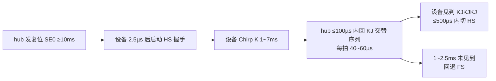

# 时序参数全表

> 📎 知识树位置: 附录 → 叶
> 兄弟叶: [01-术语表.md](01-术语表.md) · [02-速查表大全.md](02-速查表大全.md)
> 规范原文缓存索引: [../80-参考资料/README.md](../80-参考资料/README.md)

本叶把散落在树干与各枝干里的**定时器/时序参数**收拢成一张总表，按协议分节。表列为：参数 / 最小 / 典型 / 最大 / 单位 / 出处。凡从本地缓存规范 PDF（poppler 解析）提取的数值，出处标注规范名+章节；PDF 表格列有错位而采用公开通行值的，已在"出处"列注明；**无法核实的一律不写**。

## 1. USB 2.0 总线定时

来源：`80-参考资料/usb-core/USB2.0-Specification.zip`（2025-06-03 修订版 PDF，下称 USB 2.0 spec）。

### 1.1 帧定时

| 参数 | 最小 | 典型 | 最大 | 单位 | 出处 |
|---|---|---|---|---|---|
| 帧间隔（标称） | 11,958 | 12,000 | 12,042 | FS 位时间 | USB 2.0 spec §11.2.2（±42 位为 hub 帧定时器公差） |
| 微帧间隔 | — | 125 | — | µs | USB 2.0 spec §5.9 |
| FS 数据线空闲超时（判决挂起） | 3.0 | — | — | ms | §7.1.7.6（超过 3.0 ms Idle 即开始进入挂起） |
| 挂起完全生效（只吸挂起电流） | — | — | 10 | ms | §7.1.7.6 |
| 复位后恢复期（软件不得访问） | 10 | — | — | ms | §7.1.7.7（TRSMRCY）；复位后 10 ms（TRSTRCY）见 §7.1.7.5 |

### 1.2 复位与高速检测握手（Chirp）

| 参数 | 最小 | 典型 | 最大 | 单位 | 出处 |
|---|---|---|---|---|---|
| hub 下行复位宽度（TDRST） | 10 | — | — | ms | §7.1.7.5 |
| 根端口复位宽度（TDRSTR） | 50 | — | — | ms | §7.1.7.5（可分段，见下两条） |
| 分段复位间隔（TRHRSI） | — | — | <3 | ms | §7.1.7.5 |
| 每段 SE0 宽度 | 10 | — | — | ms | §7.1.7.5（TDRST） |
| 设备判定复位（上游 SE0，TDETRST） | 2.5 | — | — | µs | §7.1.7.5 |
| FS 状态下启动 HS 握手窗（TWTRSTFS） | 2.5 µs | — | 3.0 ms | — | §7.1.7.5 步骤 3b |
| HS 状态回退 FS 窗（TWTREV） | 3.0 | — | 3.125 | ms | §7.1.7.5 步骤 3c |
| 回退后采样总线窗（TWTRSTHS） | 100 µs | — | 875 µs | — | §7.1.7.5 步骤 3c |
| 设备 Chirp K 时长（TUCH/TUCHEND） | 1.0 | — | 7.0 | ms | §7.1.7.5 步骤 4 |
| hub 检出 Chirp 的滤波（TFILT） | 2.5 | — | — | µs | §7.1.7.5 步骤 5/8 |
| hub 开始 K/J 序列（TWTDCH） | — | — | 100 | µs | §7.1.7.5 步骤 6 |
| 每个 Chirp K/J 拍宽（TDCHBIT） | 40 | — | 60 | µs | §7.1.7.5 步骤 6 |
| 序列终止点（TDCHSE0，复位结束前） | 100 | — | 500 | µs | §7.1.7.5 步骤 6 |
| 设备转 HS（TWTHS） | — | — | 500 | µs | §7.1.7.5 步骤 8a |
| 未见到 KJKJKJ 回退 FS（TWTFS） | 1.0 | — | 2.5 | ms | §7.1.7.5 步骤 8b |

> 说明：任务稿中"主机 KJ 序列 40~60ms"的单位应为 **µs**（TDCHBIT，40~60 µs/拍），整段 hub chirp 序列持续到复位结束前 100~500 µs 才停止。

### 1.3 挂起/恢复/远程唤醒

| 参数 | 最小 | 典型 | 最大 | 单位 | 出处 |
|---|---|---|---|---|---|
| 主机下行恢复信号（TDRSMDN） | 20 | — | — | ms | §7.1.7.7 |
| 恢复后到首个 SOF 限时 | — | — | 3 | ms | §7.1.7.7 |
| 远程唤醒前须持续 Idle（TWTRSM） | 5 | — | — | ms | §7.1.7.7（"挂起满 5 ms 才可唤醒"） |
| 设备驱动唤醒 K（TDRSMUP） | 1 | — | 15 | ms | §7.1.7.7 |
| hub 转发/重播恢复（TURSM） | — | — | 1 | ms | §7.1.7.7 |
| 中间 hub 上行驱动恢复 | 1 | — | 15 | ms | §7.1.7.7 |

### 1.4 事务超时与包界定

| 参数 | 最小 | 典型 | 最大 | 单位 | 出处 |
|---|---|---|---|---|---|
| FS/LS 事务超时（响应未到） | 16 | — | 18 | 位时间 | §7.1.19.1 |
| HS 不超时下限 | 736 | — | — | HS 位时间 | §7.1.19.2 |
| HS 必须超时上限 | — | — | 816 | HS 位时间 | §7.1.19.2 |
| EOP：FS（SE0+J） | 2+1 | — | — | 位 | §7.1.7.4.1 |
| EOP：LS（SE0+J，LS 位时间） | 1+1 | — | — | 位 | §7.1.7.4.1 |
| EOP：HS | 8 | — | — | 位 | 表 5-3/5-10 原注（"8 bit EOP"） |
| SYNC 长度：FS/LS / HS | 8 / 32 | — | — | 位 | §8.2 |
| HS 背靠背包间延迟（THSIPDSD） | 88 | — | 192（THSRSPIPD1） | HS 位时间 | §7.1.18 |

### 1.5 TestMode

| 参数 | 最小 | 典型 | 最大 | 单位 | 出处 |
|---|---|---|---|---|---|
| 进入测试模式时限（状态段完成后） | — | — | 3 | ms | §7.1.20 |

## 2. OTG 与 Embedded Host

来源：USB 2.0 缓存包内 `USB_OTG_and_EH_2-0-version 1_1a.pdf`（OTG & EH Supplement 2.0 v1.1a）。**注意：该 PDF 的定时总表提取后列错位严重**，下表"最小/最大"凡标 ※ 的为与正文/公开通行值互核后的结果，仍建议对照原文 §5。任务稿中的"TAIDL_TRY"并无此参数，对应的是 TA_AIDL_BDIS / TB_AIDL_BDIS。

| 参数 | 含义 | 最小 | 最大 | 单位 | 出处 |
|---|---|---|---|---|---|
| TA_WAIT_BCON | A 等待 B 连接 | 1.1 | 30 | s | §5.2.1 |
| TA_AIDL_BDIS | A-Idle 到 B 断开 | 200 | 5 | ms / s（200 ms~5 s）※ | §5.3.1 |
| TA_BIDL_ADIS | B-Idle 到 A 断开 | 155 | 200 | ms | §5.2.1 |
| TA_BCON_SDB | B 连接短去抖 | 2.5 | — | µs | §5.2.3 |
| TA_BCON_LDB | B 连接长去抖 | 100 | 30 | ms / s（100 ms~30 s）※ | §5.2.1 |
| TA_SRP_RSPNS | A 响应 SRP | — | 4.9 | s | §5.1.6 |
| TB_SSEND_SRP | 会话结束到 B 发起 SRP | 1.5 | 2.0 | s ※ | §5.1.2 |
| TB_SE0_SRP | SRP 前 SE0 时长 | 100 | 150 | ms ※ | §5.1.2 |
| TB_DATA_PLS | SRP 数据脉冲宽度 | 5 | 10 | ms | §5.1.3（表值 5/10 可辨） |
| TB_SRP_FAIL | SRP 失败判定 | 5 | 6 | s | §5.1.6 |
| TB_AIDL_BDIS | B-Idle 到 B 断开 | 4 | 150 | ms | §5.2.1 |
| TB_ASE0_BRST | A-SE0 到 B 复位（HNP） | 2.5 | 155 | ms ※ | §5.3.1 |
| TB_SVLD_BCON | 会话有效到 B 连接 | — | 1 | s | §5.1.5 |

## 3. USB 3.x LTSSM 与链路定时

来源：`80-参考资料/usb-core/USB3.2-Specification-2018.zip` 内 `USB 3.2 Revision 1.0.pdf`（下称 USB 3.2 spec）。链路层定时器容差统一为 **0~+50%**（§7.5）。

### 3.1 LFPS 电气与信令（表 6-29/6-30，§6.9.1）

| 参数 | 最小 | 典型 | 最大 | 单位 | 出处 |
|---|---|---|---|---|---|
| tPeriod（LFPS 周期） | 20 | — | 100 | ns | USB 3.2 spec 表 6-29 |
| Polling.LFPS tBurst | 0.6 | 1.0 | 1.4 | µs | 表 6-30 |
| Polling.LFPS tRepeat | 6 | 10 | 14 | µs | 表 6-30 |
| Ping.LFPS tBurst | 40 | — | 200 | ns | 表 6-30（≥2 个周期） |
| U1 退出 burst 检测 | 300 | — | — | ns | 表 6-30 注 7 |
| U2/Loopback 退出 tBurst | 900 ns | — | 2 µs | — | 表 6-30（evolve #29 以 -table 重提取确认） |
| U3 唤醒 tBurst | 80 µs | — | 10 ms | — | 表 6-30（evolve #29 确认） |

> ※ 表 6-30 两行已于 evolve #29 以 -table 重提取对照原文确认（Polling.LFPS tBurst 0.6~1.4 µs、tRepeat 6~14 µs 亦同步核实）。**tNoCommonMode、tNoRxTermination** 这两个名字在 USB 3.2 规范文本中未检索到（为 USB 3.0/3.1 时代资料常用名），USB 3.2 以 tNoLFPSResponseTimeout 及表 6-29/6-30 参数承担同类判据——如需这两个符号的权威数值，请查 USB 3.0 规范原文。

### 3.2 LTSSM 状态转移超时（表 7-12，§7.5）

| 参数 | 起始状态 | 超时值 | 出处 |
|---|---|---|---|
| teSSInactiveQuietTimeout | eSS.Inactive.Quiet | 12 ms | 表 7-12 |
| tRxDetectQuietTimeoutDFP | Rx.Detect.Quiet | 12 ms（min）~120 ms（max） | 表 7-12 |
| tRxDetectQuietTimeoutUFP | Rx.Detect.Quiet | 12 ms | 表 7-12 |
| tPollingLFPSTimeout | Polling.LFPS(+Plus) | 360 ms | 表 7-12 |
| tPollingSCDLFPSTimeout（SSP） | Polling.LFPS | 60 µs | 表 7-12 |
| tPollingLBPMLFPSTimeout（SSP） | Polling.PortMatch/Config | 12 ms | 表 7-12 |
| tPollingActiveTimeout | Polling.Active | 12 ms（x1）/ 24 ms（x2） | 表 7-12 |
| tPollingConfigurationTimeout | Polling.Configuration | 12 ms（x1）/ 24 ms（x2） | 表 7-12 |
| tPollingIdleTimeout | Polling.Idle | 2 ms | 表 7-12 |
| tU0RecoveryTimeout | U0 | 1 ms | 表 7-12 |
| tU0LTimeout | U0 | 10 µs | 表 7-12 |
| tNoLFPSResponseTimeout | U1 | 2 ms | 表 7-12 |
| tNoLFPSResponseTimeout | U2 | 300 ms | 表 7-12 |
| tNoLFPSResponseTimeout | U3 | 100 ms | 表 7-12 |
| tU1PingTimeout | U1 | 100 ms | 表 7-12 |
| tRecoveryActiveTimeout | Recovery.Active | 2 ms | 表 7-12 |
| tRecoveryConfigurationTimeout | Recovery.Configuration | 10 ms | 表 7-12 |
| tRecoveryIdleTimeout | Recovery.Idle | 12 ms | 表 7-12 |
| tLoopbackExitTimeout | Loopback.Exit | 6 ms | 表 7-12 |
| tHotResetActiveTimeout / tHotResetExitTimeout | Hot Reset | 2 ms / 2 ms | 表 7-12 |
| tU3WakeupRetryDelay | U3 | 12 ms | 表 7-12 |
| tU2RxdetDelay / tU3RxdetDelay | U2 / U3 | 2 ms / 100 ms | 表 7-12 |

> 表 7-12 末数行（300 ms/100 ms×3）PDF 解析有错位，逐行归属以规范表为准；上表按语义合理归属并保留此提醒。

### 3.3 链路流控与电源管理定时（表 7-7/7-8，§7.2.4）

| 参数 | 值 | 出处 |
|---|---|---|
| PENDING_HP_TIMER（等 LGOOD/LBAD） | 10 µs | USB 3.2 spec 表 7-7 |
| CREDIT_HP_TIMER（等信用） | 5,000 µs | 表 7-7 |
| 收到 HP 后回 LGOOD_n/LBAD 期限（SS/SSP） | 3.0 µs / 1.5 µs | 表 7-7 注 |
| 链路命令处理时限 | 200 ns | 表 7-7 注 |
| PM_LC_TIMER（x1 / x2） | 4 / 8 µs | 表 7-8 |
| PM_ENTRY_TIMER（x1 / x2） | 8 / 16 µs | 表 7-8 |
| Ux_EXIT_TIMER | 6,000 µs | 表 7-8 |
| U1_MIN_RESIDENCY_TIMER | 3 µs | 表 7-8 |

## 4. USB PD

> ⚠️ 来源说明：本库 `80-参考资料/` **未缓存 USB PD 规范原文**。下表数值为 USB PD 3.x 规范定时表的公开通行值，并与 Linux 内核 TCPM 实现常量（`PD_T_*`，drivers/usb/typec）互核；标注"待复核"的行请在官方 USB PD 文档中确认后再用于合规设计。

| 参数 | 最小 | 典型 | 最大 | 单位 | 出处 |
|---|---|---|---|---|---|
| tReceive（BMC 消息接收窗） | 0.9 | — | 1.1 | ms | PD 3.x 定时表；内核 PD_T_RECEIVE |
| tSenderResponse | 24 | — | 30 | ms | 同上；内核 PD_T_SENDER_RESPONSE |
| nCapsCount（Source Cap 重发计数） | — | 50 | — | 次 | PD 3.x nCapsCount 定义 |
| tTypeCSendSourceCap | 100 | — | 200 | ms | PD 3.x 定时表；内核 PD_T_SEND_SOURCE_CAP |
| tFirstSourceCap（首次广播 Source Cap） | 100 | — | 250 | ms | PD 3.x 定时表；内核未定义此宏；**PD 3.2 V1.2 已缓存**（Table 7.10 §7.31.3.3，精确 min/max 请按缓存原文复核） |
| tPPSRequest（PPS 保活重请求） | 4 | 6 | 7.5 | s | PD 3.x PPS；内核 PD_T_PPS_REQUEST=6 s（典型值印证；**PD 3.2 V1.2 已入缓存**，Table 7.10 含本参数） |
| tPSTransition（电源状态切换） | 450 | 500 | 550 | ms | PD 3.x 定时表；内核 PD_T_PS_TRANSITION=500 印证（evolve #35） |

## 5. USB Type-C（Release 2.5）

来源：`80-参考资料/usb-core/USB-TypeC-Spec-2.5-2026.zip` 内 `USB Type-C Spec R2.5 - March 2026.pdf`，§4.11.2 Timing Parameters。

### 5.1 VBUS/VCONN（表 4-32）

| 参数 | 最小 | 最大 | 单位 | 出处 |
|---|---|---|---|---|
| tVBUSON（进入 Attached.SRC 到供上 VBUS） | 0 | 275 | ms | Type-C 2.5 表 4-32 |
| tVBUSOFF（断开后到撤除 VBUS） | 0 | 650 | ms | 表 4-32 |

### 5.2 DRP（表 4-33）

| 参数 | 最小 | 最大 | 单位 | 出处 |
|---|---|---|---|---|
| tDRP（角色切换周期） | 50 | 100 | ms | 表 4-33 |
| dcSRC.DRP（广播 Source 占空比） | 30 | 70 | % | 表 4-33 |
| tDRPTransition | 0 | 1 | ms | 表 4-33 |
| tDRPTry | 75 | 150 | ms | 表 4-33 |
| tDRPTryWait | 400 | 800 | ms | 表 4-33 |
| tTryTimeout | 550 | 1,100 | ms | 表 4-33 |
| tVPDDetach | 10 | 20 | ms | 表 4-33 |

### 5.3 CC 定时（表 4-34）

| 参数 | 最小 | 最大 | 单位 | 出处 |
|---|---|---|---|---|
| tCCDebounce（连接去抖） | 100 | 200 | ms | 表 4-34 |
| tPDDebounce（隐藏 PD BMC 通信） | 10 | 20 | ms | 表 4-34 |
| tTryCCDebounce | 10 | 20 | ms | 表 4-34 |
| tErrorRecovery（错误恢复状态时长） | 550 | 650 | ms | 表 4-34（PDF 行错位，此为通行值） |
| tSRCDisconnect（Source 判离） | 0 | 240 | ms | 表 4-34（同上） |

> 表 4-34 提取后"最小/最大"两列与行名错位明显；以上取值跨 Type-C 2.x 各版本稳定。未列出的 tCCDebounceGap、tNoToggleConnect 等参数请直接查规范表 4-34。

## 6. BLE（Bluetooth Core 6.0）

来源：`80-参考资料/bluetooth/Bluetooth-Core-6.0.pdf`（2024-08-27），Vol 6 Part B（链路层）与 Vol 4 Part E（HCI）。

| 参数 | 最小 | 典型 | 最大 | 单位 | 出处 |
|---|---|---|---|---|---|
| T_IFS_150（帧间隔，不可协商） | — | 150 | — | µs | Core 6.0 Vol 6 Part B §4.1.1 |
| T_IFS_ACL_CP / T_IFS_ACL_PC / T_IFS_CIS | — | 150（默认） | — | µs | 同上（可经 Frame Space Update 按 PHY 协商） |
| connInterval | 7.5（N×1.25） | — | 4 s（N=0x0C80） | ms | Vol 6 Part B §4.5；Vol 4 Part E（Range 0x0006~0x0C80） |
| 监督超时 supervisionTimeout | 100（N×10） | — | 32 s | ms | Vol 4 Part E HCI 参数 |
| 监督超时约束 | > (1+Max_Latency)×Subrate_Factor×connIntervalMax×2 | — | — | — | Vol 6 Part B §5.3（连接更新约束） |
| 连接未建立即判丢 | 6×connInterval（或 6 个连接事件） | — | — | — | Vol 6 Part B §4.5.2 |
| 传统广播事件间隔 | 20 | — | 10.24 | s | Vol 4 Part E LE Set Advertising Parameters（N×0.625 ms，0x0020~0x4000） |
| 扩展广播事件间隔 | 20 | — | 10,485.759375 | s | Vol 6 Part B（N×1.25 ms） |

## 7. 使用注意

1. USB 3.x 链路层定时器公差统一 0~+50%（USB 3.2 spec §7.5）；USB 2.0 多数参数只给单边界，"最小"即规范要求。
2. Type-C 明确要求 DRP 切换时钟**不要**用精密时钟源（表 4-33 前文），以便两端随机化避免死锁。
3. 本表不含主机控制器调度类数值（帧预算、事务开销），见 [../10-树干-USB核心/13-总线带宽与调度计算.md](../10-树干-USB核心/13-总线带宽与调度计算.md)。

## 相关节点

- [01-术语表.md](01-术语表.md)：符号与缩写全称
- [02-速查表大全.md](02-速查表大全.md)：PID、描述符、请求等速查
- [../10-树干-USB核心/10-电源管理与挂起唤醒.md](../10-树干-USB核心/10-电源管理与挂起唤醒.md)：挂起/恢复/远程唤醒机制
- [../10-树干-USB核心/12-TestMode与调试模式.md](../10-树干-USB核心/12-TestMode与调试模式.md)：TestMode 进入时序
- [../30-枝干-接口与供电/06-OTG与角色切换-HNP-SRP.md](../30-枝干-接口与供电/06-OTG与角色切换-HNP-SRP.md)：OTG 定时器语境
- [../30-枝干-接口与供电/07-USBPD深入-状态机与消息全表.md](../30-枝干-接口与供电/07-USBPD深入-状态机与消息全表.md)：PD 消息与状态机
- [../30-枝干-接口与供电/02-USBType-C详解.md](../30-枝干-接口与供电/02-USBType-C详解.md)：Type-C 连接状态机
- [../40-枝干-高速演进/04-USB3x包格式与LTSSM.md](../40-枝干-高速演进/04-USB3x包格式与LTSSM.md)：LTSSM 状态全景
- [../50-枝干-无线关联/BLE-低功耗蓝牙/00-BLE概述.md](../50-枝干-无线关联/BLE-低功耗蓝牙/00-BLE概述.md)：BLE 链路层基础
